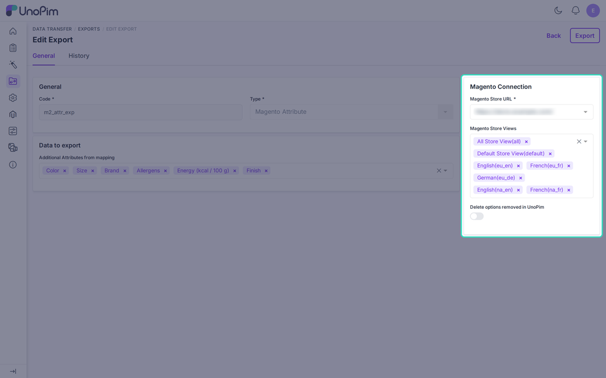

# Export Magento Attribute

The **Magento Attribute** job creates or updates product attributes in Magento, with their options and labels. Run it before the product export. Select and multiselect values need an option ID that this job creates.

## Create the Job

Go to **Data Transfer > Exports > Create Export** and choose **Magento Attribute** as the **Type**. Enter a unique **Code**.

| Filter | Required | What it does |
|---|---|---|
| **Magento Store URL** | Yes | The credential to export to. |
| **Magento Store Views** | No | Store views that receive the labels. |
| **Additional Attributes from mapping** | No | The attributes to export. The list shows the attributes from your mapping. |
| **Delete options removed in UnoPim** | No | Also deletes Magento options that you removed in UnoPim. |

Click **Save**, then **Export**.

## Which Attributes Are Sent

If you pick attributes in the job, only those are sent. If you pick none, the job exports the attributes on the [Custom Mapping](./custom-mapping) tab. With an empty mapping, nothing is exported and the log says so.

The job always skips:

- Magento system attributes such as `name` or `sku`.
- Attribute types Magento has no match for. The log says "has no Magento equivalent".

## Type Conversion

| UnoPim type | Magento type |
|---|---|
| Text, Measurement | Text |
| Textarea | Textarea |
| Price | Price |
| Boolean | Yes/No |
| Select | Dropdown |
| Multiselect, Checkbox | Multiple select |
| Date, Datetime | Date |
| Image | Media image |

The scope follows UnoPim. A locale-based attribute becomes store-view scope, a channel-based one becomes website scope, and all others stay global.

## Options and Labels

- Options are sent with an admin label and a label for each store view.
- With **Delete options removed in UnoPim** on, the job removes only options that the connector created and tracks.

## After the Run

Check the status and counts in **Data Transfer > Job Tracker**. Then open **Stores > Attributes > Product** in Magento to see the new attributes.
