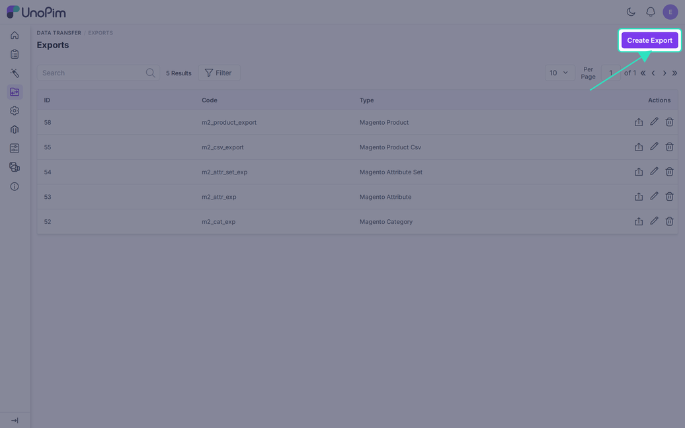
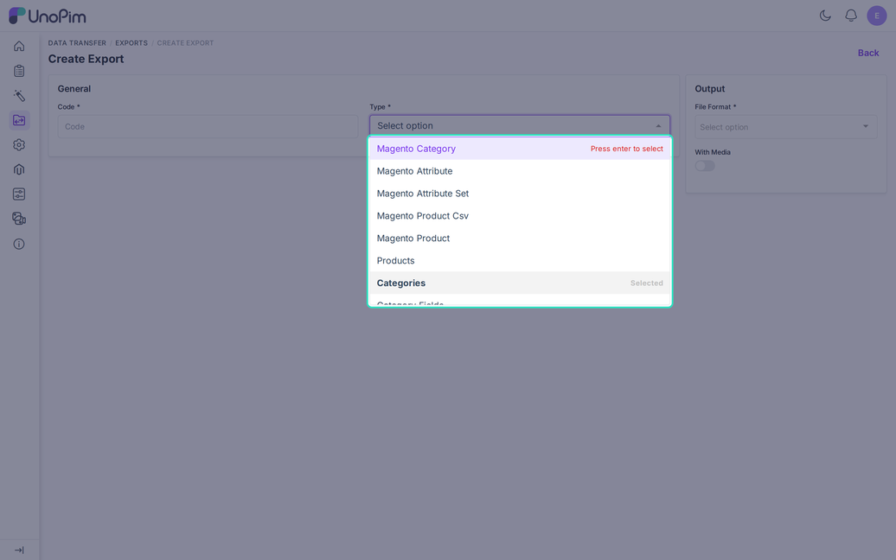
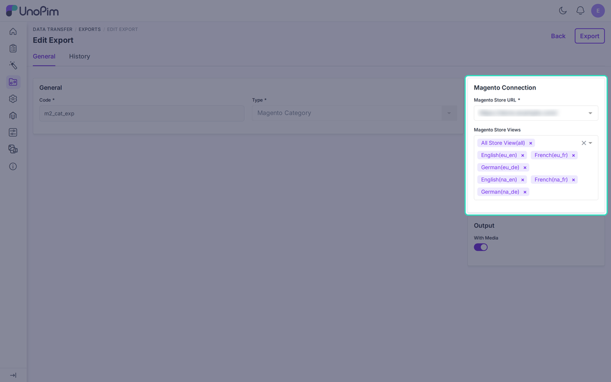

# Export Category

The **Magento Category** job sends UnoPim categories to a Magento 2 store. Run it before the product export, so products can be linked to their categories.

## Create the Job

Go to **Data Transfer > Exports** and click **Create Export**.

Enter a unique **Code**, open the **Type** list, and choose **Magento Category**.

Fill in the filters, then click **Save**.

| Filter | Required | What it does |
|---|---|---|
| **Magento Store URL** | Yes | The credential to export to. Disabled credentials are not listed. |
| **Magento Store Views** | No | Limits the export to these store views. |
| **With Media** | No | Also sends category images. Off by default. |

Click **Export** on the job page to start it.

## What Gets Exported

- Only the categories under the root category of the channel that each selected store view uses. With no store view selected, the job uses the "All Store View" channel.
- Each category goes to every store view whose channel contains it.
- The **name** comes from the locale of that store view. If it is empty, the category code is used.
- **Enable Category** and **Include in Menu** default to on for a new category.
- Extra values go out as mapped on the [Category Fields](./category-mapping) tab.

## Order Matters

A category can only be created when its parent exists in Magento. The job works through the tree from the top, in order. If a parent is missing, the child is skipped with the message "The parent category is not exported to Magento yet". Run the job again once the parent is exported.

If you move a category in UnoPim, the next run moves it in Magento too.

## Before You Run It

- The **All Store View** row on the credential must be mapped. Otherwise the job logs "The All store view is not mapped".
- The credential must be switched on.

## After the Run

Open the job in **Data Transfer > Job Tracker** to see the status and the counts of created, updated, skipped, and failed rows. Use **Download log** for the reason behind each skipped row.

Then check **Catalog > Categories** in Magento. The tree should match UnoPim for the exported channel.
