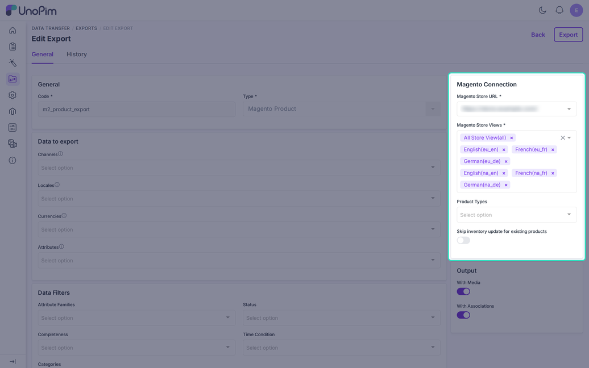
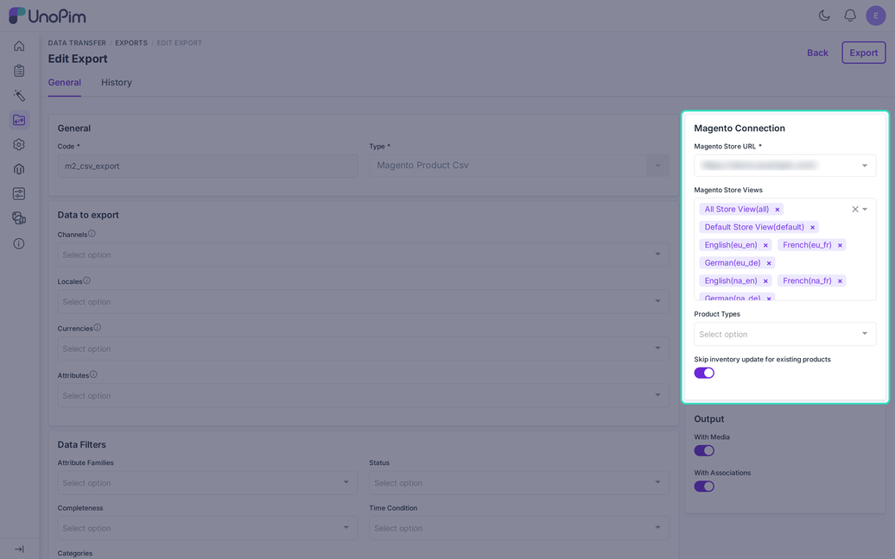
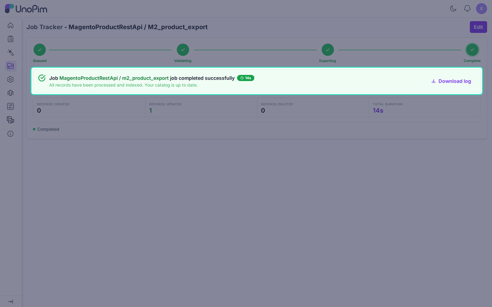

# Export Magento Product

UnoPim has two product export jobs for Magento. Both send simple and configurable products. They differ in how the data reaches Magento.

| | **Magento Product** | **Magento Product Csv** |
|---|---|---|
| How it sends data | One REST call per product and store view | Builds a CSV file and uploads it in chunks |
| Magento module needed | No | Yes, `Webkul_ProductImportQueue` |
| Store views | Required | Optional |
| Checks Magento first | Yes, it looks up each product | No |
| Keeps Magento-only data | Yes, for categories, links, and images | Magento's importer decides |
| UnoPim URL must be reachable by Magento | No | Yes, Magento downloads the CSV |

Pick **Magento Product** for most stores. It needs no extra module and gives the most careful updates. Pick **Magento Product Csv** for a very large catalog when your Magento server can reach UnoPim over the public internet.

## Before You Run It

Run these in order the first time:

1. Map [store views](./shopview-mapping) and the [attributes](./attribute-mapping). **Name** and **Price** are required.
2. Run the [category export](./export-category), so products can be linked to categories.
3. Run the [attribute export](./export-attribute) and the [attribute set export](./export-attribute-set), so options and sets exist in Magento.

## Create the Magento Product Job

Go to **Data Transfer > Exports > Create Export**. Enter a unique **Code** and choose **Magento Product** as the **Type**.

Set the filters below and click **Save**. Then click **Export** to run the job.

## Create the Magento Product Csv Job

Choose **Magento Product Csv** as the **Type**. The filters are the same, but **Magento Store Views** is optional. With no store view, only the "All Store View" values are sent.

For this job you need the Magento module from the [Installation](./installation) page. Set `APP_URL` in the UnoPim `.env` file to the public address of UnoPim. If it is wrong, the job stops with "The generated CSV URL is invalid".

## Filters

| Filter | What it does |
|---|---|
| **Magento Store URL** | Required. The credential to export to. |
| **Magento Store Views** | The views to send. Required for the REST job. |
| **Product Types** | Simple, Configurable, or both. |
| **Skip inventory update for existing products** | On by default. Stock is then sent only for new products. |
| **Attribute Families** | Only products from these families. |
| **Product Status** | Enabled, disabled, or all. |
| **With Media** | Also sends images and videos. |
| **With Associations** | Also sends related, up-sell, and cross-sell links. |
| **Identifiers** | A list of SKUs, one per line or separated by commas. |
| **Channels**, **Locales**, **Currencies** | Narrow the data to the channels, locales, and currencies of your mapped store views. |
| **Attributes** | Send only these mapped attributes. |
| **Categories** | Only products in these categories. |
| **Completeness** | Only products that meet a completeness level. |
| **Time Condition** | Only products updated in the last N days, since the last export, or between two dates. |

Only top-level products are selected. Variants travel with their parent.

## What Is Sent

- **SKU**: the attribute mapped to `sku`, or the UnoPim SKU. A product with an empty mapped SKU is skipped.
- **Name and price**: both are needed. A product without them is skipped. A configurable product with variants does not need its own price.
- **Status**: from the mapped boolean attribute. If unmapped, new products use the UnoPim status and existing Magento products keep theirs.
- **Visibility**: variants are "Not Visible Individually". A new simple product is "Catalog, Search". An existing one keeps its value.
- **Weight**: must be a plain number. Otherwise it is ignored and logged.
- **Stock**: the quantity and the stock status. Without a mapped status, it follows the quantity. Configurable parents get no stock.
- **Categories**: the REST job adds the mapped categories and keeps categories that exist only in Magento.
- **Associations**: related, up-sell, and cross-sell links, when **With Associations** is on. Links to products missing in Magento are skipped.
- **Images and videos**: when **With Media** is on. See [Image Mapping](./image-mapping) and [Video Mapping](./video-mapping).
- **Custom attributes**: the attributes on the [Custom Mapping](./custom-mapping) tab and the extra codes from [Map more Standard attributes](./attribute-mapping#map-more-standard-attributes).

## Configurable Products

Variants are exported first. Then the parent is created and the variants are linked to it.

Each variant attribute, such as **color** or **size**, must be on the [Custom Mapping](./custom-mapping) tab. The select options must exist in Magento. After a fresh option export, Magento can take a short time to index them. If a variant is not linked, the log says "Variant not indexed". Run the job again a few minutes later.

## Store Views

The REST job sends the "All Store View" values first. For each other view it sends only the values that differ, when Magento's attribute scopes can be read. If two views share a Magento website but use a different channel or currency, price comes from the first one, and the log warns you.

## After the Run

Open the job in **Data Transfer > Job Tracker**.

The tracker shows the status and the counts of processed, created, updated, skipped, and failed rows. For the CSV job, the count shows rows prepared. Magento's own rejections appear only in the log.

## Download Log

Click **Download log** after each run. The log explains every skipped or failed product, for example:

- "Product skipped: name or price is missing"
- "Store view `eu_fr` failed for `SKU-1`: ..." with Magento's reply
- "Category `Shoes` is not exported to Magento yet and was not assigned to this product"
- "Image skipped: the file ... does not exist in storage"

Check the log first when a job stays pending, shows `0` records, or skips products.
