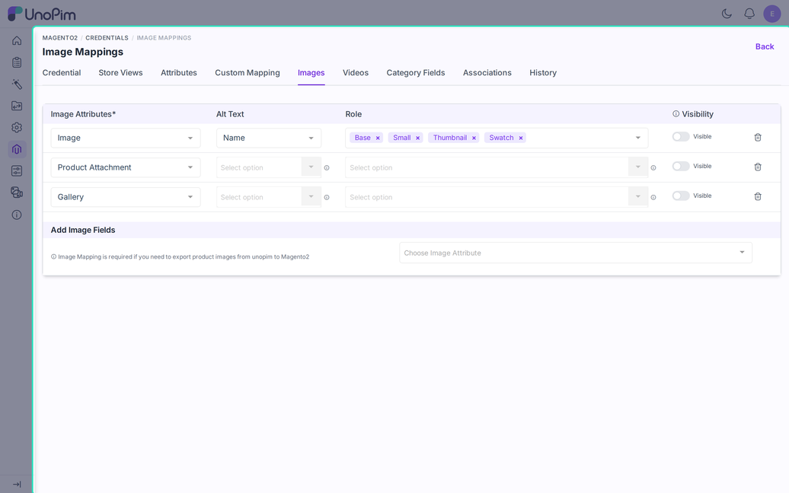

# Image Mappings

The **Images** tab chooses which UnoPim image attributes go to Magento and how each image is used on the product page.

Open it from **Magento2 > Credentials**, click a credential, then choose **Images**.

> [!NOTE]
> Images are exported only when **With Media** is switched on in the product export job. See [Export Magento Product](./export-product).

## Add an Image Attribute

At the bottom, use **Add Image Fields** and pick an attribute in **Choose Image Attribute**. The list offers attributes of type **Image**, **Gallery**, and **Asset**. Each attribute can be added once.

## The Columns

| Column | What it does |
|---|---|
| **Image Attributes** `(Required)` | The UnoPim attribute that holds the image. Everything you add becomes part of the Magento product gallery. |
| **Alt Text** | An attribute whose value becomes the image label in Magento. |
| **Role** | The Magento roles this image fills: **Base**, **Small**, **Thumbnail**, **Swatch**. |
| **Visibility** | A switch between **Visible** and **Hidden**. A hidden image stays in the gallery data but does not show on the product page. |

## Single Image and Gallery Rows

A single image attribute lets you pick the alt text attribute and the roles. A **Gallery** or **Asset** row works differently:

- The Alt Text and Role boxes are disabled.
- The image file name becomes the alt text.
- Any role you did not give to another row goes to the first gallery or asset image.

## Rules

- Each role can be used on one row only. A second use shows "role already assigned to another image".
- You need at least one row. With none, saving shows "No image field is added".
- Image file names may contain only letters, numbers, underscores, spaces, and hyphens. Other names are skipped in the CSV export.
- If the file is missing from storage, the image is skipped and the log names the path.
- A row with no visibility choice is exported as visible, and the log notes it.

## What Happens to Old Images

The REST export compares images one by one. Images that did not change stay as they are, and images that exist only in Magento are kept. When an image that the connector created is removed in UnoPim, it is removed in Magento too.

## Tips

- Give your main packshot the **Base**, **Small**, and **Thumbnail** roles so every storefront area shows it.
- Use **Swatch** for the small color or texture image on configurable products.
- Keep lifestyle shots in a gallery attribute, so you do not need one row per picture.
