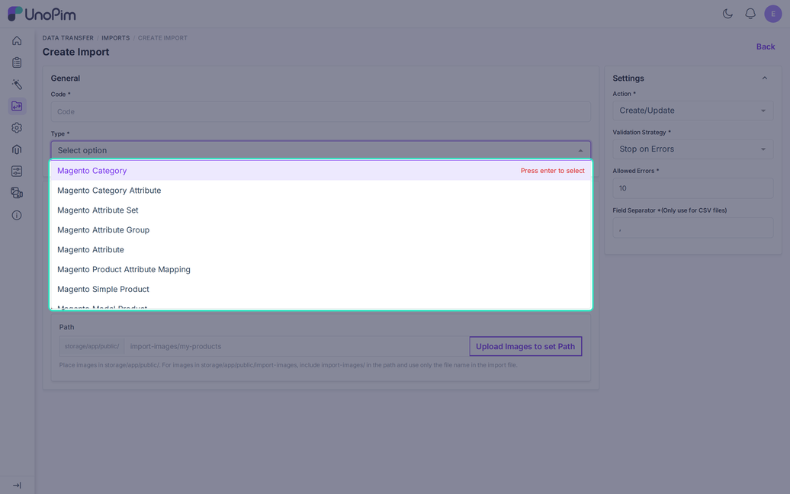
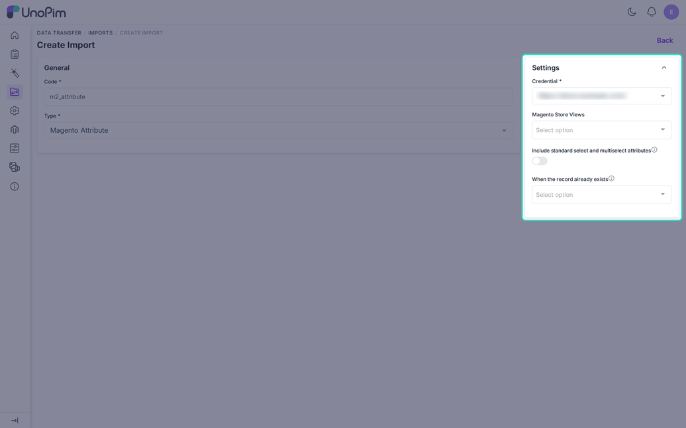
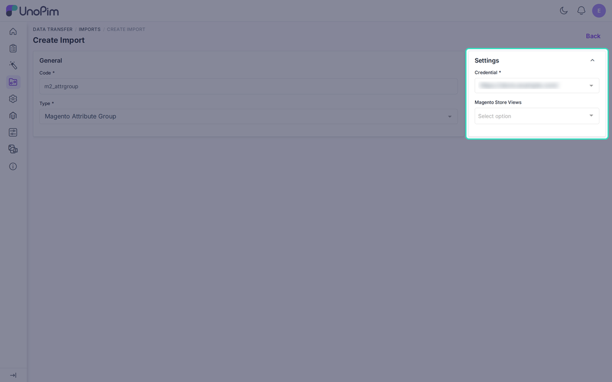
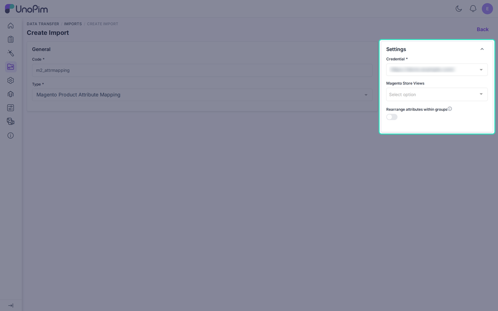

# Import Magento Attributes

Four jobs bring the attribute structure from Magento into UnoPim.

| Job | What it creates |
|---|---|
| **Magento Attribute** | Attributes, labels, and options. |
| **Magento Attribute Set** | Attribute families. |
| **Magento Attribute Group** | Attribute groups, linked to their families. |
| **Magento Product Attribute Mapping** | Puts attributes into the right group of each family. |

Run them in this order: **Attribute**, **Attribute Set**, **Attribute Group**, then **Product Attribute Mapping**. Each step needs the one before it.

## Create a Job

Go to **Data Transfer > Imports > Create Import**. Enter a unique **Code** and choose the **Type**.

---

## Part 1: Magento Attribute

### What It Does

The job creates UnoPim attributes from Magento product attributes. It also saves the labels for each store view and the option list of select and multiselect attributes.

### Filters

| Filter | Required | Description |
|---|---|---|
| **Credential** | Yes | The Magento store to read from. |
| **Magento Store Views** | No | One or more store views for translated labels. |
| **Include standard select and multiselect attributes** | No | Off by default. See below. |
| **When the record already exists** | No | **Create only**, **Fill empty values** (default), or **Overwrite**. |

### Type Conversion

| Magento input | UnoPim type |
|---|---|
| Text, weight, weee | Text |
| Textarea | Textarea |
| Boolean | Boolean |
| Price | Price |
| Select, text swatch, visual swatch | Select |
| Multiselect | Multiselect |
| Date | Date |
| Datetime | Datetime |
| Image, media image | Image |
| Gallery | Gallery |
| Anything else | Text |

A Magento attribute set to the **store view** scope becomes locale-based. One set to the **website** scope becomes channel-based.

### Which Attributes Are Skipped

Magento system attributes such as `name`, `sku`, `price`, `status`, `visibility`, `tax_class_id`, and `url_key` are skipped. The connector maps those on the [Attributes](./attribute-mapping) tab instead.

Switch on **Include standard select and multiselect attributes** to also import the standard attributes that have an option list, such as tax class or country of manufacture. The attributes `custom_design` and `custom_layout_update_file` are never imported.

### Options

Option codes come from the label. If two labels give the same code, the Magento ID is added. UnoPim remembers which Magento option matches which UnoPim option, and the product import uses that match.

### Existing Attributes

An existing attribute never changes its type or scope. The log shows a warning instead.

- **Create only**: nothing changes, including options.
- **Fill empty values**: adds missing labels and options.
- **Overwrite**: also updates attribute properties and labels.

---

## Part 2: Magento Attribute Set

### What It Does

The job creates one UnoPim **attribute family** for each Magento attribute set. It sets the family name in the locale of the chosen store view. The Magento set "Default" updates the built-in UnoPim family `default`.

This job does not create groups or assign attributes. The next two jobs do that.

### Filters

| Filter | Required | Description |
|---|---|---|
| **Credential** | Yes | The Magento store to read from. |
| **Magento Store Views** | No | One store view. It sets the locale of the family name. Empty means the "All Store View". |

---

## Part 3: Magento Attribute Group

### What It Does

The job creates UnoPim attribute groups with names in the chosen locale. It links a group to its family only when the family already exists from the attribute set import. Without that, the group is created but not linked.

### Filters

| Filter | Required | Description |
|---|---|---|
| **Credential** | Yes | The Magento store to read from. |
| **Magento Store Views** | No | One store view for the group names. |

---

## Part 4: Magento Product Attribute Mapping

### What It Does

This job copies Magento's layout into UnoPim. For each attribute set, it puts every attribute into the same group that Magento uses.

It does not fill the connector's [Attributes](./attribute-mapping) tab.

### Filters

| Filter | Required | Description |
|---|---|---|
| **Credential** | Yes | The Magento store to read from. |
| **Magento Store Views** | No | One store view. |
| **Rearrange attributes within groups** | No | Off by default. |

### The Rearrange Switch

- **Off**: attributes already in a family stay in their group. Only missing attributes are added to the group Magento chooses.
- **On**: attributes already in the family also move to the group Magento chooses.

If a set has no imported group, the job skips it and logs a warning. It needs the results of the attribute, attribute set, and attribute group jobs.

---

## Store Views for These Jobs

Single-select jobs read one store view. If you leave it empty, the job uses the **All Store View**. A selected view must be fully mapped on the credential. Otherwise the job fails with "StoreView mapping not found".

## Recommended Order

1. **Magento Attribute**
2. **Magento Attribute Set**
3. **Magento Attribute Group**
4. **Magento Product Attribute Mapping**

Then continue with the [product import](./import-product).
