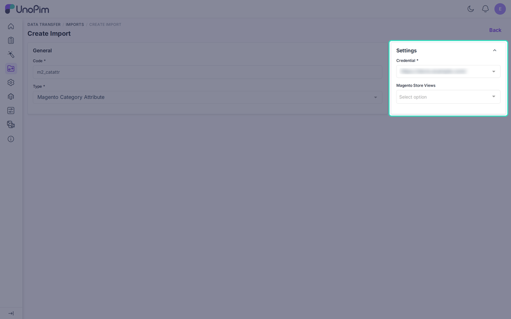
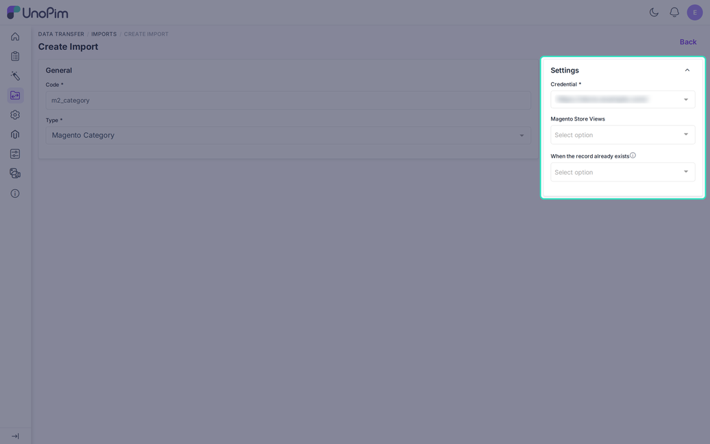

# Import Magento Category and Category Attribute

Two jobs bring category data from Magento into UnoPim.

- **Magento Category** imports the category tree.
- **Magento Category Attribute** imports Magento category attributes as UnoPim category fields.

Run the attribute job first, so the category job has fields to fill.

## Create a Job

Go to **Data Transfer > Imports > Create Import**. Enter a unique **Code** and choose the **Type**.

---

## Part 1: Magento Category Attribute

### What It Does

The job reads the category attributes from Magento and creates or updates UnoPim category fields. Labels and options are saved in the locale of the store view you choose.

### Filters

| Filter | Required | Description |
|---|---|---|
| **Credential** | Yes | The Magento store to read from. |
| **Magento Store Views** | No | One store view. It sets the locale of the imported labels. Empty means the "All Store View". |

### Type Conversion

| Magento input | UnoPim field type |
|---|---|
| Text | Text |
| Textarea | Textarea |
| Select | Select |
| Select with a Yes/No source | Boolean |
| Multiselect | Multiselect |
| Boolean | Boolean |
| Date | Date |
| Datetime | Datetime |
| Image | Image |
| Anything else | Text |

The job also copies the required, unique, rich text, status, position, and per-locale settings. Text fields get a number or decimal check when Magento stores them as numbers.

An existing field is only filled in, not overwritten. Options that Magento no longer sends are removed only when the field is overwritten.

---

## Part 2: Magento Category

### What It Does

The job reads the category tree and creates or updates UnoPim categories. It keeps the parent and child order and saves the names per locale.

### Filters

| Filter | Required | Description |
|---|---|---|
| **Credential** | Yes | The Magento store to read from. |
| **Magento Store Views** | No | One or more store views. Each adds its translated names. |
| **When the record already exists** | No | **Create only**, **Fill empty values** (default), or **Overwrite**. |

### How Store Views Work

The job always imports the **All Store View** first, which creates the categories. Then it goes through each store view you selected and adds the names in that view's locale.

Every selected view needs a channel, locale, and currency on the credential. If one is missing, the job stops before it starts and names the incomplete view.

### What Is Imported

- The **name** per locale, and the **enabled** status.
- The **hierarchy**. Magento's hidden root (ID 1) is skipped. "Default Category" (ID 2) becomes a top-level category.
- The **category code**, made from the name. If the code is taken, the Magento ID is added.
- Values for the fields on the [Category Fields](./category-mapping) tab, such as URL key, description, and image. Select values match by option code first and by label second. Images are downloaded.
- A missing parent is created first so the tree stays whole.

### The Three Existing-Record Choices

| Choice | Result |
|---|---|
| **Create only** | Existing categories stay untouched. They are counted as skipped. |
| **Fill empty values** | Only blank values and new items are written. |
| **Overwrite** | Magento data replaces what UnoPim has. |

## After the Import

Open **Catalog > Category Fields** and **Catalog > Categories** in UnoPim to check the result. Use **Download log** on the job page for any skipped rows.
