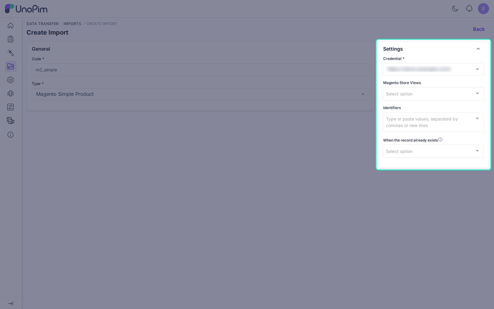
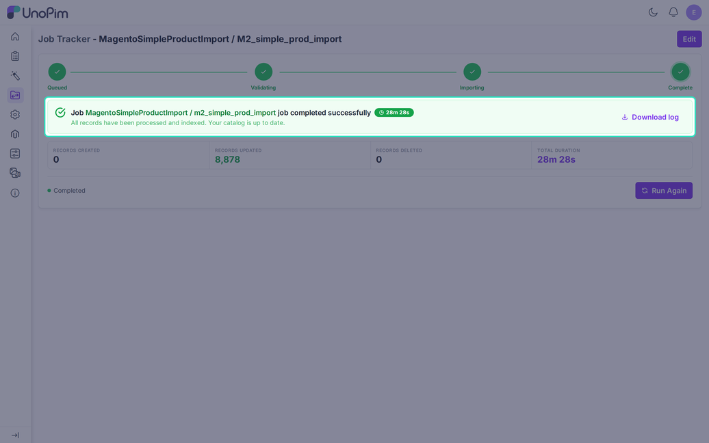
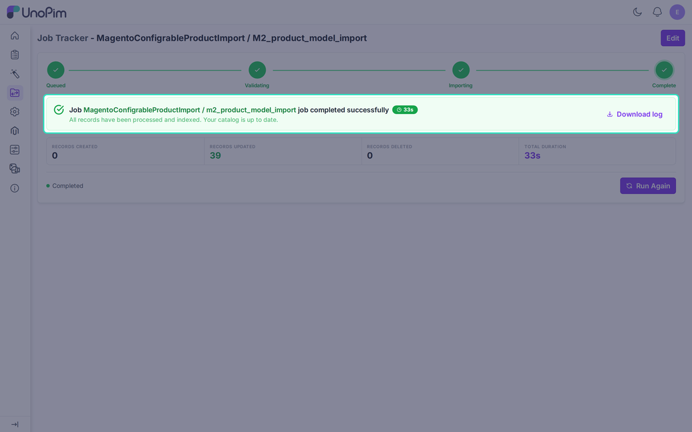
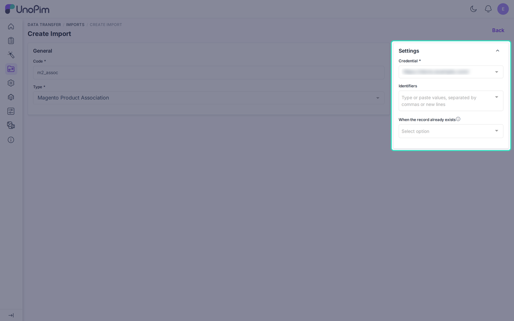

# Import Magento Product

Three jobs bring product data from Magento into UnoPim.

- **Magento Simple Product** imports simple and virtual products.
- **Magento Model Product** imports configurable products and links their variants.
- **Magento Product Association** imports related, up-sell, and cross-sell links.

A common use is to import a live catalog, improve it in UnoPim with better texts and more locales, and export it back.

## Before You Start

Import in this order. Each step needs the data of the earlier ones.

1. [Store View Details](./import-store-view): channels, locales, and currencies.
2. [Store view mapping](./shopview-mapping) on the credential.
3. [Category Attribute and Category](./import-category).
4. [Attribute, Attribute Set, Attribute Group](./import-attribute).
5. The [Attributes](./attribute-mapping), [Images](./image-mapping), and [Associations](./association-mapping) tabs, as far as you need them.
6. **Magento Simple Product**, then **Magento Model Product**, then **Magento Product Association**.

## Create a Job

Go to **Data Transfer > Imports > Create Import**. Enter a unique **Code** and choose the **Type**.

## Shared Filters

| Filter | Required | Description |
|---|---|---|
| **Credential** | Yes | The Magento store to read from. |
| **Magento Store Views** | No | One or more store views. Not on the association job. |
| **Identifiers** | No | A list of SKUs, separated by commas, spaces, or new lines. Only exact matches are imported. Empty means all products. |
| **When the record already exists** | No | **Create only**, **Fill empty values** (default), or **Overwrite**. |

### Store Views

The job always imports the **All Store View** first. Then it adds the values for each view you selected, in the channel, locale, and currency of that view. Several views fit in one job.

Each selected view must be fully mapped on the credential. Otherwise the job stops before it starts with a message like "The store view mapping for `eu_fr` is incomplete".

### Existing Products

| Choice | Result |
|---|---|
| **Create only** | Existing products are skipped. |
| **Fill empty values** | New values are added. Values already in UnoPim stay. |
| **Overwrite** | Magento values replace UnoPim values, including status and family. The SKU never changes. |

---

## Part 1: Simple Products

### What It Does

The job creates UnoPim products from Magento simple and virtual products. Other types, such as bundle and grouped, are not imported.

### What Gets Imported

- **SKU**. See the SKU note below.
- **Attribute family**, taken from the attribute set that the attribute set import matched. If there is none, the `default` family is used.
- **Status**: enabled or disabled.
- **Attribute values**, through the [Attributes](./attribute-mapping) tab. An attribute you did not map is imported under its own code when UnoPim has an attribute with that code. Otherwise it is skipped.
- **Prices** are saved in the currency of the store view. **Dates** keep the `Y-m-d` format.
- **Categories**, only those already imported. Others are ignored without a message.
- **Stock**, when **Quantity** or **Stock Status** is mapped. The connector reads Magento Multi-Source Inventory (MSI) and adds up all sources. If that request fails, stock is skipped and the log says so.
- **Images**, described below.

Select values need the option match created by the [attribute import](./import-attribute). A missing option is skipped and logged.

### Images

The [Images](./image-mapping) tab decides where each Magento image goes. A role match comes first, then the order of the images. Extra images go to a gallery or asset attribute.

- Only real images are kept: JPEG, PNG, GIF, and WebP. UnoPim checks the file itself, not the extension.
- The `no_selection` placeholder from Magento is skipped.
- Images download six at a time, up to 20 MB each.
- A file UnoPim already stored for the product is not downloaded again.
- Videos are not imported.

### SKU Note

A SKU stays as it is when it uses letters, numbers, hyphens, and underscores. Other characters turn into hyphens. If two products would end up with the same SKU, the Magento ID is added.

To keep the original Magento SKU, map Magento `sku` to a separate UnoPim attribute. If `sku` is mapped to the UnoPim SKU itself, the original is kept only in the mapping and the log warns you.

### Run It

Click **Import Now** on the job page. The job tracker shows the progress.

A product that fails to save is logged and skipped. The job goes on with the next one.

---

## Part 2: Configurable Products (Magento Model Product)

### What It Does

The job creates the configurable parent in UnoPim and links its variants. It imports only the Magento type `configurable`.

It does not create the variants. Run the simple product import first. The job then finds each variant by its Magento ID, not by its SKU.

### What Happens

- The parent is created with its variation attributes.
- Variants that are already in UnoPim are linked to the parent.
- A variant that is not in UnoPim yet is skipped. The log says "Variant skipped: not imported yet, run the Magento simple product import first".
- If there is no attribute set match, the log warns you.
- The job does not import stock. The summary counts parents only.

---

## Part 3: Import Product Associations

### What It Does

The job reads the **related**, **up-sell**, and **cross-sell** links and writes them to the matching UnoPim products. It always reads the **All Store View**, so it has no store view filter.

Each link type must be mapped on the [Associations](./association-mapping) tab. A link type with no mapping is skipped.

### Rules

- Only products that already exist in UnoPim are linked. Missing targets are dropped without a message.
- **Fill empty values** adds the new links to the existing ones.
- **Overwrite** replaces the whole set of links for that type.
- **Create only** leaves products that already have links alone.

---

## Download Log

Use **Download log** on the job page after every run. It helps when:

- The job stays pending.
- `0` records are imported.
- A product or image was skipped.
- A SKU did not arrive.

The log names the row, the SKU, and the reason, so you can fix the source data or the mapping and run the job again.
