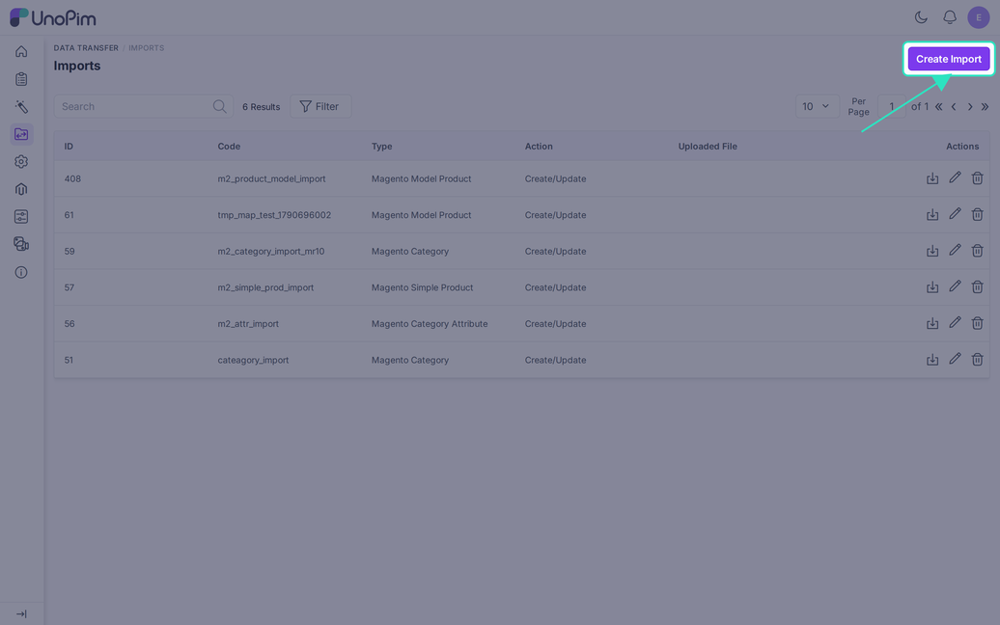
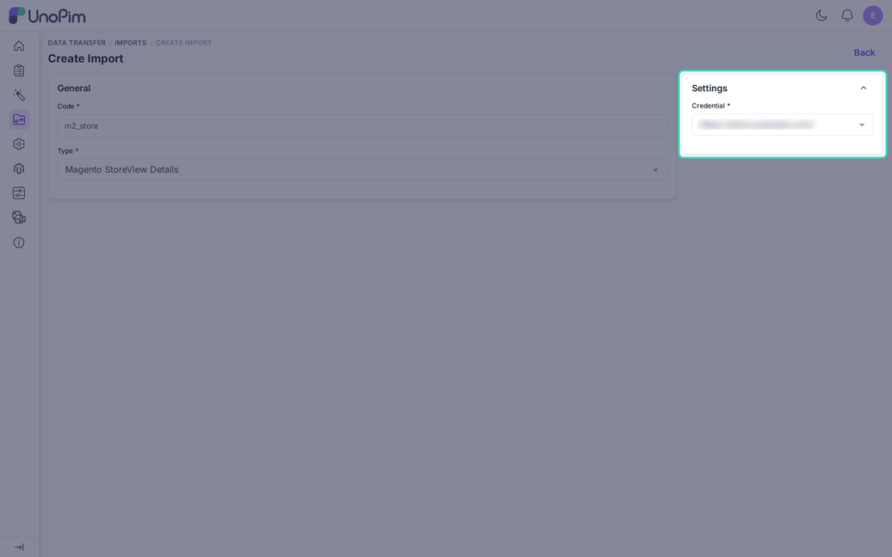

# Import Store View Details

The **Magento StoreView Details** job reads your Magento store groups and creates matching UnoPim **channels**, with their locales and currencies. Use it when you start from a Magento store and want the UnoPim channel setup to follow it.

It does not fill the **Store Views** tab on the credential. You still map each store view by hand. See [Store View Mapping](./shopview-mapping).

## Create the Job

Go to **Data Transfer > Imports > Create Import** and choose **Magento StoreView Details** as the **Type**. Enter a unique **Code**.

| Filter | Required | What it does |
|---|---|---|
| **Credential** | Yes | The Magento store to read from. |

Click **Save**, then **Import Now**.

## What Gets Created

For each Magento store group, the job creates or updates one UnoPim channel:

- **Code and name**: taken from the store group. The group with the code `default` is skipped.
- **Locales**: every locale used by the store views of the same Magento website. A missing locale is created and activated.
- **Currencies**: every base currency used by those store views. A missing currency is created with no decimals.
- **Root category**: found through the category mapping. Import categories first, or the channel is created without one and the log shows a warning.

## If the Channel Already Exists

The job never removes anything from an existing channel.

- Name, description, and root category stay as they are when they already have a value.
- Locales and currencies from Magento are added to the ones the channel already has.

## Good Order

1. Run this job to create channels, locales, and currencies.
2. Run [Import Category](./import-category), then run this job again to set root categories.
3. Open the credential and map every store view on the [Store Views tab](./shopview-mapping).

Re-run the job when Magento gets a new store group or a new language.
