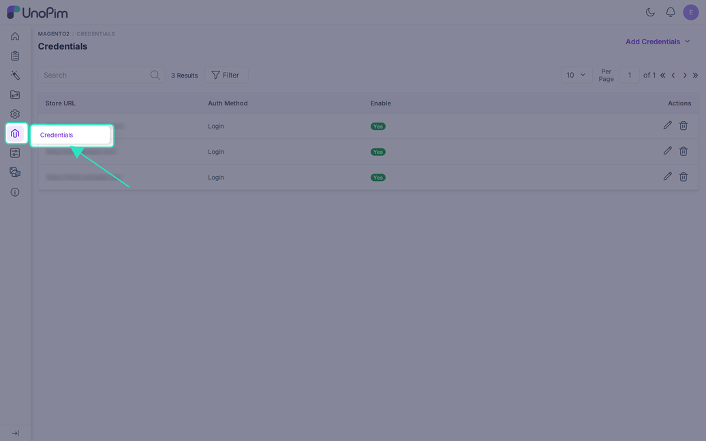
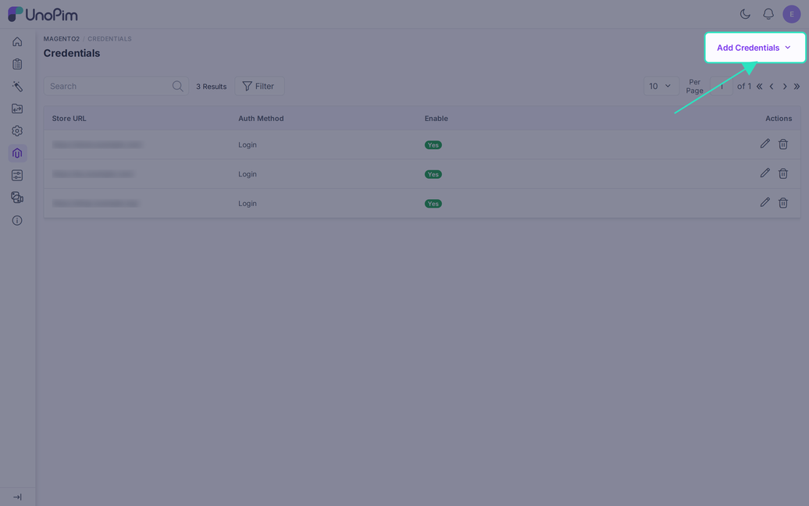
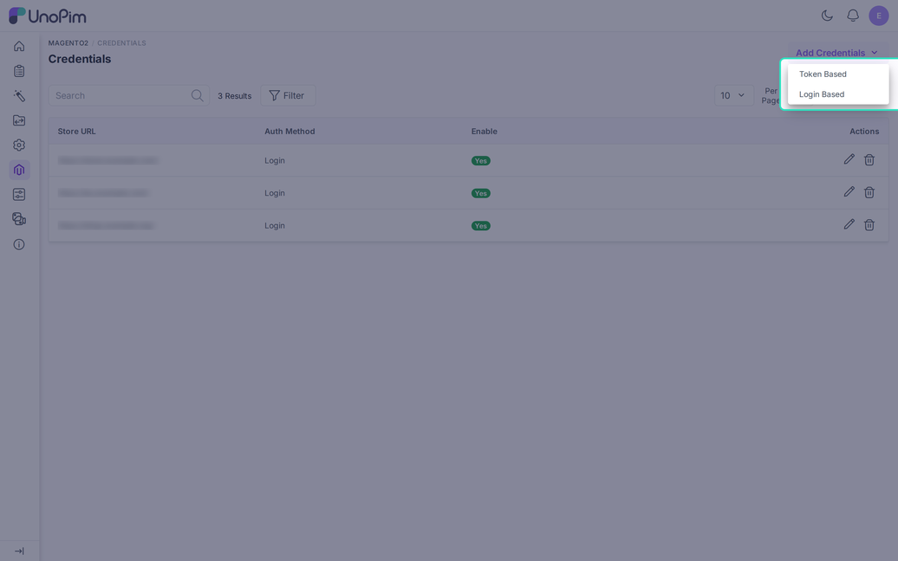
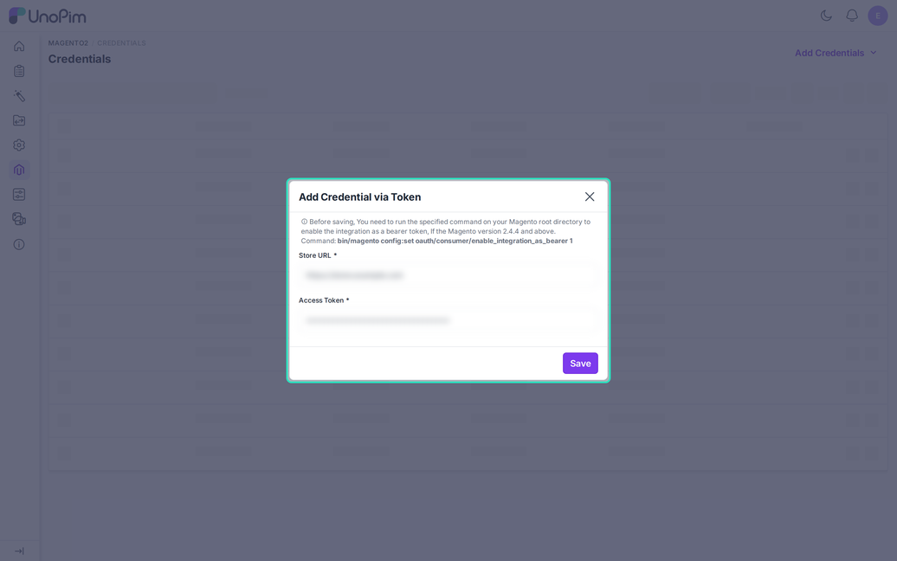
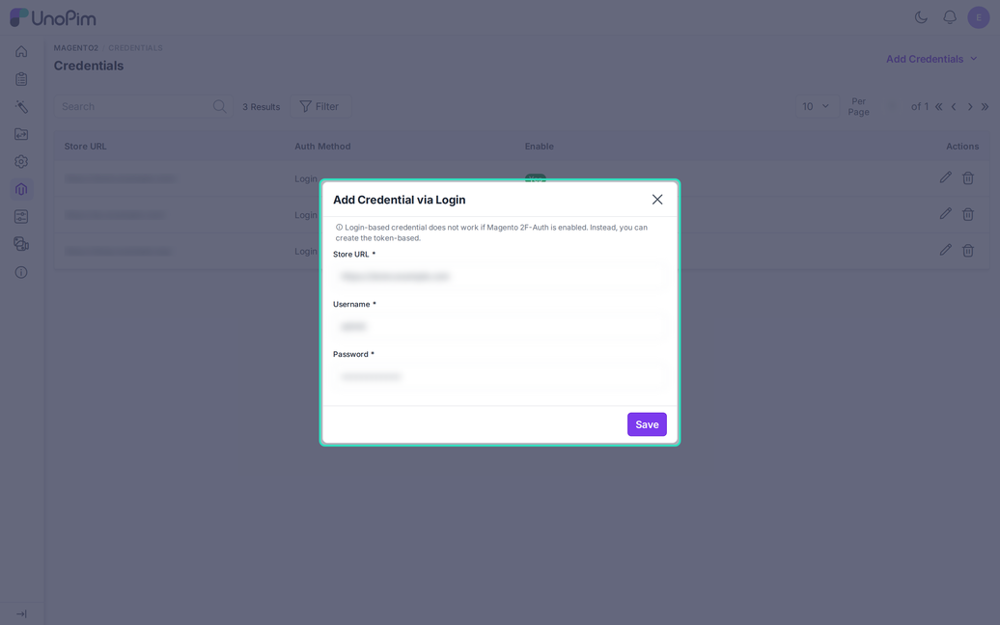
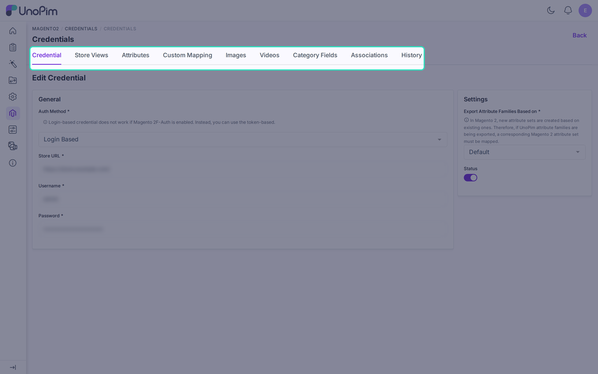
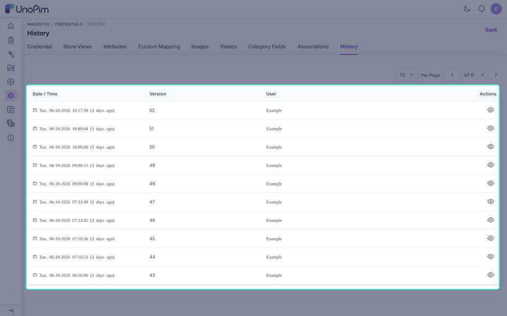

# Setup Credentials in UnoPim

A credential tells UnoPim how to reach one Magento 2 store. Every import and export job asks you to pick a credential, so this is the first thing to set up after installation.

You manage credentials under **Magento2 > Credentials** in the UnoPim sidebar. Each credential has its own tabs for mappings, so one UnoPim instance can serve several Magento stores with different rules.



Credentials is the only Magento2 entry in the sidebar. All mappings now live as tabs inside each credential.



## Before You Start

Check these points first. They cause most failed connections.

- The Store URL must be public. UnoPim rejects private, internal, and localhost addresses with the message "The Store URL must point to a public host, not a private or internal address."
- Each Store URL can be saved only once. A second credential for the same URL shows "This Store URL is already in use".
- When you save, UnoPim calls Magento to test the login. A wrong URL, token, or password stops the save and shows the reason.

> [!NOTE]
> On a development machine you can allow private hosts by setting `MAGENTO2_ALLOW_PRIVATE_HOSTS=true` in the UnoPim `.env` file. Leave it off in production.

## Choose an Authentication Method

Click **Add Credentials** and pick one of two options.



| Method | Use it when | Limit |
|---|---|---|
| **Token Based** | You want a dedicated API connection. This is the recommended choice. | Needs an integration in Magento. |
| **Login Based** | You want to connect with a Magento admin account. | Does not work when Magento two-factor authentication (2FA) is on. |

## Token-Based Credentials

### Step 1: Create an Integration in Magento

In the Magento admin, go to **System > Integrations > Add New Integration**.

Enter a **Name** and your admin **Password**. Then open the **API** tab and give the integration access, either **All** or **Custom** resources. Click **Save**.

### Step 2: Check the Magento Permissions

If you choose **Custom** resources, turn on every area the connector reads or writes:

- Catalog, Inventory, Products, Categories
- Product Attachment
- Stores, Settings, Currency
- Attributes

If a job later fails with an access error, a missing permission here is the usual cause.

### Step 3: Activate the Integration

Back on the **Integrations** page, click **Activate** on your integration. Then click **Allow**.

Magento now shows four values: Consumer Key, Consumer Secret, Access Token, and Access Token Secret. UnoPim needs only the **Access Token**. Copy it and keep it safe.

### Step 4: Allow Bearer Tokens (Magento 2.4.4 and Later)

From Magento 2.4.4, integration tokens work as bearer tokens only after you switch this on. Run this in the Magento root folder:

```bash
bin/magento config:set oauth/consumer/enable_integration_as_bearer 1
```

You can skip this step if it was done before.

### Step 5: Save the Credential in UnoPim

Go to **Magento2 > Credentials**, click **Add Credentials**, and choose **Token Based**.



1. Enter the **Store URL**, for example `https://store.example.com`.
2. Paste the **Access Token**.
3. Click **Save**.

## Login-Based Credentials

Go to **Magento2 > Credentials**, click **Add Credentials**, and choose **Login Based**.



1. Enter the **Store URL**.
2. Enter the Magento admin **Username**.
3. Enter the admin **Password**.
4. Click **Save**.

> [!NOTE]
> Login-based credentials fail when Magento 2FA is enabled. Use a token-based credential in that case.

## Edit a Credential

Click any row in the list, or its pencil icon, to open the credential. The page has nine tabs.



| Tab | What it holds |
|---|---|
| **Credential** | Login details, base attribute set, and the status switch. |
| **Store Views** | Magento store view to UnoPim channel, locale, and currency. |
| **Attributes** | Standard product field mapping. See [Attribute Mapping](./attribute-mapping). |
| **Custom Mapping** | Attributes sent as Magento custom attributes. See [Custom Mapping](./custom-mapping). |
| **Images** | Image roles, alt text, and visibility. See [Image Mapping](./image-mapping). |
| **Videos** | Video title, preview, and description. See [Video Mapping](./video-mapping). |
| **Category Fields** | Category field mapping. See [Category Mapping](./category-mapping). |
| **Associations** | Related, up-sell, and cross-sell links. See [Association Mapping](./association-mapping). |
| **History** | Who changed this credential and its mappings, and when. |

### Settings on the Credential Tab

- **Export Attribute Families Based on**: Magento builds a new attribute set from an existing one. Pick the Magento set that UnoPim should copy when it exports a family. It is required, and the default is the Magento set with ID 4.
- **Status**: when you switch it off, export jobs for this credential fail and the credential disappears from the job forms. Use it to pause a store without deleting the credential.

### Refresh from Magento

UnoPim keeps a saved copy of your Magento store views and attribute sets. If that copy is empty, the **Refresh from Magento** button appears. Click it to load both lists again.

Saving the credential also reloads the store views.

### Secrets Stay Hidden

UnoPim stores the password and access token encrypted. The edit page shows them as dots. Leave the dots as they are to keep the saved value, or type a new value to replace it.

## Store View Mapping

The **Store Views** tab links each Magento store view to a UnoPim channel, locale, and currency. Without it, UnoPim cannot tell which language or price belongs to which storefront.

Details and an example are on the [Store View Mapping](./shopview-mapping) page.

## History

The **History** tab lists every saved version of the credential and its mappings. Each row shows the date, a version number, and the user. Click the eye icon to see what changed.



Passwords and tokens never appear in the history.

## Permissions

Admins need the right roles to see these screens. Set them under **Settings > Roles**.

- **Credentials**: view, create, edit, delete.
- **Mappings**: attribute, custom mapping, image, video, category field, and association.

A user with the credential **Edit** permission can open every mapping tab and save it.
