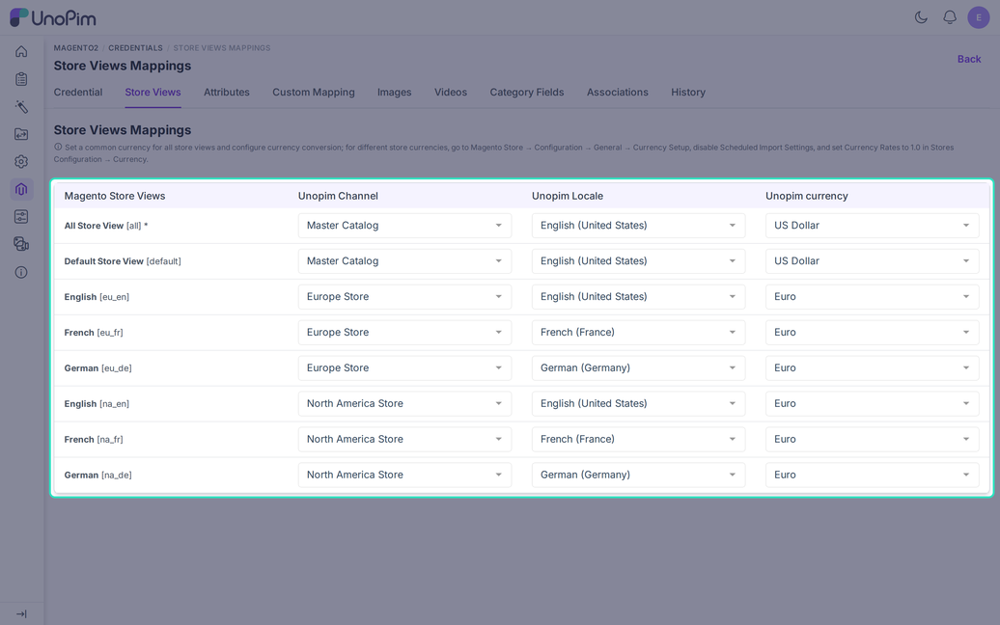

# Store View Mapping

The **Store Views** tab links each Magento store view to a UnoPim channel, locale, and currency. Every export and import job reads this table, so fill it in before you run a job.

Open it from **Magento2 > Credentials**, click a credential, then choose the **Store Views** tab.

## Why It Matters

A Magento store view is one language and price setup of a store. A shop with an English, a French, and a German view needs UnoPim to know which locale feeds which view.

Without the mapping, UnoPim cannot pick the right translation or price for a view. Jobs that need it stop with a message such as "The store view mapping for `eu_fr` is incomplete".

## The Columns

| Column | What to choose |
|---|---|
| **Magento Store Views** | Read-only. Shows the store view name and its code, for example `French [eu_fr]`. |
| **UnoPim Channel** | The channel whose products and categories this view uses. |
| **UnoPim Locale** | The language UnoPim reads or writes for this view. |
| **UnoPim Currency** | The currency used for prices in this view. |

## Rules to Know

- The **All Store View** row is required. It stands for Magento's default scope, and every job starts with it.
- The channel must exist in UnoPim. The locale and currency must be active.
- Rows you leave empty are skipped.
- Store view codes may use lowercase letters, numbers, and underscores, and must start with a letter.

## Example

| Magento store view | UnoPim channel | Locale | Currency |
|---|---|---|---|
| All Store View `[all]` | `default` | `en_US` | `USD` |
| English `[eu_en]` | `europe` | `en_US` | `EUR` |
| French `[eu_fr]` | `europe` | `fr_FR` | `EUR` |
| German `[eu_de]` | `europe` | `de_DE` | `EUR` |

## Currencies in Magento

Magento holds prices in the base currency and converts them with rates. Choose one of these two setups.

- **One currency for all views.** Map every view to the same currency and let Magento convert prices.
- **A different currency for each view.** In Magento, go to **Stores > Configuration > General > Currency Setup** and turn off **Scheduled Import Settings**. Then set every rate to `1.0` under **Stores > Currency Rates**, so Magento does not change the prices UnoPim sends.

## Loading the Store Views

UnoPim keeps a saved copy of the store views. The table is empty at first, and the page shows "Store views have not been loaded from Magento yet".

Click **Refresh from Magento** to load them. Saving the credential also reloads them. Do this again whenever someone adds or renames a store view in Magento.

## Related Job: Import StoreView Details

You can also build the UnoPim side from Magento. The **Magento StoreView Details** import creates channels, locales, and currencies from your Magento store groups. It does not fill this table, so you still map the views by hand. See [Import Store View Details](./import-store-view).
