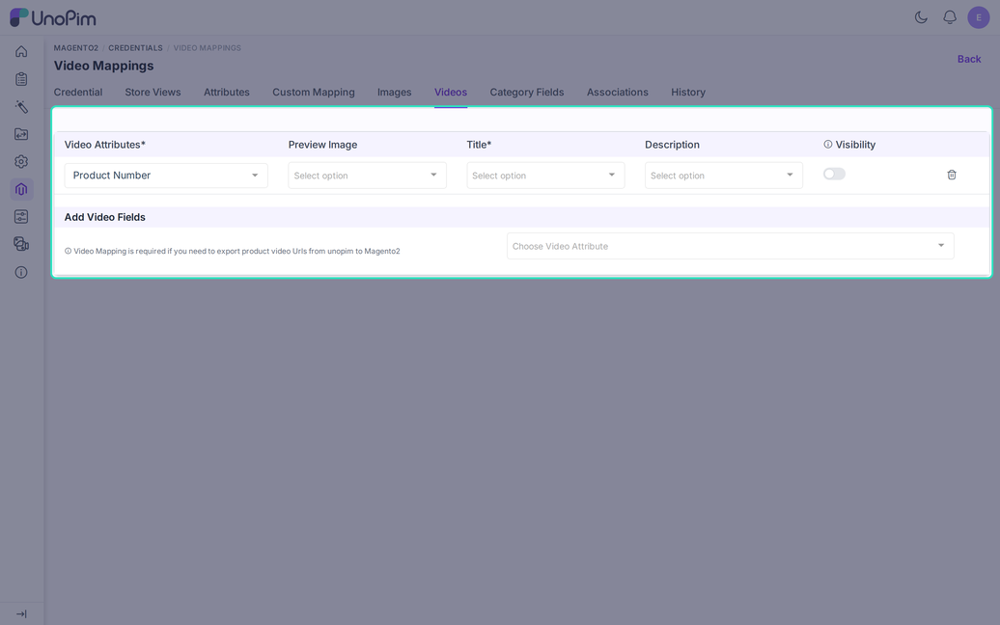

# Video Mapping

The **Videos** tab maps the UnoPim attributes that hold video links, so Magento can show them on the product page.

Open it from **Magento2 > Credentials**, click a credential, then choose **Videos**.

> [!NOTE]
> Videos are exported only when **With Media** is switched on in the product export job.

## Add a Video Field

Use **Add Video Fields** and pick a **Video Attribute**. The list offers text attributes whose validation is empty or set to URL. Attributes already used in another mapping are hidden.

## The Columns

| Column | Required | What it does |
|---|---|---|
| **Video Attributes** | Yes | The UnoPim attribute with the video URL. |
| **Title** | Yes | The attribute with the video title. The server rejects a row without it. |
| **Preview Image** | Yes in the form | The attribute with the preview picture. |
| **Description** | No | The attribute with a short description. |
| **Visibility** | No | Shows or hides the video on the product page. |

## Rules

- Each video attribute can be added once.
- A product with a video but no readable preview image is skipped for that video in the REST export. The log says "Video skipped: Magento needs a preview image".
- The CSV export needs only a title. Without one the log says "This video cannot be exported because its title is not mapped".
- YouTube and Vimeo links are recognised. Other hosts are sent without a provider name.
- The **Visibility** switch works for the CSV export. The REST export always sends the video as visible.

## Tips

- Use full links, for example `https://www.youtube.com/watch?v=...`.
- Keep the preview image as a normal image attribute with a file in storage.
