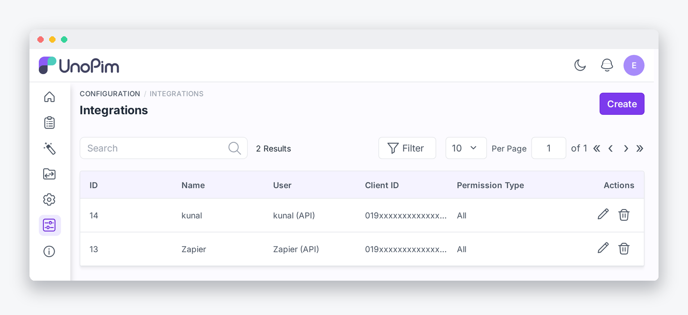

# Connect UnoPim in n8n

n8n authenticates against UnoPim's existing OAuth **password grant**. There is no consent screen to click through. You paste five values into the credential and the node exchanges them for a bearer token it caches and reuses.

All the UnoPim values come from a **single row** on the API Keys screen.

**Open it from:** *Configuration → Integrations*

---

## Step 1. Create the API key in UnoPim

1. Go to **Configuration → Integrations**.

   

2. Click **Create** in the top right corner.

3. Give it a name. *n8n* is a good one. Then choose a **Permission Type**.

   | Permission Type | When to use it |
   |---|---|
   | **All** | Simplest. The key can reach every API route, which is what a general purpose n8n connection needs. |
   | **Custom** | Tick the individual permissions instead. For n8n you need **n8n**, **Subscriptions**, **Create**, **Delete** and **Trigger Samples**, plus the permissions for whichever resources your workflows read or write. |

4. Save. UnoPim generates the credentials and shows the **API Password once**. Copy it now.

5. Open the key again to see the rest of the values.

   

> [!TIP]
> The **Secret Key** and **API Password** are masked once saved. If you lose either, use the regenerate icon next to it. The new value is shown only once, and any existing n8n credential has to be updated afterwards.

---

## Step 2. Create the credential in n8n

In n8n go to **Credentials** → **Create credential** → search for **UnoPim API**.

Five fields:

| n8n field | What goes in it | Where it is on the UnoPim screen |
|---|---|---|
| **UnoPim URL** | The root URL of your instance, for example `https://pim.example.com` | not on that screen |
| **Client ID** | The OAuth client identifier | **Client ID** |
| **Client Secret** | The OAuth client secret | **Secret Key** |
| **Username** | The generated API user, shaped `integration+<uuid>@api.local` | **API Username** |
| **Password** | The generated API password | **API Password** |

The UnoPim labels and the n8n labels differ in three places. n8n's *Client Secret* is UnoPim's **Secret Key**, n8n's *Username* is UnoPim's **API Username**, and n8n's *Password* is UnoPim's **API Password**.

> [!CAUTION]
> ### The Username is not your admin login
>
> The **Username** field takes the generated **API Username** from the API Keys screen, a value shaped `integration+<uuid>@api.local`. It is **not** the email address you sign into the UnoPim admin with.
>
> This is the single biggest support trap with this connector. UnoPim ties each key's OAuth client to the generated API user on the same row, so a username that does not resolve to that client is rejected at the token step. `/oauth/token` answers **`invalid_client`**, no token is issued, and the connection never completes.
>
> The same error appears if the Username is clipped when copying, because the value is 58 characters long. Copy all four credential values from **the same row** of the API Keys screen and the problem disappears.

> [!WARNING]
> ### Use HTTPS in production
>
> The credential sends your client secret and API password in the request body. Over plain HTTP those travel in the clear. Use `https://` for anything other than a local test instance.

---

## Step 3. Test the connection

Click **Test** on the credential. The node calls `GET /api/v1/rest/n8n/me` and, on success, reports the instance it reached.

A successful test proves four things at once:

- The URL is right and UnoPim is reachable from n8n
- The four API key values are valid and belong together
- The key has the `api.n8n` permission
- The connector package is installed, because that endpoint does not exist otherwise

## What the URL must look like

The credential is strict about the URL, because a malformed one fails later in ways that are hard to read.

| Rule | Why |
|---|---|
| Must start with `http://` or `https://` | Without a scheme the request cannot be built |
| No trailing slash | A trailing slash produces `host//api/...`, which UnoPim will not route |
| No username or password in the URL | Credentials belong in the fields below, not the address |
| No query string or fragment | The node appends its own paths to this value |

The credential trims a trailing slash for you and rejects the rest with a message explaining what to fix.

## Where the credential can be used

The credential is locked to this connector's own nodes. The generic HTTP Request node cannot read it, so a workflow cannot borrow your PIM credentials for an unrelated call.

## Troubleshooting

| What you see | What it usually means |
|---|---|
| *Those credentials were rejected* | The Username is your admin login instead of the generated API username, or one of the four values came from a different row |
| *UnoPim did not return an access token* | The URL points somewhere other than the application root, so `/oauth/token` is not reachable there |
| *401 on every request after the test passed* | The API key was revoked or its permissions changed after the credential was saved |
| *404 on the test* | The connector package is not installed, or `php artisan optimize:clear` has not been run since installing it |

More cases in [Troubleshooting](./troubleshooting).

## Next

Build your first workflow: [Triggers](./triggers).
