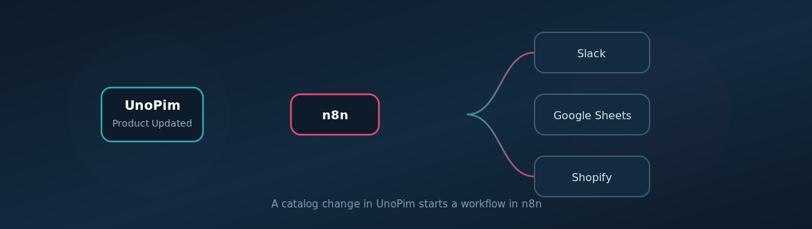

# n8n Connector

The **UnoPim n8n Connector** puts your catalog on [n8n](https://n8n.io). A product, category, attribute or family change in UnoPim starts a workflow, and that workflow can read and write your catalog back. The connector pairs the UnoPim backend package with the community node [`n8n-nodes-unopim`](https://www.npmjs.com/package/n8n-nodes-unopim) on npm.

Every trigger is an **instant webhook**. UnoPim pushes the moment a record changes, so there is no polling interval to tune and no delay to explain.

n8n runs on your own infrastructure and does not bill per task, which changes what is practical. Bulk work is welcome here.

 

  

 

## What you can do

- **Trigger a workflow on any catalog change** with 17 instant events covering creates, updates and deletes for **products**, **categories**, **attributes** and **families**.
- **Watch everything with one workflow** using five wildcard events, including *Any Catalog Change*, so you do not build twelve near identical workflows.
- **Read and write eleven catalog resources** from n8n, each with list, read, create, replace, partial update and delete.
- **Work through the whole catalog** with a Return All toggle. It walks every page for you using keyset pagination, which stays fast on a large catalog.
- **Let an AI agent work the catalog** directly. The UnoPim node is available as an agent tool.
- **Keep values nested** so an expression reaches `values.common.name` without any flattening. Flattening is there if you prefer it, as a per workflow option.
- **Narrow the payload** to one locale and one channel when you only care about a single storefront.
- **See every delivery** on the [Delivery Logs](./delivery-logs) page, with the payload as sent and the response that came back.
- **Zero admin upkeep**. Workflows register themselves when switched on and disconnect themselves when switched off.

## The 17 events at a glance

Twelve concrete events:

| Entity | Events |
|---|---|
| **Product** | `product.created` · `product.updated` · `product.deleted` |
| **Category** | `category.created` · `category.updated` · `category.deleted` |
| **Attribute** | `attribute.created` · `attribute.updated` · `attribute.deleted` |
| **Family** | `family.created` · `family.updated` · `family.deleted` |

Plus five wildcards, for a workflow that cares *something* changed rather than exactly what:

| Key | Fires on |
|---|---|
| `product.any` | all three product events |
| `category.any` | all three category events |
| `attribute.any` | all three attribute events |
| `family.any` | all three family events |
| `catalog.any` | all twelve concrete events |

Every wildcard payload carries `entity` and `reference`, so one workflow listening on `catalog.any` can still tell a product from a family. See [Triggers](./triggers) for the full detail.

## The 11 resources you can read and write

| Resource | Endpoint |
|---|---|
| **Product** | `/products` |
| **Configurable Product** | `/configurable-products` |
| **Category** | `/categories` |
| **Attribute** | `/attributes` |
| **Attribute Group** | `/attribute-groups` |
| **Attribute Family** | `/families` |
| **Category Field** | `/category-fields` |
| **Association Type** | `/association-types` |
| **Locale** | `/locales` |
| **Channel** | `/channels` |
| **Currency** | `/currencies` |

These call UnoPim's existing REST API. See [Actions](./actions).

## Bulk work is practical here

n8n runs on your own server and does not charge per task, so a workflow that touches thousands of products costs nothing extra. **Return All** walks the whole result set for you.

That said, a first full catalog load still belongs to UnoPim's own **importers and exporters**. They batch, they retry, and they have a mapping UI. Use the connector for changes and for targeted bulk jobs, such as filling every product that is missing a French description.

## Before you start

You need:

1. A working **UnoPim** installation that your n8n instance can reach over HTTP or HTTPS.
2. An **n8n** instance that UnoPim can reach back, because deliveries are pushed to it. See [Triggers](./triggers) if your n8n has no reachable address.
3. The **n8n Connector** package installed in UnoPim. See [Installation](./installation).
4. A **queue worker on the `n8n` queue**. Deliveries are queued, and without a worker **no trigger ever fires**.
5. An **API key** under *Configuration → Integrations*. See [Connect UnoPim in n8n](./credentials).
6. The **UnoPim node** ([`n8n-nodes-unopim`](https://www.npmjs.com/package/n8n-nodes-unopim)) installed in n8n. See [Installation](./installation).

## Requirements

| Requirement | Details |
|---|---|
| **UnoPim** | 3.0+ (Laravel 13) |
| **PHP** | 8.4+ |
| **n8n** | 1.x or newer |
| **Node** | 22+ and npm 10+, only if you build the node package yourself |
| **Network** | UnoPim and n8n must be able to reach each other over HTTP or HTTPS |
| **Queue** | A worker running `php artisan queue:work --queue=n8n` |
