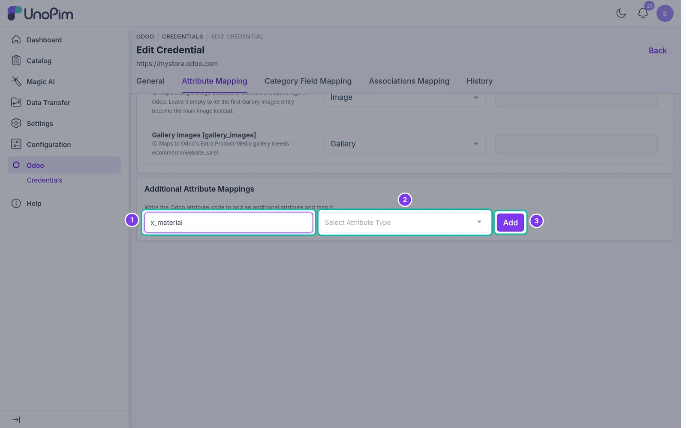

# Additional Attribute Mappings

Send more product fields to Odoo than the default list.

## Overview

The [Attribute Mapping](./attribute-mapping) tab lists the standard Odoo product fields. If your Odoo store has other fields - including custom `x_` fields added by Odoo Studio or a module - you can add them here and map them to UnoPim attributes.

Additional fields are saved per credential, just like the rest of the mapping.

## Add a field

Open **Odoo → Credentials → edit → Attribute Mapping** and scroll to **Additional Attribute Mappings** at the bottom of the page.

1. **Odoo Attribute Code** - enter the technical name of the Odoo field, e.g. `x_material`.
2. **Attribute Type** - choose the UnoPim attribute type for this field (text, textarea, select, boolean, price, and so on). Only attributes of this type are offered in the mapping dropdown.
3. Click **Add**.

The new field appears in the mapping list above. Choose the UnoPim attribute (or a fixed value) for it, then click **Save changes**.

> **Tip:** You can find a field's technical name in Odoo by turning on **Developer mode** and hovering over the field label.

## Remove a field

Click the delete icon next to an additional field and confirm. Removing the field only stops it from being exported - nothing is deleted in Odoo.
