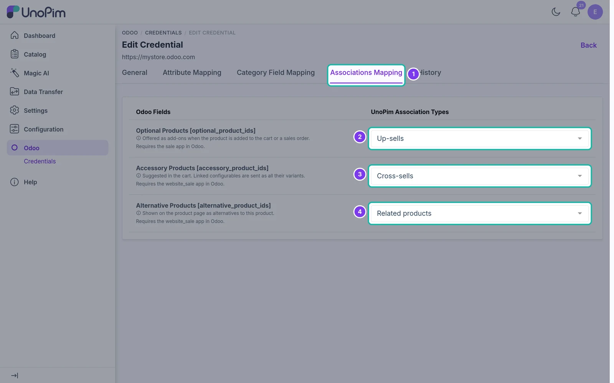

# Associations Mapping

Link UnoPim product associations to Odoo's related-product fields.

## Overview

UnoPim products can be linked to each other through **association types** such as *Up-sells*, *Cross-sells* and *Related products*. Odoo has three similar fields on each product. The **Associations Mapping** tab tells the connector which UnoPim association type fills which Odoo field.

This mapping is used by both the [Product Associations export](./export-product-associations) and the [Product Associations import](./product-association-import).

## Open the Associations Mapping

Go to **Odoo → Credentials**, edit your credential and open the **Associations Mapping** tab.

## Odoo association fields

| Odoo field | Where it appears in Odoo | Odoo app needed |
| --- | --- | --- |
| **Optional Products** `[optional_product_ids]` | Offered as add-ons when the product is added to the cart or a sales order. | Sales (`sale`) |
| **Accessory Products** `[accessory_product_ids]` | Suggested in the cart. Linked configurable products are sent as all their variants. | eCommerce (`website_sale`) |
| **Alternative Products** `[alternative_product_ids]` | Shown on the product page as alternatives to the product. | eCommerce (`website_sale`) |

For each Odoo field, choose a **UnoPim Association Type** from the dropdown, or **Not mapped** to skip the field.

Click **Save changes** in the bar at the bottom of the page.

> **Note:** If no field is mapped, the association export and import jobs stop with *"Associations mapping not found!"*.
