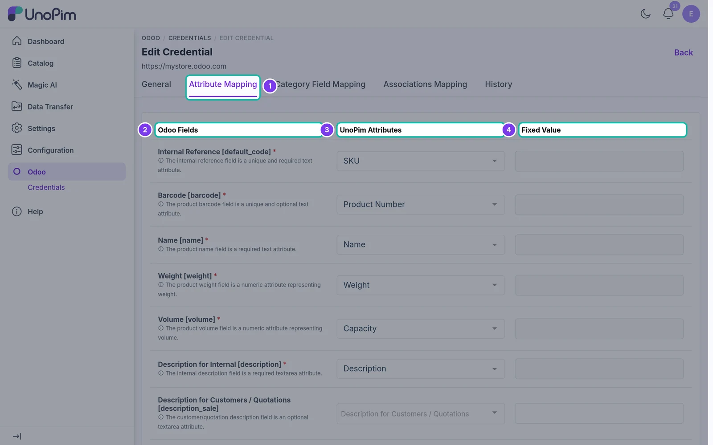
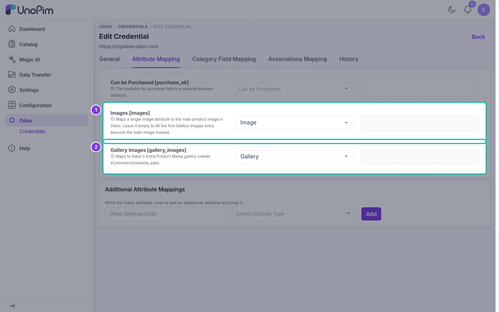

# Attribute Mapping

Map UnoPim product attributes to Odoo product fields before exporting products.

## Overview

When you export products to Odoo, the connector uses the attribute mapping of the selected credential to decide which UnoPim value goes into each Odoo field.

Since version 1.3.0, the mapping belongs to the **credential**. If you connect more than one Odoo store, each store has its own attribute mapping.

## Open the Attribute Mapping

1. Go to **Odoo → Credentials**.
2. Click the **edit** icon of the credential you want to configure.
3. Open the **Attribute Mapping** tab.

## How the mapping screen works

| Column | Purpose |
| --- | --- |
| **Odoo Fields** | Destination fields in Odoo. The technical field name is shown in brackets, e.g. `[default_code]`. Required fields are marked with `*`. |
| **UnoPim Attributes** | The UnoPim attribute whose value is written to the Odoo field. Only attributes of a matching type are listed. |
| **Fixed Value** | A value written to the Odoo field for every exported product, regardless of UnoPim data. |

Use **Fixed Value** when all exported products should share the same value for a field (for example, a default product type or route). Each field takes either an attribute or a fixed value - selecting one disables the other.

## Default mappable product fields

Fields marked **Yes** must be mapped (or given a fixed value) before products can be exported.

| Odoo field | Type | Required | Notes |
| --- | --- | --- | --- |
| **Internal Reference** `[default_code]` | Text | Yes | Unique product identifier. |
| **Barcode** `[barcode]` | Text | Yes | Unique barcode. |
| **Name** `[name]` | Text | Yes | Product name. |
| **Weight** `[weight]` | Number / Measurement | Yes | Measurement attributes are converted to Odoo's weight unit. |
| **Volume** `[volume]` | Number / Measurement | Yes | Measurement attributes are converted to Odoo's volume unit. |
| **Description for Internal** `[description]` | Textarea | Yes | Internal description. |
| **Description for Customers / Quotations** `[description_sale]` | Textarea | No | Customer or quotation description. |
| **Ecommerce Description** `[description_ecommerce]` | Textarea | No | eCommerce description. |
| **Description for Vendors** `[description_purchase]` | Textarea | No | Vendor description. |
| **Description for Delivery Orders** `[description_pickingout]` | Text | No | Delivery order notes. |
| **Description for Receptions** `[description_pickingin]` | Text | No | Reception notes. |
| **Description for Internal Transfers** `[description_picking]` | Text | No | Internal transfer notes. |
| **Cost** `[standard_price]` | Price | No | Cost price. |
| **Sale Price** `[list_price]` | Price | No | Retail or sale price. |
| **Can be Sold** `[sale_ok]` | Boolean | No | Flag for sellable products. |
| **Routes** `[route_ids]` | Multi-select | No | Stock movement routes. |
| **Taxes** `[taxes_id]` | Multi-select | No | Customer or sales taxes. |
| **Purchase Taxes** `[supplier_taxes_id]` | Multi-select | No | Supplier or purchase taxes. |
| **Product Type** `[type]` | Selection | No | The product type in Odoo. |
| **Can be Purchased** `[purchase_ok]` | Boolean | No | Flag for purchasable products. |
| **Images** `[images]` | Image | No | The main product image. |
| **Gallery Images** `[gallery_images]` | Gallery | No | Extra product images. |

## Images and gallery

Two fields control product media:

1. **Images** - map a single **image** attribute. Its value becomes the main product image in Odoo. Leave it empty to use the first gallery image as the main image instead.
2. **Gallery Images** - map a **gallery** attribute. Its images are exported to Odoo's **Extra Product Media**, which needs the Odoo **eCommerce** (`website_sale`) app.

> **Note:** Media is only sent when **With Media** is turned on in the product export job.

## Configure the mapping

1. For each Odoo field you want to export, choose the matching **UnoPim attribute**.
2. Optionally enter a **Fixed Value**.
3. To send a field that is not in the list, add it under [Additional Attribute Mappings](./additional-mapping).
4. Click **Save changes** in the unsaved changes bar at the bottom of the page.

New product exports for this credential use the saved mapping. Every save is recorded in the credential's [History](./mapping-history).
