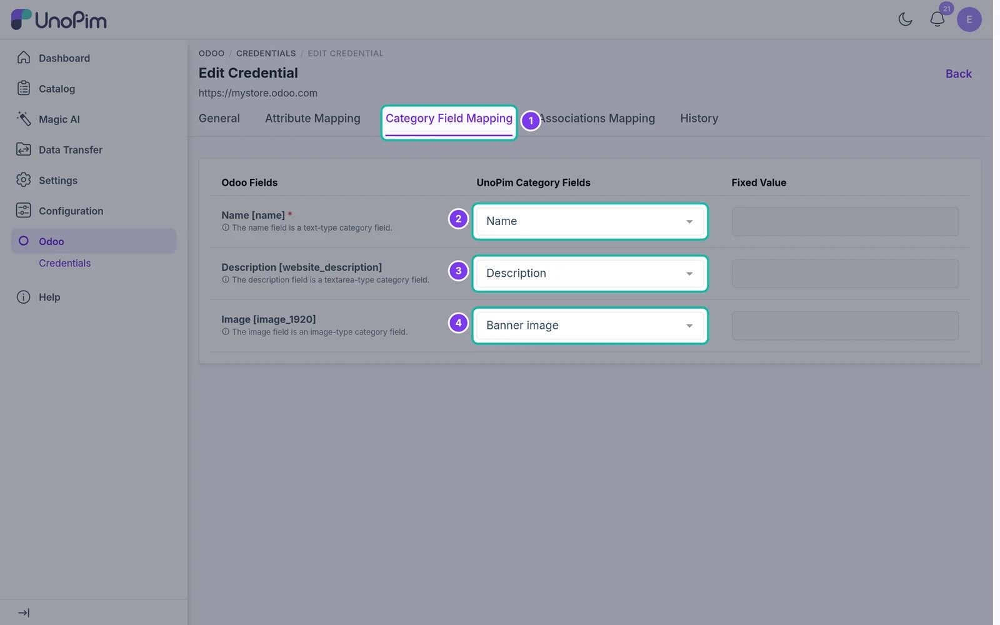

# Category Field Mapping

Map UnoPim category fields to Odoo category fields before exporting categories.

## Overview

When you export categories to Odoo, the connector uses the category field mapping of the selected credential to decide which category data is sent to each Odoo field.

## Open the Category Field Mapping

Go to **Odoo → Credentials**, edit your credential and open the **Category Field Mapping** tab.

The screen has three columns:

| Column | Purpose |
| --- | --- |
| **Odoo Fields** | Destination fields in Odoo where UnoPim category data is written. |
| **UnoPim Category Fields** | The UnoPim category field that fills each Odoo field. |
| **Fixed Value** | A value used for every exported category, regardless of UnoPim data. |

## Mappable category fields

| Odoo field | Type | Notes |
| --- | --- | --- |
| **Name** `[name]` | Text | Required. The category name in Odoo. |
| **Description** `[website_description]` | Textarea | Category description, shown on eCommerce category pages. |
| **Image** `[image_1920]` | Image | Category image. |

> **Note:** The category tree (parent and child categories) is exported automatically - you don't need to map it.

## Save

Choose a UnoPim category field (or a fixed value) for each Odoo field and click **Save changes** in the bar at the bottom of the page. New category exports for this credential use the saved mapping.
