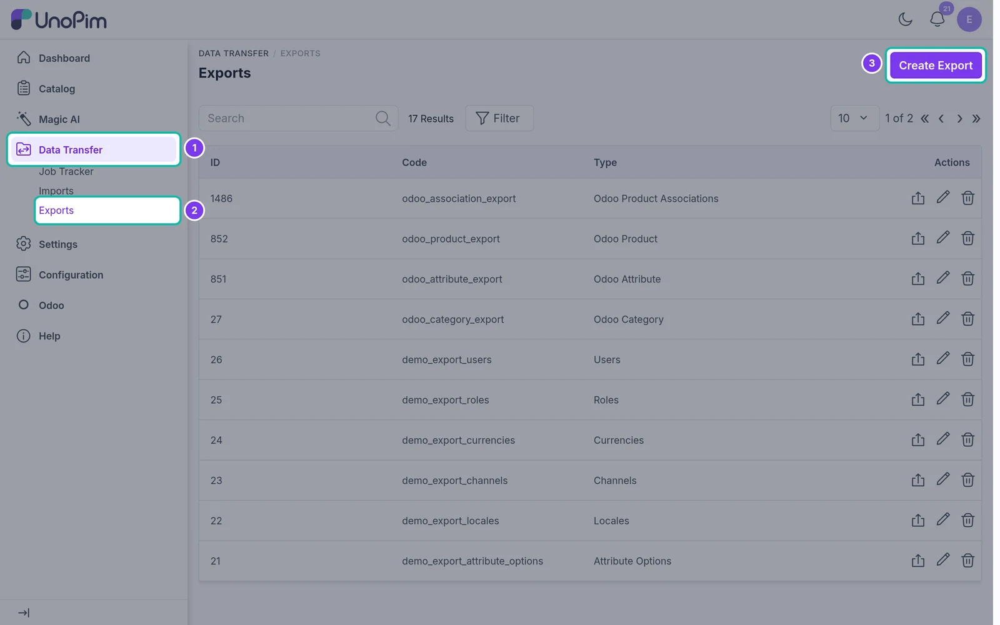
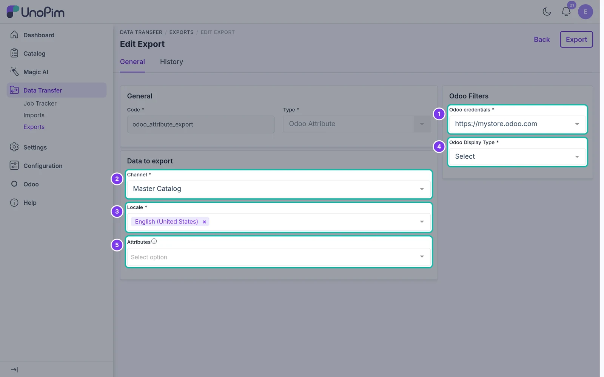
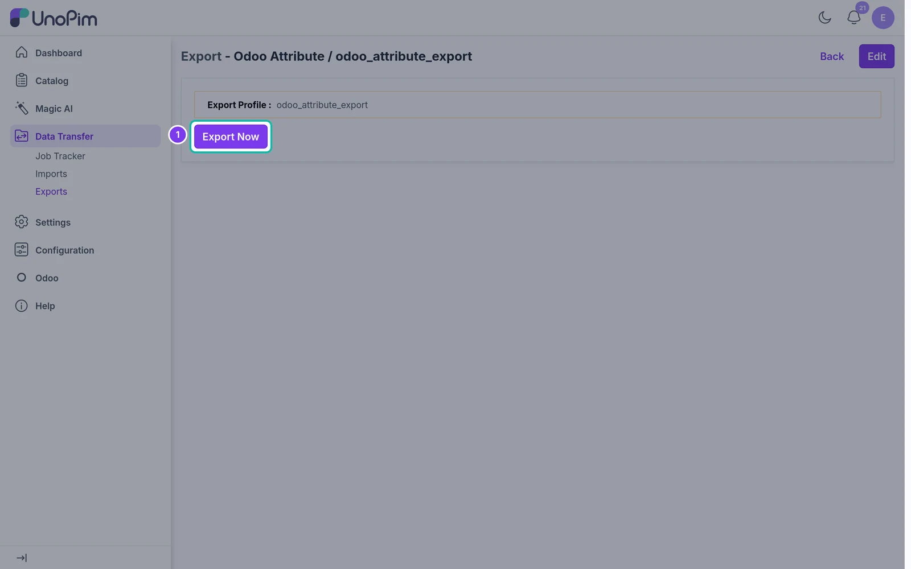
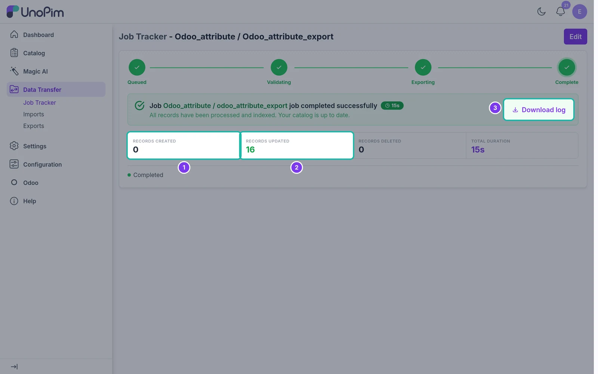

# Export Attributes

Export UnoPim attributes and their options to Odoo.

## Overview

The **Odoo Attribute** export job creates or updates **product attributes** and their **values** in Odoo. Run it before exporting products, so that configurable products can use these attributes for their variants.

Only **select**, **multiselect** and **checkbox** attributes are exported - these are the attribute types Odoo can use as product attributes.

## Step 1 - Open Exports

In the sidebar, go to **Data Transfer → Exports** and click **Create Export**.

## Step 2 - Enter a Code and Select the Type

Enter a unique **Code** for the job, e.g. `odoo_attribute_export`. Open the **Type** dropdown and choose **Odoo Attribute**.

## Step 3 - Set the Filters

| Filter | What it does |
|---|---|
| **Odoo credentials** | The Odoo store to export to. Required. |
| **Channel** | The UnoPim channel to read labels from. Required. |
| **Locale** | One or more locales for the attribute and option labels. Required. |
| **Odoo Display Type** | How the attribute is shown in Odoo: **Select**, **Radio**, **Color**, **Pills** or **Multi-checkbox**. Required. |
| **Attributes** | Pick the attributes to export. Leave it empty to export every select, multiselect and checkbox attribute. |

> **Variant creation mode:** attributes exported with the **Multi-checkbox** display type are created in Odoo with variant creation set to **Never** - they describe the product but don't create variants. All other display types use **Instantly**, so they can create variants. If an attribute is already used on products in Odoo, its variant creation mode is left unchanged and a warning is written to the job log.

## Step 4 - Save the Export

Click **Save changes** in the bar at the bottom of the page. The export job page opens.

## Step 5 - Run the Export

Click **Export Now** to start the job.

## Step 6 - Check the Result

UnoPim opens the **Job Tracker**. When the job finishes you'll see how many records were **created** and **updated** in Odoo. Click **Download log** to see warnings or errors for individual attributes.

Run the job again at any time - attributes and options that already exist in Odoo are updated, new ones are created.
