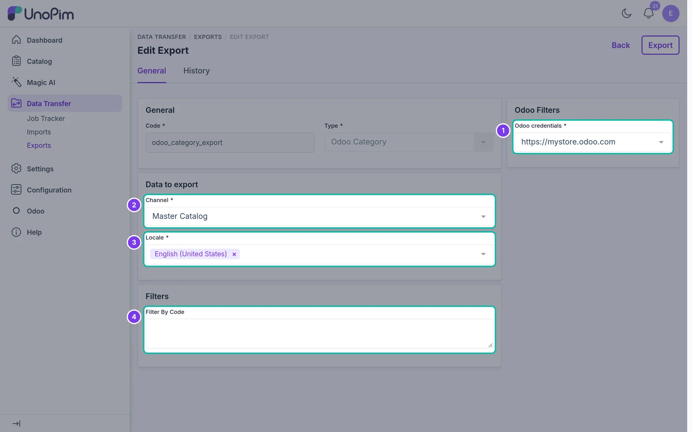
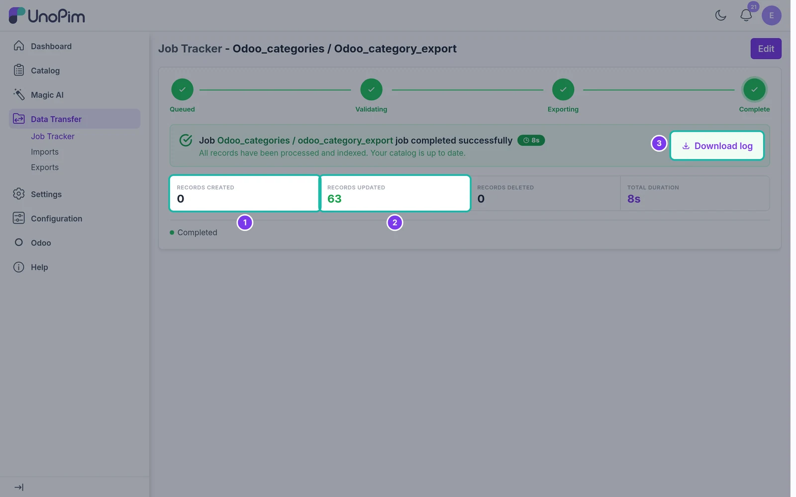

# Export Categories

Export your UnoPim category tree to Odoo.

## Overview

The **Odoo Category** export job creates or updates categories in Odoo, keeping the parent/child structure. Which Odoo fields are filled depends on the credential's [Category Field Mapping](./category-mapping).

If **Categories export as E-Commerce categories** is turned on in the [credential](./setup-credentials#step-4-configure-the-store), categories are exported as **Odoo eCommerce categories**; otherwise they are exported as internal product categories.

## Step 1 - Create the Export

Go to **Data Transfer → Exports** and click **Create Export**. Enter a unique **Code**, e.g. `odoo_category_export`, and choose **Odoo Category** as the **Type**.

## Step 2 - Set the Filters

| Filter | What it does |
|---|---|
| **Odoo credentials** | The Odoo store to export to. Required. |
| **Channel** | The UnoPim channel to export from. Required. |
| **Locale** | One or more locales for the category names. Required. |
| **Filter By Code** | Optional. Enter category codes to export only those categories. Leave empty to export all of them. |

## Step 3 - Save and Run

Click **Save changes** in the bar at the bottom of the page, then **Export Now** on the export job page that opens.

## Step 4 - Check the Result

The **Job Tracker** shows how many categories were **created** and **updated** in Odoo. Use **Download log** to see any warnings.

