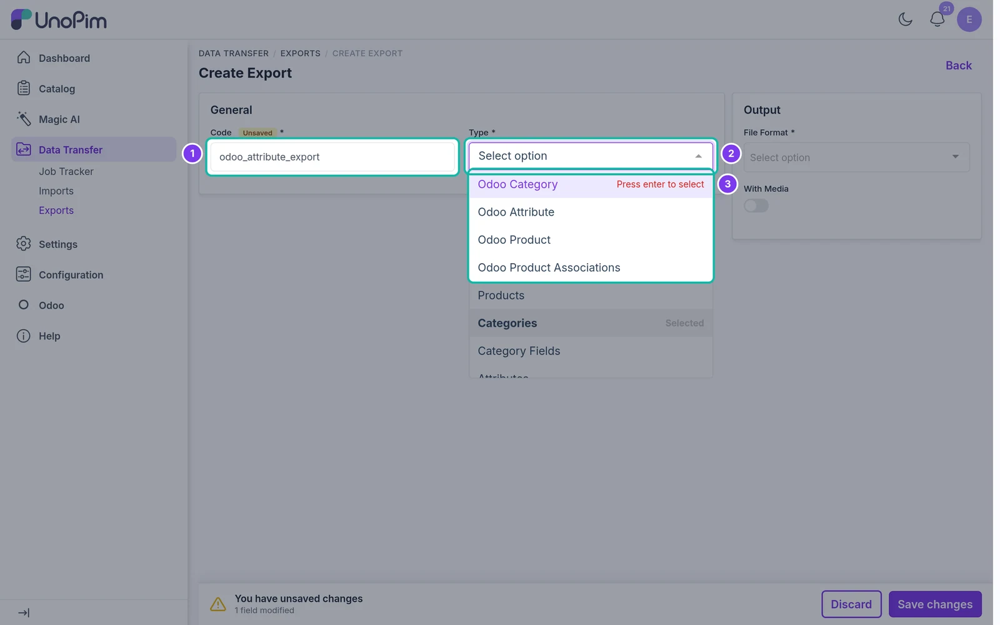
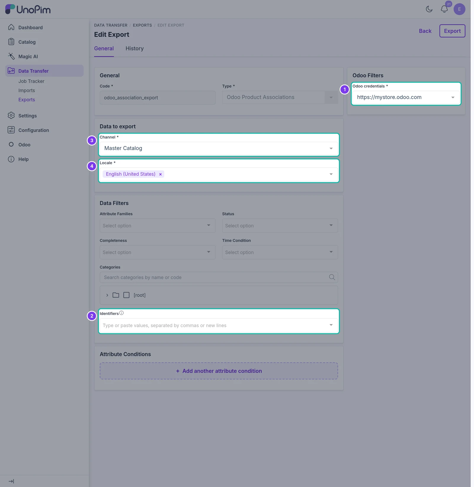
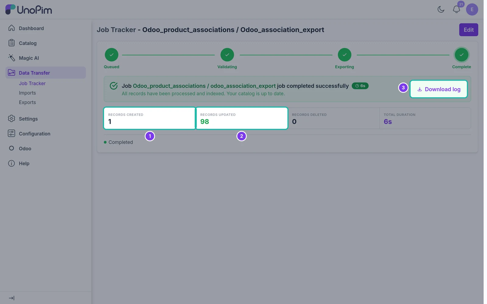

# Export Product Associations

Send UnoPim up-sells, cross-sells and related products to Odoo.

## Overview

The **Odoo Product Associations** export job writes the links between products to Odoo's **Optional**, **Accessory** and **Alternative** product fields. It only writes these link fields - names, prices, images and other product data are not changed.

Which UnoPim association type fills which Odoo field is set on the credential's [Associations Mapping](./associations-mapping) tab.

## Prerequisites

- Map at least one Odoo field on the [Associations Mapping](./associations-mapping) tab.
- Export the products first with the [product export](./export-products). Both the product and the products it links to must already exist in Odoo.
- Install the Odoo **Sales** app (optional products) and **eCommerce** app (accessory and alternative products).

## Step 1 - Create the Export

Go to **Data Transfer → Exports** and click **Create Export**. Enter a unique **Code**, e.g. `odoo_association_export`, and choose **Odoo Product Associations** as the **Type**.

## Step 2 - Set the Filters

The filters pick which products' links are exported. They are the same as the [product export](./export-products#step-2-set-the-filters) filters, without **Currencies**, **Attributes** and **With Media** - these have no effect on links.

| Filter | What it does |
|---|---|
| **Odoo credentials** | The Odoo store to export to. Required. |
| **Identifiers** | Export links only for these SKUs. Leave empty for all products. |
| **Channel** | Required. |
| **Locale** | Required. |

You can also narrow the products by family, category, completeness, update time, attribute conditions and status.

## Step 3 - Save and Run

Click **Save changes** in the bar at the bottom of the page, then **Export Now** on the export job page that opens.

## Step 4 - Check the Result

The **Job Tracker** shows how many products had their links **created** (no links in Odoo before) or **updated** (links replaced). Products that don't exist in Odoo yet are skipped - check **Download log** for details.

> **Note:** The export replaces the links in each mapped Odoo field with the links from UnoPim. A link removed in UnoPim is also removed in Odoo on the next run. Fields that are **Not mapped** are left untouched.
