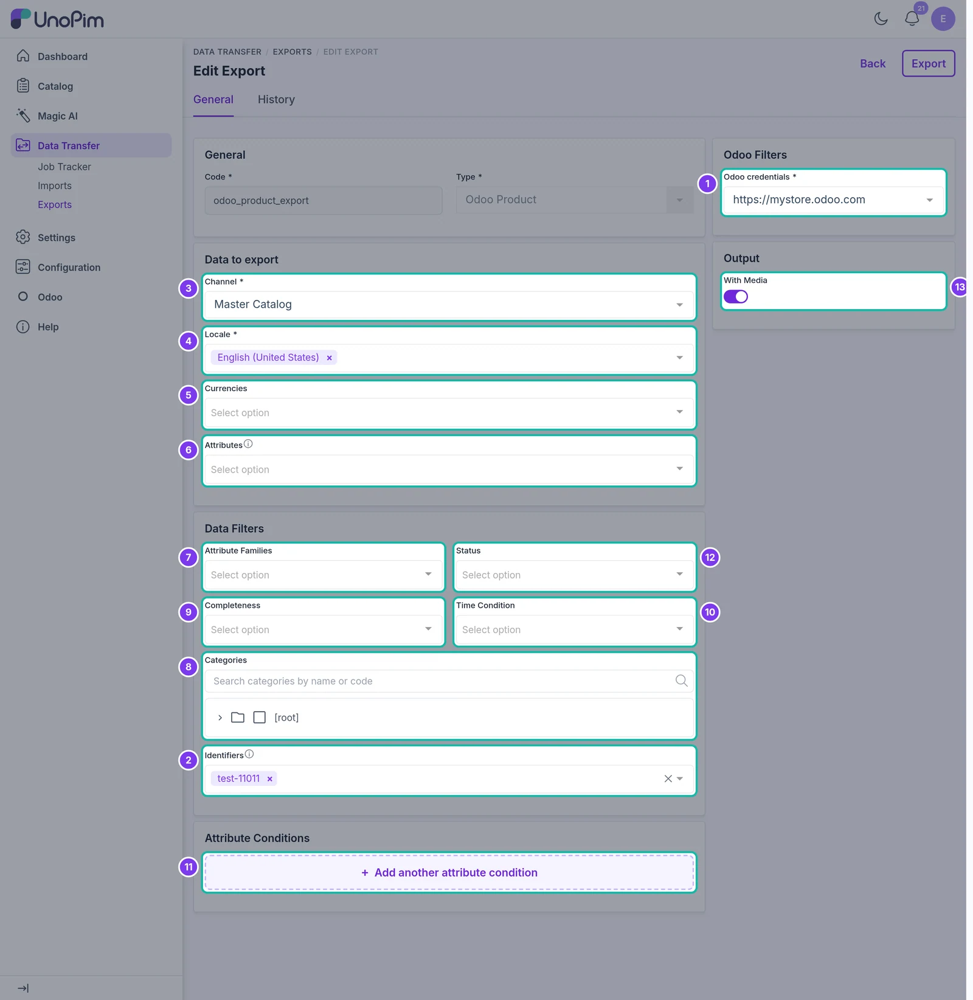
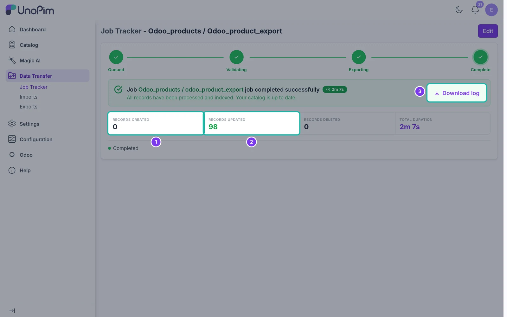

# Export Products

Export simple and configurable products from UnoPim to Odoo.

## Overview

The **Odoo Product** export job creates or updates products in Odoo. Simple products become Odoo products; configurable products become product templates with their variants. The values written to each Odoo field come from the credential's [Attribute Mapping](./attribute-mapping).

## Prerequisites

Before exporting products:

1. Set up the [Attribute Mapping](./attribute-mapping) for your credential.
2. Run the [attribute export](./export-attributes) and the [category export](./export-categories), so that variant attributes and categories exist in Odoo.

## Step 1 - Create the Export

Go to **Data Transfer → Exports** and click **Create Export**. Enter a unique **Code**, e.g. `odoo_product_export`, and choose **Odoo Product** as the **Type**.

## Step 2 - Set the Filters

The Odoo product export uses the same filters as UnoPim's own product export, plus the Odoo credential.

| Filter | What it does |
|---|---|
| **Odoo credentials** | The Odoo store to export to. Required. |
| **Identifiers** | Paste SKUs (one per line) to export only those products. Leave empty to export all products. |
| **Channel** | The UnoPim channel to read values from. Required. |
| **Locale** | One or more locales to export. Required. |
| **Currencies** | The price currencies to export. |
| **Attributes** | Export only the selected attributes. Leave empty to export every mapped attribute. |
| **Attribute Families** | Export only products of the selected families. |
| **Categories** | Export only products in the selected categories. |
| **Completeness** | No condition, complete on at least one selected locale, or complete on all selected locales. |
| **Time Condition** | Export products updated in the last N days, since the last export, or between two dates. |
| **Attribute conditions** | Add conditions on attribute values, e.g. *brand equals Acme*. |
| **Status** | Export enabled, disabled or all products. |
| **With Media** | Turn on to export the main image and gallery images. |

> **Tip:** Use **Time Condition → Updated products since last export** for scheduled jobs. Each run only sends what changed.

## Step 3 - Save and Run

Click **Save changes** in the bar at the bottom of the page, then **Export Now** on the export job page that opens.

## Step 4 - Check the Result

The **Job Tracker** shows how many products were **created** and **updated** in Odoo. Products that could not be exported are counted as skipped - click **Download log** to see why.

Run the job again at any time. Products that already exist in Odoo - matched by the **Default Product Identifier** of the credential - are updated instead of created again.

## Export Results in Odoo

After the export, the products are available in Odoo, where you can review, edit and publish them. On the Odoo eCommerce storefront, customers see the product name, images, price and other information.

## Products with Variations

Configurable products in UnoPim (for example a T-shirt in several sizes and colors) are exported as one **product template** with a **variant** for each combination. The template uses the configurable product's **super attributes**, which must be select attributes already exported with the [attribute export](./export-attributes).

To link products to each other (up-sells, cross-sells, related products), run the [Product Associations export](./export-product-associations) after the product export.
