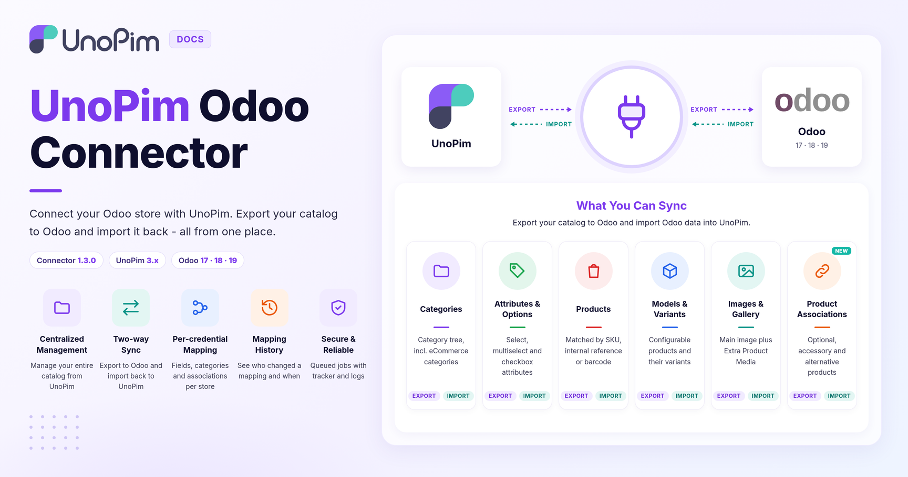

# UnoPim Odoo Connector

Store Link: [View on Webkul Store](https://store.webkul.com/unopim-odoo-connector.html)

The **UnoPim Odoo Connector** bridges your **Odoo store** and **UnoPim** - letting you manage your entire product catalog from one place and push it directly to Odoo whenever you're ready.

Instead of updating products in two systems separately, you handle everything in UnoPim - categories, products, attributes, images, variations and product associations - and the connector takes care of getting it all into Odoo accurately and efficiently.

 

  

 

## What Can It Do?

The connector works in two directions:

- **Export** - push your product data from UnoPim into Odoo
- **Import** - pull existing data from Odoo back into UnoPim

## What's New in 1.3.0

| Change | What it means for you |
|---|---|
| **Mappings per credential** | Attribute, category field and association mappings now live inside each Odoo credential. Every Odoo store can have its own mapping, with its own change history. |
| **Product associations** | Sync up-sells, cross-sells and related products with Odoo's **Optional**, **Accessory** and **Alternative** products - in both directions. |
| **Gallery images** | Map a gallery attribute to Odoo's **Extra Product Media**, separately from the main product image. |
| **Richer export filters** | Product export jobs get the same filters as UnoPim's own product export: SKU, families, categories, completeness, status, updated time and attribute conditions. |
| **Checkbox attributes** | Checkbox and multi-checkbox attributes can be exported, including the Odoo variant creation mode. |
| **Weight & volume units** | Measurement attributes are converted to the unit Odoo expects. |
| **Created vs. updated counts** | The job tracker now shows how many records were created and how many were updated in Odoo. |

> **Upgrading from an older version?** Run `php artisan migrate` after updating the package. Saved export filters and existing mappings are migrated automatically, and old mapping links redirect to the new credential tabs.

## Features

### Export

Everything you build in UnoPim can be exported to Odoo:

- **Categories** - export all categories, or only the ones you pick by code. Categories can also be exported as **Odoo eCommerce categories**.
- **Attributes and Options** - export select, multiselect and checkbox attributes along with all their options, using the Odoo display type you choose.
- **Product Models and Products** - export your full product catalog, including configurable products and their variants.
- **Product Images** - export the main image and a full **gallery** for each product.
- **Product Associations** - export up-sells, cross-sells and related products as Odoo optional, accessory and alternative products.
- **Targeted Export** - export only specific products by **SKU**, family, category, completeness, status or update date.
- **Update Existing Products** - re-run an export at any time. Records that already exist in Odoo are updated instead of being created again.

### Mapping & Configuration

Each Odoo credential has its own mapping tabs:

- **Attribute Mapping** - map UnoPim attributes to Odoo product fields, or set a fixed value.
- **Additional Attribute Mappings** - add any other Odoo field by its code and map it.
- **Category Field Mapping** - map UnoPim category fields to Odoo category fields.
- **Associations Mapping** - map UnoPim association types to Odoo's product link fields.
- **History** - see every saved version of the credential and its mappings.

### Import

You can also bring data from Odoo into UnoPim using the following import job types:

- Categories
- Attributes
- Product Models
- Products
- Product Associations

### Advanced Filtering

When running a product export, you can filter exactly what gets exported using:

| Filter | What it does |
|---|---|
| **Odoo Credentials** | Select which Odoo store to export to |
| **Identifiers (SKU)** | Export only the products with these SKUs |
| **Channel** | Export product data from a specific channel |
| **Locales** | Export product data in one or more languages |
| **Families / Categories** | Export only products from selected families or categories |
| **Completeness** | Export products by completeness (none, at least one locale, all locales) |
| **Updated** | Export products changed in the last N days, since the last export, or between two dates |
| **Attribute Conditions** | Export products whose attribute values match your conditions |
| **Status** | Export enabled, disabled or all products |
| **With Media** | Include or exclude product images |

## Requirements

| Requirement | Version |
|---|---|
| **UnoPim** | 3.0 or later (documented on **3.1.3**) |
| **PHP** | 8.4 or later |
| **Odoo** | 17, 18 or 19 |
| **Connector** | 1.3.0 |

> **Please Note:**
> - Only **select**, **multiselect** and **checkbox** attributes can be exported to Odoo as product attributes. Select attributes become variation (super) attributes for configurable products.
> - Accessory and alternative products need the Odoo **eCommerce** (`website_sale`) app. Optional products need the **Sales** app.
