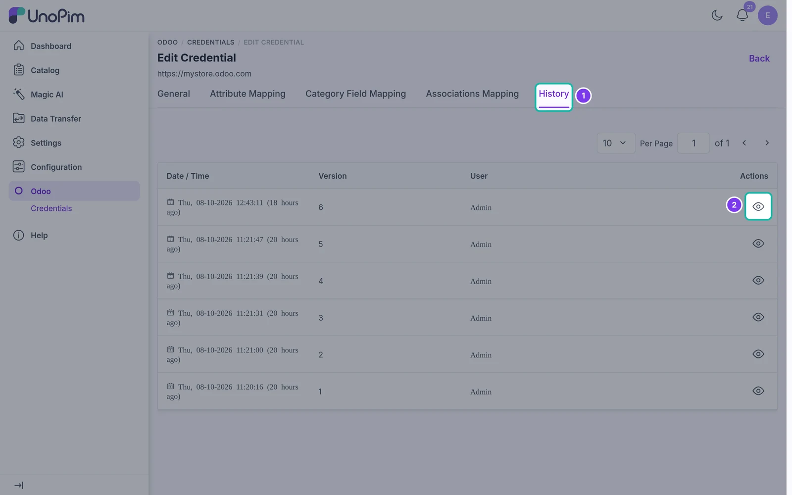

# Mapping History

See every change made to a credential and its mappings.

## Overview

Each time you save the credential, its store configuration or any of its mapping tabs, UnoPim records a new **version**. The **History** tab lists these versions so you can check who changed what, and when.

## Open the history

Go to **Odoo → Credentials**, edit your credential and open the **History** tab.

| Column | What it shows |
| --- | --- |
| **Date / Time** | When the change was saved. |
| **Version** | The version number. The highest number is the current state. |
| **User** | The UnoPim user who saved the change. |
| **Actions** | Click the **view** icon to see the old and new values for that version. |

> **Tip:** Use the history to find out why an export started sending different data - compare the latest version with the one before your last successful export.
