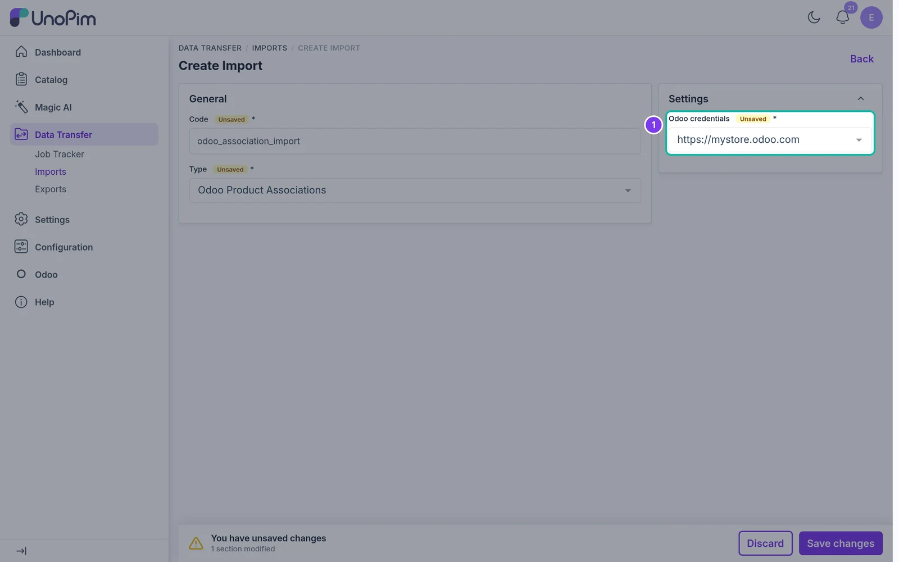

# Import Product Associations

Import Odoo optional, accessory and alternative products into UnoPim associations.

## Overview

The **Odoo Product Associations** import job reads the **Optional**, **Accessory** and **Alternative** products of each product in Odoo and saves them as UnoPim associations, using the credential's [Associations Mapping](./associations-mapping).

## Prerequisites

- Map at least one Odoo field on the [Associations Mapping](./associations-mapping) tab.
- The products must exist in UnoPim **and** be linked to Odoo for this credential - that is, they were exported to or imported from this Odoo store by the connector. Products without an Odoo record are skipped.

## Step 1 - Open Imports

In the sidebar, go to **Data Transfer → Imports** and click **Create Import**.

## Step 2 - Enter a Code and Select the Type

Enter a unique **Code**, e.g. `odoo_association_import`. Open the **Type** dropdown and choose **Odoo Product Associations**.

## Step 3 - Configure the Settings

| Field | What it does |
|---|---|
| **Odoo credentials** | The Odoo store to import from. Its Associations Mapping decides which Odoo field fills which UnoPim association type. Required. |

## Step 4 - Save the Import

Click **Save changes** in the bar at the bottom of the page. The import job page opens.

## Step 5 - Run the Import

Click **Import Now** to start the job.

## Step 6 - Monitor Progress

UnoPim opens the **Job Tracker**, where you can follow the progress of the job. When it finishes, it shows how many records were created and updated. Click **Download log** to see warnings or errors for individual records.

> **Note:** For each mapped association type, the import replaces the product's links in UnoPim with the links from Odoo. Linked Odoo products that don't exist in UnoPim are left out and listed in the log. If an Odoo field is missing (its app isn't installed), the UnoPim links mapped to it are left unchanged.
