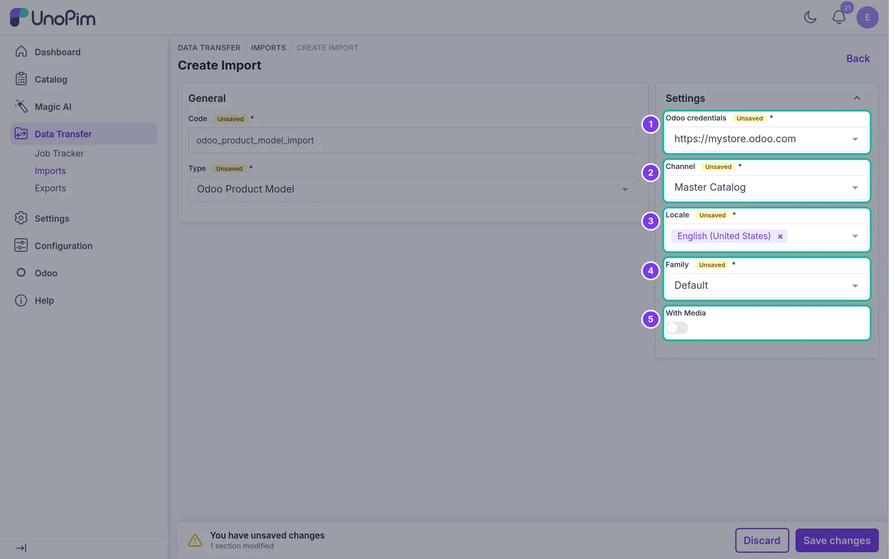

# Import Product Models

Import Odoo product templates with variants into UnoPim as configurable products.

## Overview

The **Odoo Product Model** import job reads product templates that have variants in Odoo and creates them as configurable products (product models) in UnoPim, with one variant for each Odoo variant.

## Prerequisites

- Set up an [Odoo credential](./setup-credentials).
- Import [attributes](./attribute-import) and [categories](./category-import) from Odoo first. The variant attributes must exist in UnoPim and belong to the selected family.

## Step 1 - Open Imports

In the sidebar, go to **Data Transfer → Imports** and click **Create Import**.

## Step 2 - Enter a Code and Select the Type

Enter a unique **Code**, e.g. `odoo_product_model_import`. Open the **Type** dropdown and choose **Odoo Product Model**.

## Step 3 - Configure the Settings

| Field | What it does |
|---|---|
| **Odoo credentials** | The Odoo store to import from. Required. |
| **Channel** | The UnoPim channel to import into. Required. |
| **Locale** | One or more UnoPim locales for the imported labels. Required. |
| **Family** | The UnoPim attribute family the imported product models are created in. Required. |
| **With Media** | Turn on to import product images as well. |

## Step 4 - Save the Import

Click **Save changes** in the bar at the bottom of the page. The import job page opens.

## Step 5 - Run the Import

Click **Import Now** to start the job.

## Step 6 - Monitor Progress

UnoPim opens the **Job Tracker**, where you can follow the progress of the job. When it finishes, it shows how many records were created and updated. Click **Download log** to see warnings or errors for individual records.
