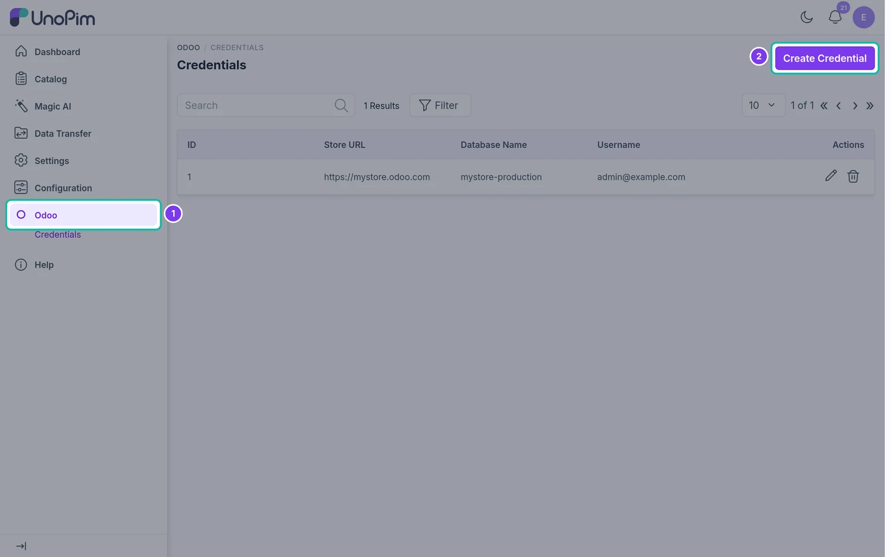
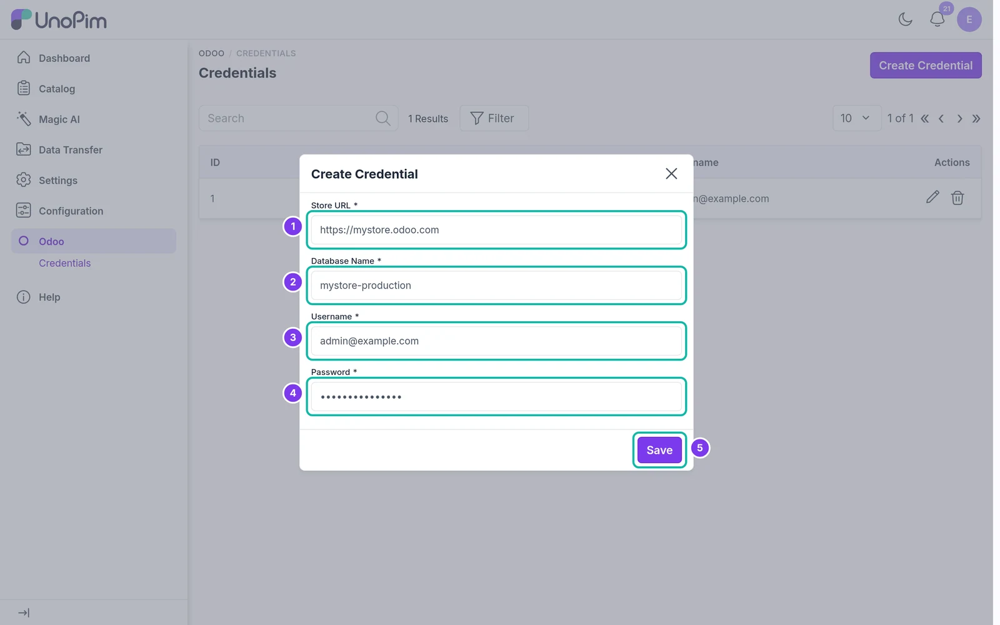
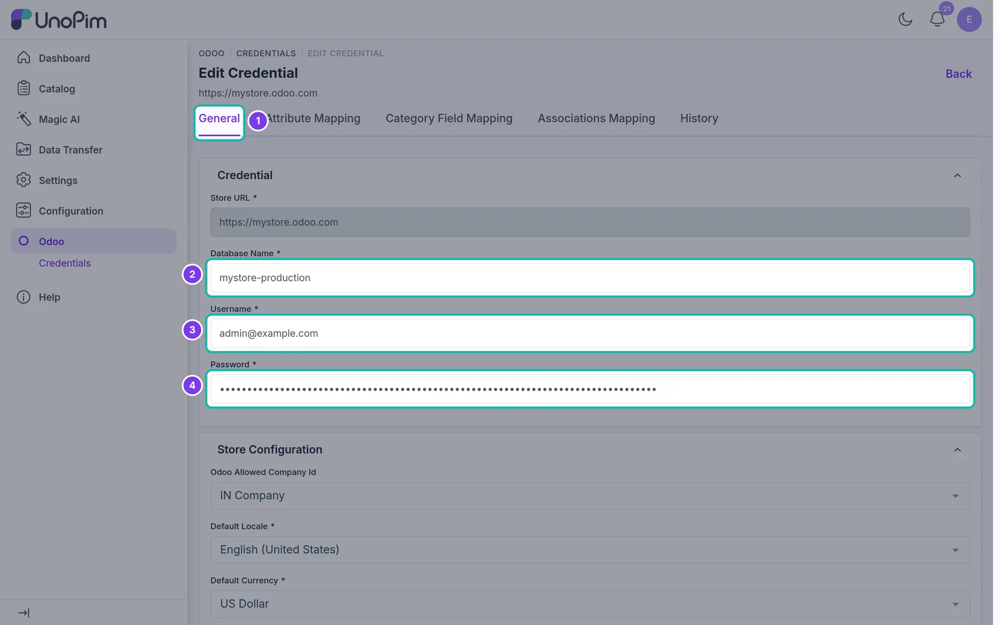
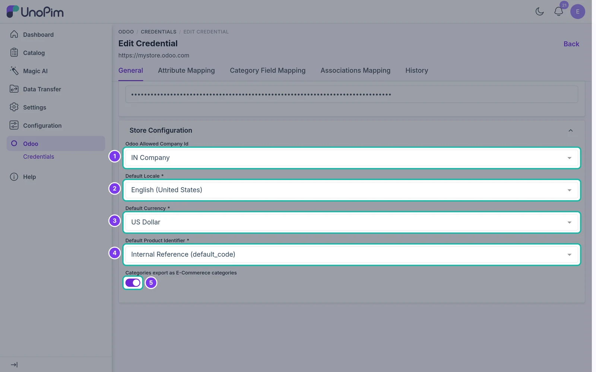
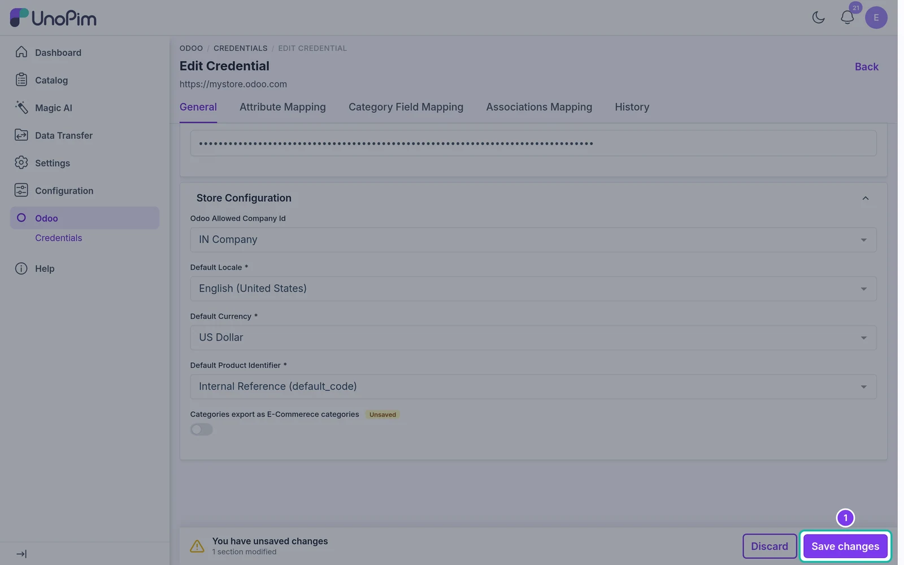

# Setting Up Odoo Credentials

Once the connector is installed, the next step is to connect your Odoo store to UnoPim. A **credential** holds your Odoo server details, the store settings used for export, and - since version 1.3.0 - all the **mappings** for that store.

## Step 1 - Open the Credentials Page

Log in to your UnoPim dashboard and click **Odoo** in the left sidebar. The **Credentials** list opens. Click **Create Credential**.

## Step 2 - Enter Your Odoo Server Details

A dialog opens. Fill in the following fields:

| Field | What to enter |
|---|---|
| **Store URL** | The full URL of your Odoo server (e.g., `https://mystore.odoo.com`) |
| **Database Name** | The name of your Odoo database |
| **Username** | Your Odoo login (usually the admin email) |
| **Password** | The password or API key for that Odoo user |

Click **Save**. UnoPim checks the connection before saving.

> **Note:** Each credential must use a unique database name. If the database name is already used by another credential, or Odoo rejects the login, UnoPim shows an error and the credential is not saved.

## Step 3 - Review the Credential

After saving, the credential's edit page opens on the **General** tab. You can update the **Database Name**, **Username** and **Password** here at any time. The Store URL cannot be changed once the credential is created.

The tabs at the top hold everything else that belongs to this Odoo store:

| Tab | What it's for |
|---|---|
| **General** | Server details and store configuration |
| **Attribute Mapping** | Map UnoPim attributes to Odoo product fields - see [Attribute Mapping](./attribute-mapping) |
| **Category Field Mapping** | Map UnoPim category fields to Odoo category fields - see [Category Mapping](./category-mapping) |
| **Associations Mapping** | Map UnoPim association types to Odoo product links - see [Associations Mapping](./associations-mapping) |
| **History** | Every saved version of this credential and its mappings - see [Mapping History](./mapping-history) |

## Step 4 - Configure the Store

Scroll down to **Store Configuration**. These settings decide how products are exported to this store.

| Setting | What it does |
|---|---|
| **Odoo Allowed Company Id** | The Odoo company to export products to. Leave it blank to export to all companies. |
| **Default Locale** | The UnoPim locale that matches your Odoo store's language, e.g. `English (United States)`. |
| **Default Currency** | The currency used for prices in Odoo, e.g. `US Dollar` or `Euro`. |
| **Default Product Identifier** | How products are matched in Odoo: **Internal Reference** (`default_code`) or **Barcode** (`barcode`). |
| **Categories export as E-Commerce categories** | Turn on to export UnoPim categories as **Odoo eCommerce categories** instead of internal product categories. |

> **Tip:** Pick the product identifier before your first product export. The connector uses it to find existing products in Odoo, so changing it later can create duplicates.

## Step 5 - Save Your Changes

As soon as you change a field, an **unsaved changes** bar appears at the bottom of the page. Click **Save changes** to store the credential, or **Discard** to undo.

Your Odoo store is now connected. Next, set up the [Attribute Mapping](./attribute-mapping) for this credential.

> **Tip:** You can connect more than one Odoo store. Create a separate credential for each store - each one keeps its own mappings, so stores with different fields can be exported from the same UnoPim catalog.
