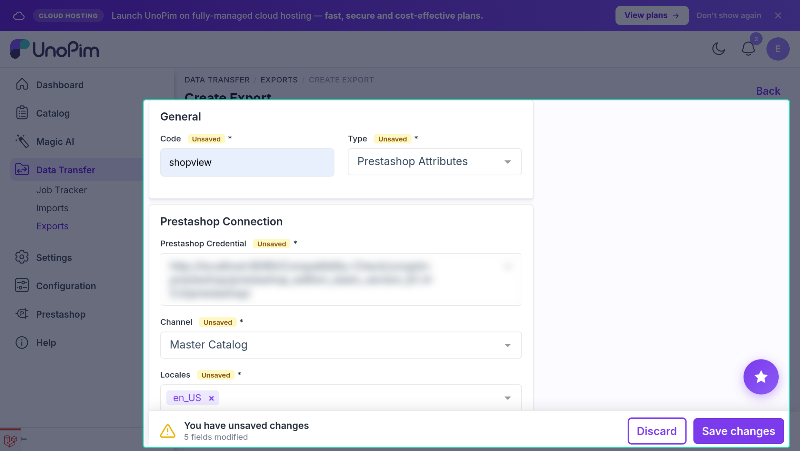
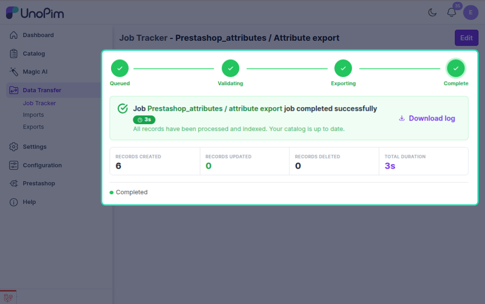

# Attribute Export

The attribute export job pushes UnoPim attributes to PrestaShop. Depending on how the attribute is configured in **Attribute Mapping**, it exports as either a **Feature** or a **Variant Option**.

---

## How to Run

1. Go to **Data Transfer → Exports → Create Export Job**.


2. Select exporter type **Prestashop Attributes**.



3. Set the filters:

| Filter | What to pick |
|---|---|
| **Credential** | Your PrestaShop connection |
| **Shop** | The shop to export attributes to |
| **Locales** | Which languages to include |

4. Save and run the job.



---

## Two Types of Attributes

| Type | Where configured | What it becomes in PrestaShop |
|---|---|---|
| **Feature** | Added to *Feature Attributes* in Attribute Mapping | A product feature (e.g. "Material: Cotton") |
| **Variant Option** | Added to *Variant Attributes* in Attribute Mapping | A product option used in combinations (e.g. "Color", "Size") |

Only attributes configured in one of these two sections are exported. Unmapped attributes are skipped.

---

## What Gets Exported

For each attribute:

- **Attribute name** — localized per language
- **All attribute options** — each option's label is also localized

---

## Create vs Update

| Situation | What happens |
|---|---|
| Attribute not in PrestaShop yet | **Created**; its PrestaShop ID is saved |
| Attribute already exported | **Updated** |
| Option not in PrestaShop yet | **Created** and linked to its parent attribute |
| Option already exported | **Updated** |

---

## Localization

Attribute names and option labels are sent as localized XML — one entry per PrestaShop language ID, using the locale mappings from the credential's **Shop & Channel Mapping**.

If a locale has no label, it falls back to the attribute/option code.

---

## Example

UnoPim attribute `color` (Feature type) with options: Red, Blue.

PrestaShop receives:
```
Feature: Color
  Feature Value: Red
  Feature Value: Blue
```

UnoPim attribute `size` (Variant type) with options: S, M, L.

PrestaShop receives:
```
Product Option: Size
  Option Value: S
  Option Value: M
  Option Value: L
```

---

## Common Issues

| Issue | Fix |
|---|---|
| Attribute not exported | Check it is added in Attribute Mapping (Feature or Variant section) |
| Options missing | Re-run the job — options sync after the parent attribute is created |
| Names are blank | Make sure the selected locales have label values in UnoPim |
| Export fails at startup | Verify the credential is active and shop mapping is complete |
