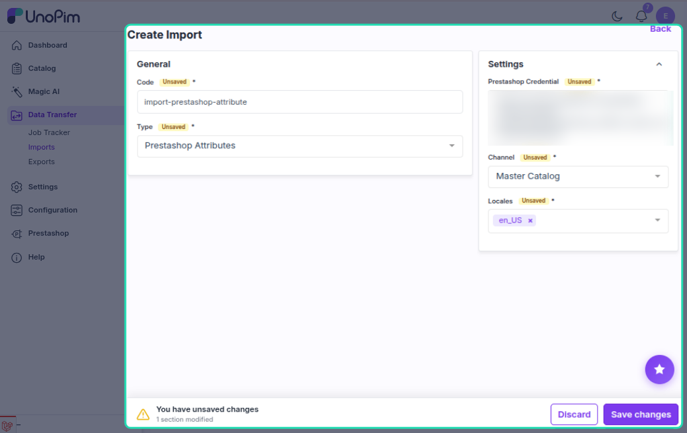
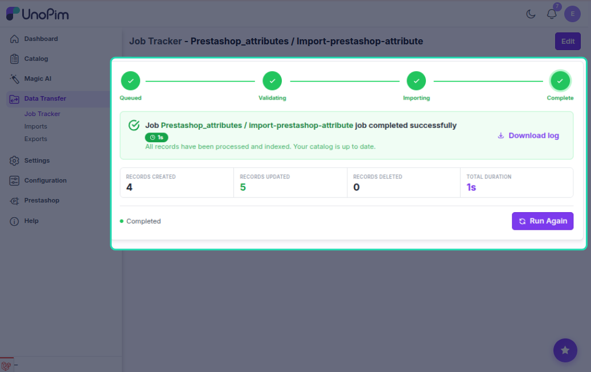

# Attribute Import

The attribute import job pulls attributes from PrestaShop into UnoPim. It imports two types: **Features** (descriptive product attributes) and **Variant Options** (attributes used in product combinations).

---

## How to Run

1. Go to **Data Transfer → Imports → Create Import Job**.

2. Select importer type **Prestashop Attributes**.

3. Set the filters:

| Filter | What to pick |
|---|---|
| **Credential** | Your PrestaShop connection |
| **Shop** | The shop to import from |
| **Locales** | Which languages to import |

4. Save and run the job.

---

## Two Types Imported

| PrestaShop Type | What it is | Created in UnoPim as |
|---|---|---|
| **Feature** | A product feature (e.g. Material, Color) | A `select` type attribute |
| **Variant Option Group** | A combination attribute (e.g. Size, Color) | A `select` type attribute |

Both types import their options/values along with the parent attribute.

> Custom feature values (entered per-product in PrestaShop) are skipped — only predefined options are imported.

---

## What Gets Imported Per Attribute

- **Attribute code** — slugified from the name (e.g. "Material" → `material`)
- **Attribute name** — localized per language
- **All options** — each with its own code and localized labels

If the attribute already exists in UnoPim (same code), it is **updated**. Otherwise it is **created**.

---

## Variant Import Mapping (Optional Pre-configuration)

For variant option groups, you can pre-configure which PrestaShop option maps to which UnoPim attribute code before running the import.

Go to **Attribute Mapping → Other** and set the **Variant Import Attributes** section. This lets you control the attribute code rather than letting it be auto-generated from the PrestaShop name.

---

## Code Generation

If no existing mapping or pre-configuration is found, the attribute code is generated by slugifying the PrestaShop name (spaces → underscores, lowercase). Example: "Shoe Size" → `shoe_size`.

On re-import, the connector matches by PrestaShop ID so existing attributes are updated without duplicates.

---

## Localization

Attribute names and option labels are imported for each selected locale using the credential's **Shop & Channel Mapping** (PrestaShop language ID → UnoPim locale code).

If a name is missing for a locale, it falls back to the default locale value.

---

## Common Issues

| Issue | Fix |
|---|---|
| Attributes not appearing in UnoPim | Check the job log for API errors; verify the credential has permission to read features |
| Wrong attribute code generated | Pre-configure the mapping in Attribute Mapping → Other → Variant Import Attributes |
| Option labels missing | Make sure the selected locales are mapped in the credential's Shop & Channel Mapping |
| Duplicate attributes created | Re-imports match by PrestaShop ID — check the data mapping table for stale records |
