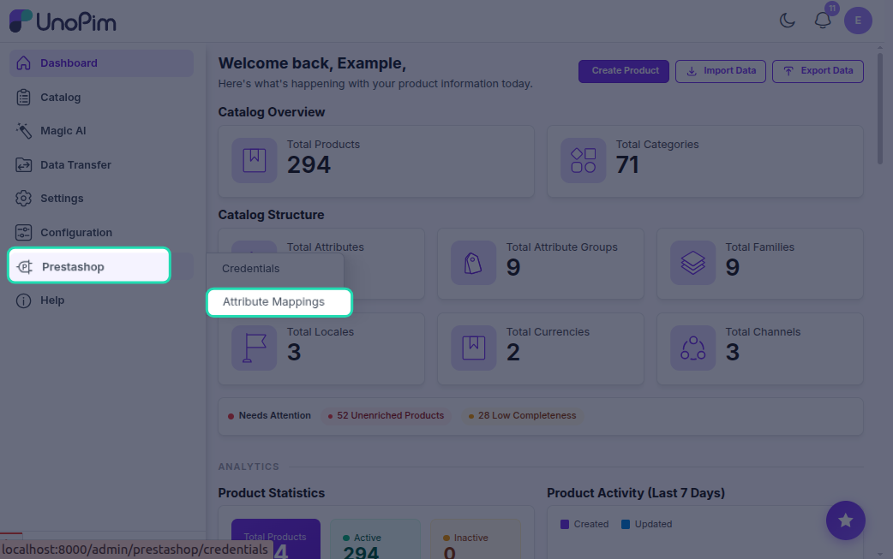
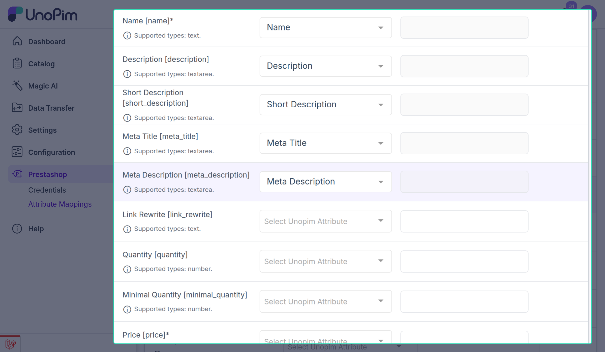
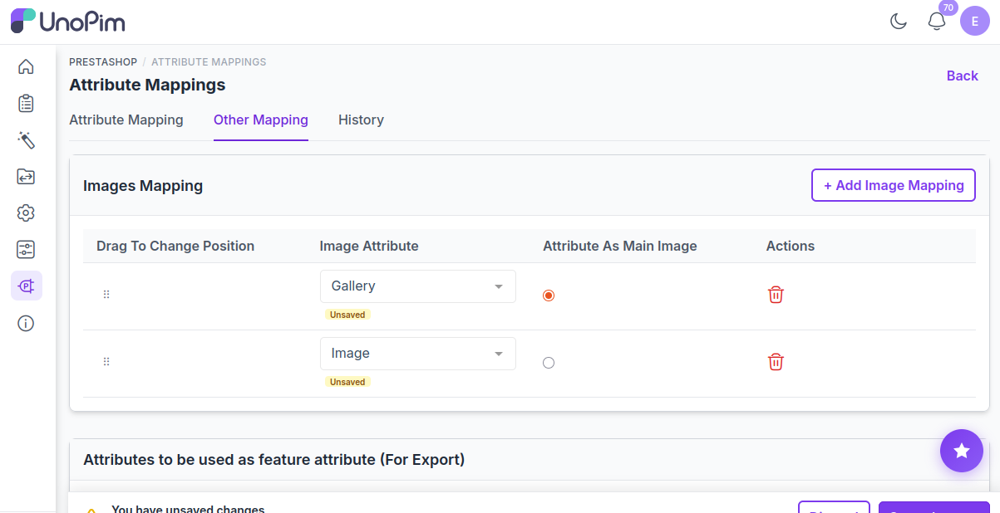

# Attribute Mapping

Attribute mapping tells the connector which UnoPim attribute should fill which PrestaShop product field. Without it, the connector won't know how to populate fields like name, price, or description.

---

## Where to Configure

Go to **Prestashop → Attribute Mapping** in the sidebar.

The page has two tabs:

| Tab | What you configure |
|---|---|
| **Standard** | Map UnoPim attributes to PrestaShop's built-in product fields |
| **Other** | Images, features, variant attributes |

---

## Standard Mapping

Each row maps one PrestaShop field to a UnoPim attribute.

**Examples:**

| PrestaShop Field | UnoPim Attribute |
|---|---|
| `name` | `product_name` |
| `price` | `sale_price` |
| `description` | `long_description` |
| `weight` | `product_weight` |
| `ean13` | `barcode` |

> `name` and `price` are required — the connector won't export without them.

You can also set a **Default Value** on any row. If the product has no value for that attribute, the default is used instead.

---

## Other Mapping

### Image Mapping
Select which UnoPim attribute holds the **main image** and which holds **additional images**.

### Feature Attributes
Select UnoPim attributes that should export as **PrestaShop Features** (shown in the product's feature list, e.g. "Material: Cotton").

### Variant Attributes
Select which attributes carry over when exporting **product variants** (combinations in PrestaShop).

---

## How It Works During Export

When an export job runs:

1. The connector loads all saved mappings.
2. For each product, it looks up the mapped UnoPim attribute value.
3. It falls back in this order: **common value → channel value → locale value**.
4. The value is type-cast to match what PrestaShop expects (price as decimal, quantity as integer, etc.).
5. Localized fields (name, description, etc.) are exported once per mapped locale.
6. Feature attribute values are exported as separate PrestaShop feature entries.

---

## Example

You have a UnoPim attribute `sale_price` (value: `29.99`) mapped to PrestaShop field `price`.

The connector reads `sale_price`, casts it to `29.990000`, and puts it in the product XML before sending to PrestaShop.

---

## Common Issues

| Issue | Fix |
|---|---|
| Product exports but name is blank | Map a UnoPim attribute to `name` |
| Export fails with "price required" | Map a UnoPim attribute to `price` |
| Feature values not appearing | Add the attribute to **Feature Attributes** in the Other tab |
| Images not syncing | Set the image attribute in the **Image Mapping** section |
