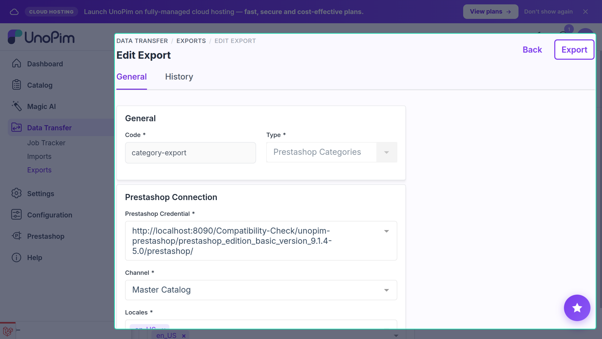
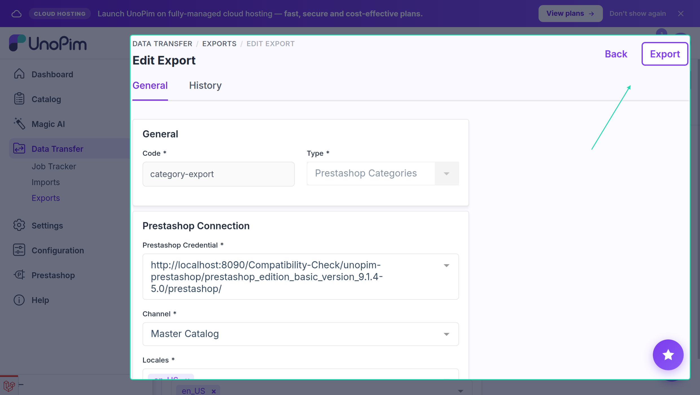
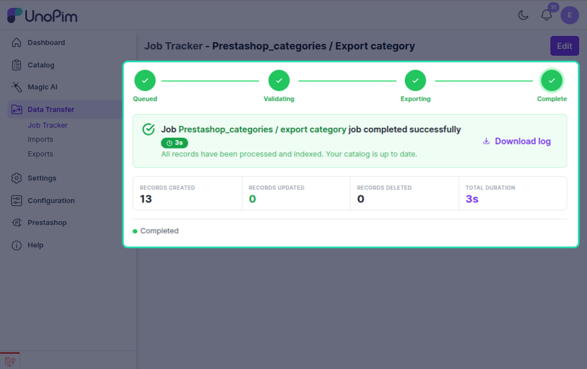
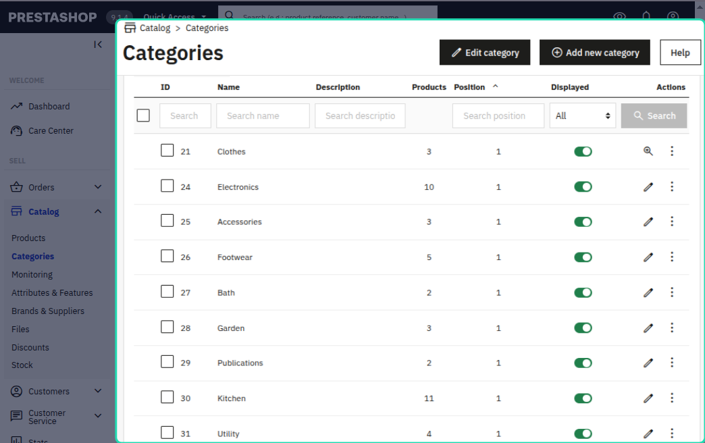

# Category Export

The category export job pushes UnoPim categories to PrestaShop, keeping the same parent-child hierarchy. Each category is created or updated via the PrestaShop Webservice API.

---

## How to Run

1. Go to **Data Transfer → Exports → Create Export Job**.


2. Select exporter type **Prestashop Categories**.



3. Set the filters:

| Filter | What to pick |
|---|---|
| **Credential** | Your PrestaShop connection |
| **Shop** | The shop to export categories to |
| **Locales** | Which languages to include |

4. Save and run the job.





---

## What Gets Exported

For each category (except the root), the connector exports:

- **Name** — localized per language
- **Description** — localized
- **Slug** (`link_rewrite`) — auto-generated from the name if not set
- **Meta title / Meta description** — localized
- **Active status**
- **Parent category** — resolved automatically so PrestaShop hierarchy matches UnoPim



> The `root` category is always skipped.

---

## Create vs Update

The connector checks the `prestashop_data_mapping` table to see if a category was exported before.

| Situation | What happens |
|---|---|
| No mapping found | Category is **created** in PrestaShop; the new ID is saved |
| Mapping found, ID exists | Category is **updated** |
| Mapping found, ID missing in PrestaShop (404) | Category is **recreated** and mapping is refreshed |

---

## Parent-Child Hierarchy

Categories are exported in the correct order — parents before children. The connector:

1. Builds a full tree of categories.
2. Walks the tree top-down (depth-first).
3. Ensures the parent exists in PrestaShop before creating a child.

If a parent category hasn't been exported yet during the same job, the connector creates it first automatically.

---

## Localization

Category names and descriptions are sent as localized XML nodes — one entry per PrestaShop language ID.

The connector maps PrestaShop language IDs to UnoPim locales using the **Shop & Channel Mapping** configured in the credential. If a locale has no value, it falls back to the **Default Locale**.

---

## Example

UnoPim tree:
```
Electronics (parent)
  └── Phones (child)
        └── Smartphones (grandchild)
```

PrestaShop receives them in order: **Electronics → Phones → Smartphones**, each with its parent ID already set.

---

## Common Issues

| Issue | Fix |
|---|---|
| Categories missing in PrestaShop | Check the job log — look for skipped items or API errors |
| Category names are blank | Make sure the selected locales have values in UnoPim |
| Parent category not linked | Ensure the full category tree is included in the export |
| Export fails at startup | Verify the credential is active and shop mapping is configured |
