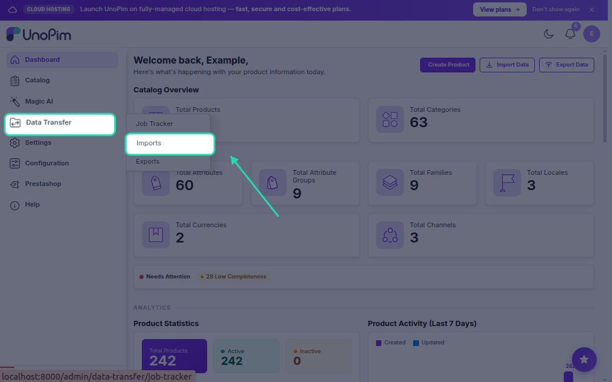
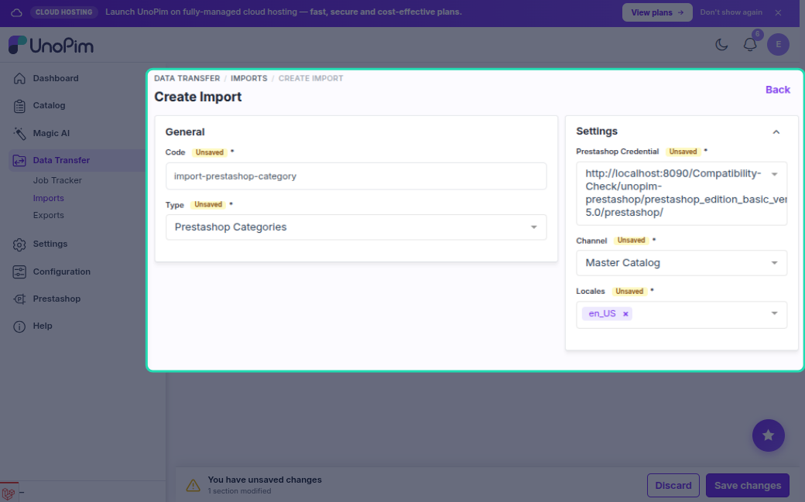
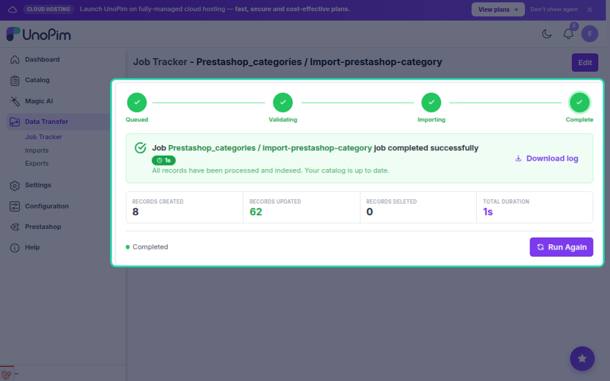

# Category Import

The category import job pulls categories from PrestaShop into UnoPim, preserving the parent-child hierarchy. Categories are created or updated under the channel's root category.

---

## How to Run

1. Go to **Data Transfer → Imports → Create Import Job**.

2. Select importer type **Prestashop Categories**.

3. Set the filters:

| Filter | What to pick |
|---|---|
| **Credential** | Your PrestaShop connection |
| **Shop** | The shop to import from |
| **Locales** | Which languages to import |

4. Save and run the job.

---

## What Gets Imported Per Category

| Field | Notes |
|---|---|
| **Name** | Localized per language |
| **Description** | Localized |
| **Meta title / description** | Localized |
| **Active status** | Whether the category is enabled |
| **Parent category** | Resolved from the hierarchy |

---

## Category Code

Each category needs a unique code in UnoPim. The connector derives it in this order:

1. **Existing mapping** — if this PrestaShop category was imported before, the saved code is reused
2. **`link_rewrite`** (URL slug from PrestaShop)
3. **Name** — slugified (e.g. "Men's Shoes" → `mens-shoes`)
4. **Fallback** — `ps-category-{id}` if name is empty

---

## Parent-Child Hierarchy

Categories are imported parent-first (depth-first order) so the parent always exists before its children are created.

Top-level PrestaShop categories (whose parent is the PrestaShop root) are placed under the **channel's root category** in UnoPim.

---

## Create vs Update

| Situation | What happens |
|---|---|
| Category not in UnoPim | **Created** |
| Category already exists (same code) | **Updated** |

The connector matches on code — if a category was previously imported, it is updated in-place without creating a duplicate.

---

## Localization

Names, descriptions, and meta fields are imported for each selected locale using the credential's **Shop & Channel Mapping** (PrestaShop language ID → UnoPim locale code).

---

## Common Issues

| Issue | Fix |
|---|---|
| Categories not appearing | Check the job log for API errors; verify the credential has `GET` permission on `categories` |
| Wrong parent assigned | Re-run the import — the parent resolution uses the latest mapping data |
| Duplicate categories | These shouldn't happen; if they do, check for conflicting codes in the data mapping table |
| Names missing | Ensure selected locales are mapped in the credential's Shop & Channel Mapping |
