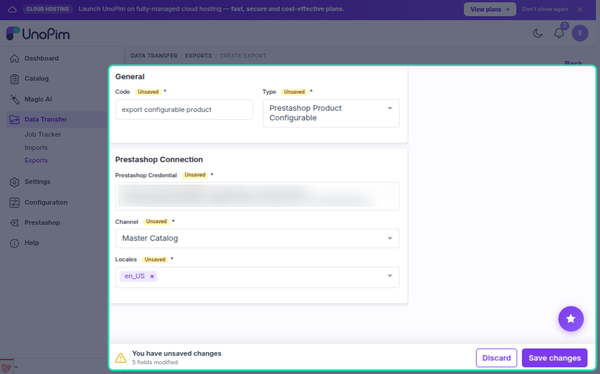
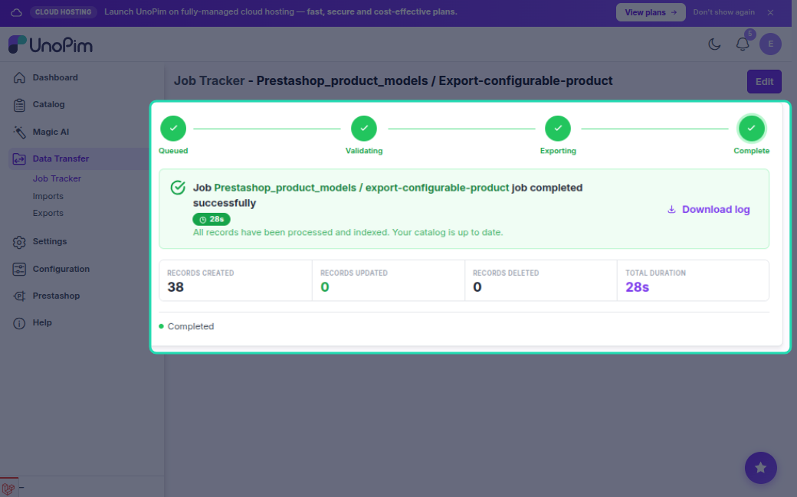

# Configurable Product Export

The configurable product export job pushes UnoPim configurable products (products with variants) to PrestaShop. In PrestaShop these become **products with combinations** — a parent product that holds shared data, with each variant as a combination underneath it.

---

## How to Run

1. Go to **Data Transfer → Exports → Create Export Job**.

2. Select exporter type **Prestashop Configurable Products**.

3. Set the filters:

| Filter | What to pick |
|---|---|
| **Credential** | Your PrestaShop connection |
| **Shop** | The shop to export to |
| **Locales** | Which languages to include |

4. Save and run the job.

---

## What Gets Exported

### Parent Product

| Field | Notes |
|---|---|
| **Name** | Localized per language |
| **Description / Short description** | Localized |
| **Price** | Base price (required) |
| **SKU** (`reference`) | From product code |
| **Slug** (`link_rewrite`) | Auto-generated from name |
| **Meta title / description** | Localized |
| **EAN13 / UPC / MPN** | If mapped in Attribute Mapping |
| **Weight, dimensions** | If mapped |
| **Active status** | Defaults to active |
| **Categories** | Linked via category export mappings |
| **Features** | Attributes marked as features in Attribute Mapping |
| **Images** | Uploaded via image attribute in Attribute Mapping |

### Variants (Combinations)

Each variant is exported as a combination on the parent product with:
- Its own SKU
- Price offset (variant price minus parent price)
- Stock quantity
- Linked option values (e.g. Color: Red, Size: M)

> The first variant is set as the **default combination** shown on the product page.

---

## Create vs Update

| Situation | What happens |
|---|---|
| Parent product not in PrestaShop | Parent is **created** first, then variants |
| Parent already exported | Parent is **updated** |
| Variant not yet in PrestaShop | Combination is **created** |
| Variant already exported | Combination is **updated** |
| Saved ID missing in PrestaShop | Stale record removed, product **recreated** |

---

## Export Order

The connector always creates the **parent product first**, then exports its variants. Variant attributes (combinations options) must exist in PrestaShop before variants can be linked — run the **Attribute Export** job first.

**Recommended export order:**
1. Attribute Export
2. Category Export
3. Configurable Product Export

---

## Images

Images are attached to the **parent product**, not individual combinations.

- Set the image attribute in **Attribute Mapping → Other → Image Mapping**.
- Images removed from UnoPim are deleted from PrestaShop on the next export.

---

## Common Issues

| Issue | Fix |
|---|---|
| Variants missing in PrestaShop | Run **Attribute Export** first so combination options exist |
| Categories not linked | Run **Category Export** first |
| Parent created but no combinations | Check the job log for variant-level errors |
| Price shows as 0 on combinations | Ensure the parent product has a base price set |
| Images not uploading | Set the image attribute in Attribute Mapping → Other → Image Mapping |
