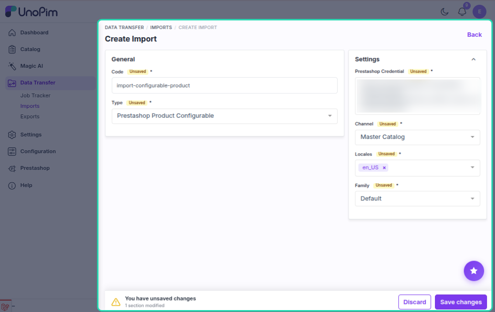
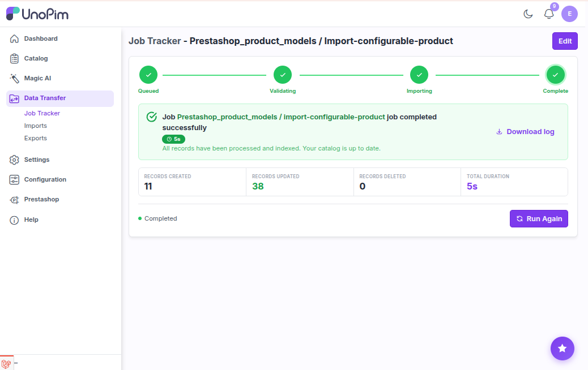

# Configurable Product Import

The configurable product import job pulls products with combinations from PrestaShop into UnoPim as configurable products. It imports the parent product only — variants are imported separately by the **Product Variant Import** job.

---

## How to Run

1. Go to **Data Transfer → Imports → Create Import Job**.

2. Select importer type **Prestashop Configurable Products**.

3. Set the filters:

| Filter | What to pick |
|---|---|
| **Credential** | Your PrestaShop connection |
| **Shop** | The shop to import from |
| **Locales** | Which languages to import |
| **Default Attribute Family** | The family to assign to imported products |

4. Save and run the job.

---

## What Gets Imported

Same fields as simple product import (name, price, description, categories, images, etc.), plus:

- **Product type** is set to `configurable` in UnoPim
- **Variant attributes** (super attributes) are assigned — these define which attributes create combinations

---

## How Variant Attributes Are Determined

The connector picks super attributes in this order:

1. **Variant Import Attributes** — configured in Attribute Mapping → Other → Variant Import Attributes
2. **Variant Export Attributes** — used as fallback if no import mapping is set

If a variant attribute is not part of the selected attribute family, it is skipped with a warning in the job log.

---

## What is Skipped

Simple products (no combinations) are skipped. A product is treated as configurable if:

- Its type is `configurable` or `combinations`
- It has a default combination set (`id_default_combination > 0`)
- It has combination associations in its data

If an existing UnoPim product with the same SKU is already type `simple`, the import is skipped with a warning.

---

## Configurable Product Import vs Product Variant Import

| | Configurable Product Import | Product Variant Import |
|---|---|---|
| **Imports** | Parent product only | Child variants (combinations) |
| **Creates in UnoPim** | Configurable product with super attributes | Variant products under the parent |
| **Use first** | Yes — parent must exist before variants | After configurable product import |

---

## Create vs Update

| Situation | What happens |
|---|---|
| Product not in UnoPim | **Created** as configurable type |
| Product already exists (configurable) | **Updated** — values merged, super attributes synced |
| Product exists but is type `simple` | **Skipped** with a warning |

---

## Images

Handled the same as simple product import — downloaded from PrestaShop and stored in UnoPim's file storage using the image attribute configured in Attribute Mapping.

---

## Recommended Import Order

1. Attribute Import
2. Category Import
3. **Configurable Product Import**
4. Product Variant Import

---

## Common Issues

| Issue | Fix |
|---|---|
| No configurable products found | Verify PrestaShop products have combinations set |
| Variant attributes missing | Configure Variant Import Attributes in Attribute Mapping → Other |
| Variant attributes not assigned to product | Ensure the attributes exist in the selected attribute family |
| Existing simple product skipped | The SKU exists as `simple` in UnoPim — resolve the conflict manually |
| Categories not linked | Run **Category Import** first |
