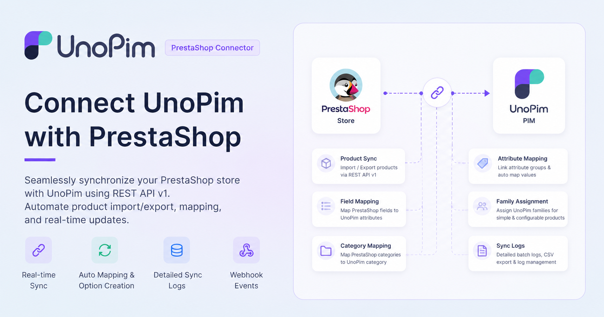

# UnoPim PrestaShop Connector

**Store Link:** [View on Webkul Store](https://store.webkul.com/unopim-prestashop-connector.html)

The UnoPim PrestaShop Connector allows businesses to integrate one or more PrestaShop stores with the UnoPim PIM platform.

 

  

  

---

## Introduction

With this connector, store owners can synchronize catalog data between UnoPim and PrestaShop through a WebService API-based integration.

It supports both export and import workflows, allowing businesses to manage product information in one central system and keep data aligned across platforms more efficiently. Whether you run a single PrestaShop storefront or multiple shops, the connector handles the complexity of multi-shop and multi-language catalog management from a single place.

---

## What the Connector Supports

The connector supports the export and import of categories, attributes, attribute options, simple products, configurable product models, and their variants (combinations).

It also supports mapping for standard attributes, custom attributes, categories, images, shop channels, and locales, so product data can be transferred in a structured and reliable way across any number of PrestaShop shops.

---

## Why Use This Connector

Managing product data across PrestaShop and other systems manually leads to errors, duplication, and wasted time. The UnoPim PrestaShop Connector centralizes your catalog in UnoPim and automates the sync in both directions.

It keeps product data consistent across platforms and supports important product details such as name, description, short description, SKU, price, special price, quantity, EAN13, UPC, MPN, SEO fields, images, category assignments, attribute options, and product variant combinations.

---

## Features of UnoPim PrestaShop Connector

### Bidirectional Data Sync

- Supports a full PrestaShop to UnoPim import pipeline in addition to UnoPim to PrestaShop exports.
- Tracks synced records using external ID mapping so updates are applied to the correct entities on re-runs.
- Persists credential and shop mappings so they can be reused across multiple import and export runs.

### Export Capabilities

- Exports categories from UnoPim to PrestaShop, including full parent-child hierarchy and locale-aware names and descriptions.
- Exports attributes as PrestaShop product features, with attribute options exported as feature values.
- Exports variant-defining attributes as PrestaShop product options with their corresponding option values.
- Exports simple products with all mapped attribute data, category assignments, pricing, SEO fields, and images.
- Exports configurable product models and their combinations (variants) together in a single pipeline.
- Supports re-running export jobs to update previously exported catalog data without duplication.

### Export Mapping and Filtering

- Supports standard attribute mapping and additional custom PrestaShop field mapping.
- Supports image attribute mapping for main image and additional images.
- Supports feature-type and variant-type attribute mapping to control how attributes are exported to PrestaShop.
- Allows filtering exported products by credential, channel, locale, and attribute family.
- Supports multiple export job profiles for categories, attributes, simple products, product models, and product variants.

### Import Capabilities

- Imports PrestaShop product features as UnoPim attributes with their feature values as attribute options.
- Imports PrestaShop product options as variant-defining UnoPim attributes with mapped option values.
- Imports categories with full hierarchy and locale-aware labels mapped to UnoPim channel-locales.
- Imports simple products with full attribute mapping, media sync, and category links.
- Imports configurable products and their combinations as UnoPim product models and variants.

### Import Mapping and Filtering

- Supports shop-to-channel mapping, linking PrestaShop shops to UnoPim channels with locale and currency configuration.
- Supports locale mapping between PrestaShop language IDs and UnoPim locale codes.
- Supports filtering imported data by credential, channel, and locale.
- Automatically assigns attribute families to imported products based on configured mapping.

### Multi-Shop Support

- Supports syncing product and catalog data across multiple PrestaShop shops from a single credential.
- Stores per-shop locale and channel mappings so each shop receives the correct localized data.
- Maintains shop-specific external ID records to ensure entities are created or updated in the right shop context.

### Credential and Connection Management

- Stores PrestaShop WebService credentials (host name and API key) securely within UnoPim.
- Credentials can be enabled or disabled independently.
- All import and export jobs require a credential selection, ensuring controlled and auditable connections.
- Connection configuration and shop mapping are persisted so they do not need to be re-entered for each job.

---

## Basic Requirements

- PrestaShop 1.7.x up to the latest supported PrestaShop version.
- PrestaShop WebService must be enabled with a valid API key that has the required permissions.
- UnoPim version v0.2.x or later.
- Your server must meet the UnoPim system requirements before installation.

---

You can also explore the UnoPim Maker Checker Workflow extension for product and asset approvals, as well as the UnoPim Public Image URL extension for simplified media handling.
