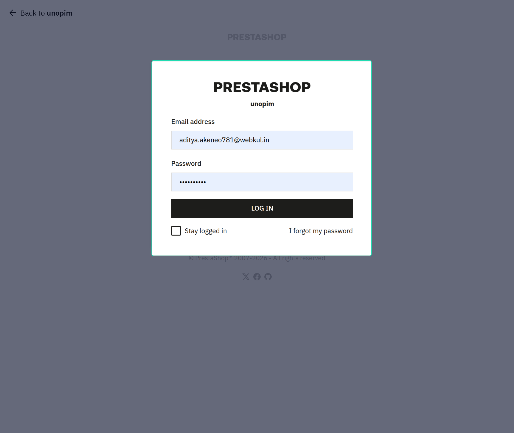
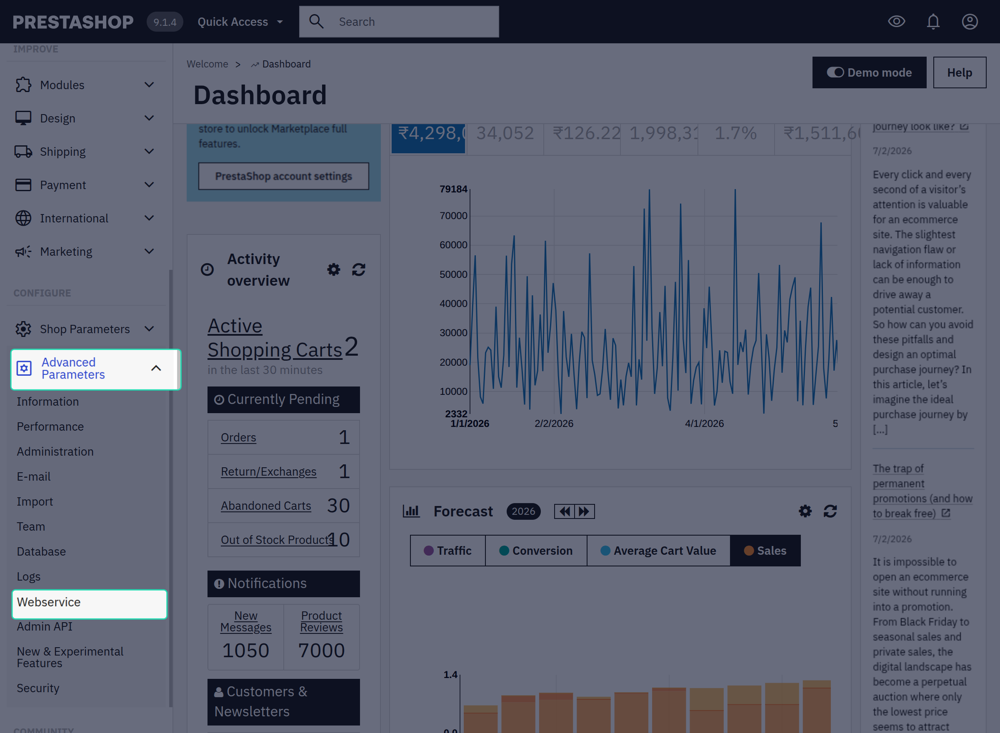
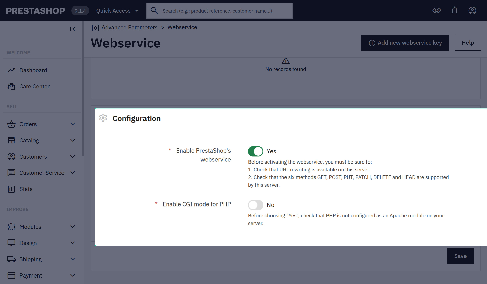
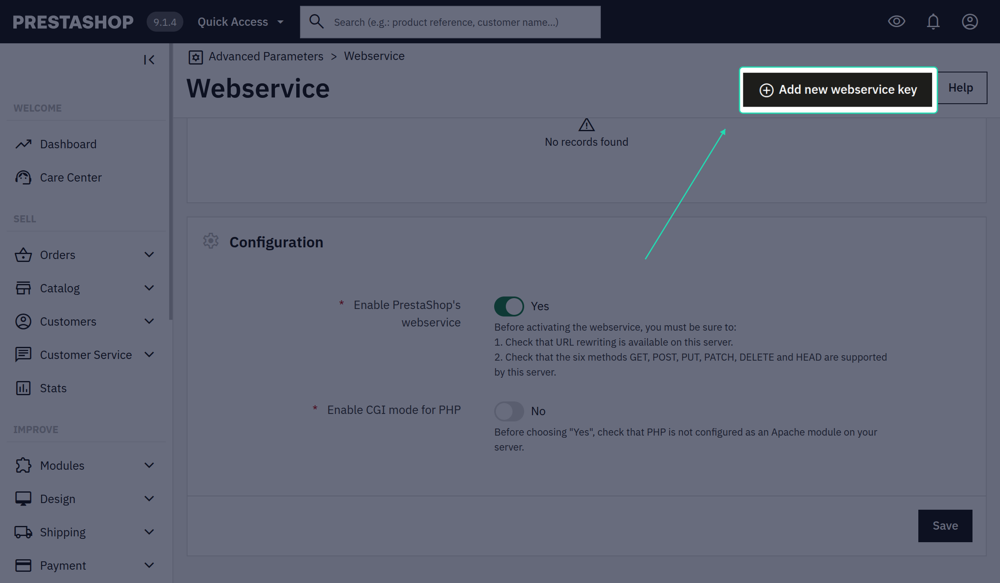
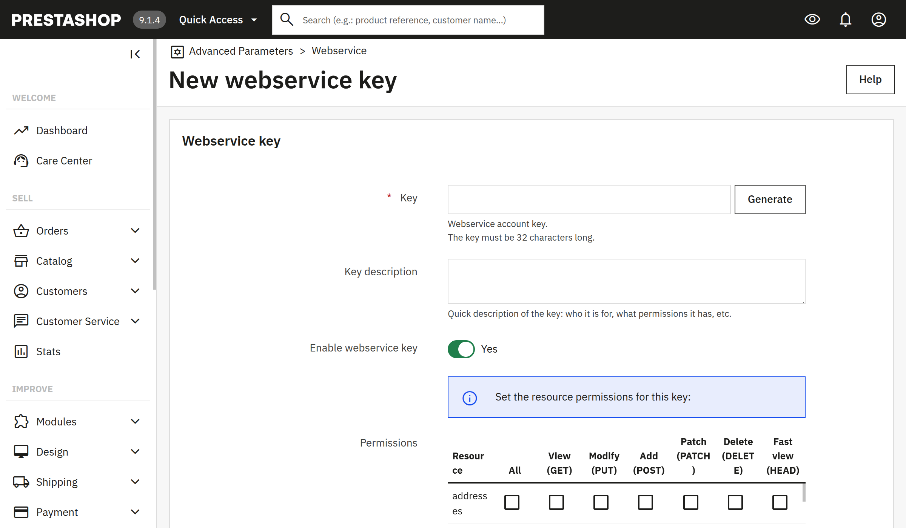
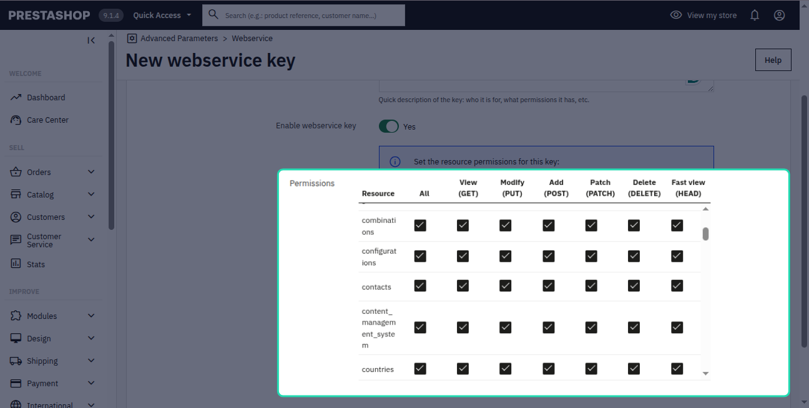

# PrestaShop Setup Guide

This guide covers the end-to-end setup required before you can run any import or export jobs between UnoPim and PrestaShop.

---

## 1. PrestaShop WebService Configuration

The connector communicates with PrestaShop through its built-in WebService (REST API). You must enable the WebService and generate an API key before creating a credential in UnoPim.

### Enable the WebService

1. Log in to your PrestaShop back office.

2. Go to **Advanced Parameters → Webservice**.

3. Set **Enable PrestaShop's webservice** to **Yes** and save the configuration.

### Create an API Key

1. On the same Webservice page, click **Add new webservice key**.

2. Click **Generate** to create a random key, or enter your own.

3. Under **Permissions**, enable the following resources and grant at least the permissions listed:

| Resource | GET | POST | PUT | DELETE |
|---|---|---|---|---|
| `categories` | ✓ | ✓ | ✓ | |
| `products` | ✓ | ✓ | ✓ | |
| `combinations` | ✓ | ✓ | ✓ | |
| `product_features` | ✓ | ✓ | ✓ | |
| `product_feature_values` | ✓ | ✓ | ✓ | |
| `product_options` | ✓ | ✓ | ✓ | |
| `product_option_values` | ✓ | ✓ | ✓ | |
| `images` | ✓ | ✓ | ✓ | |
| `languages` | ✓ | | | |
| `shops` | ✓ | | | |
| `currencies` | ✓ | | | |
| `stock_availables` | ✓ | ✓ | ✓ | |
| `tax_rules` | ✓ | | | |

4. Set **Status** to **Enabled**.
5. Save the key and copy the generated API key — you will need it in UnoPim.

> **Note:** For a read-only import setup, you only need GET permission on each resource.
