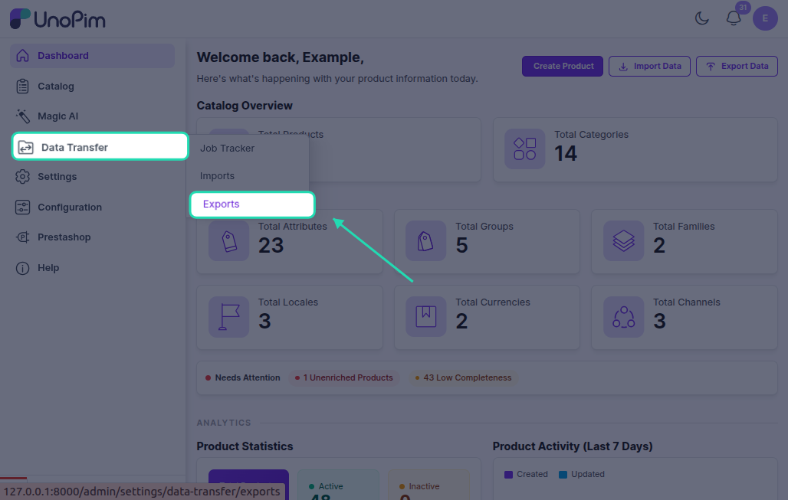
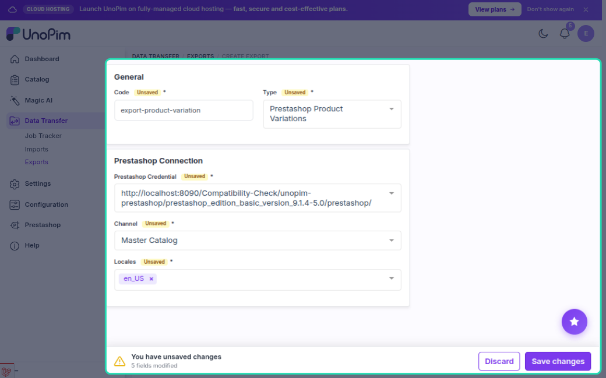
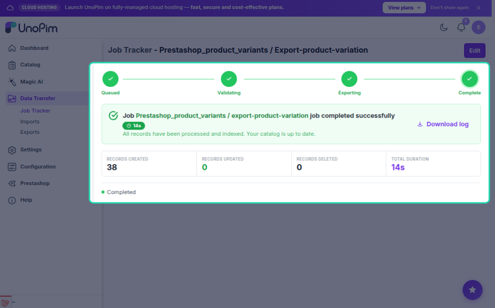

# Product Variation Export

The product variation export job pushes variant combinations (child products) to PrestaShop. It focuses only on the combinations — SKU, price, stock, and option values — without re-exporting the parent product's description, images, or categories.

---

## Configurable Product Export vs Product Variation Export

Both jobs work with configurable products (products that have variants), but they do different things:

| | Configurable Product Export | Product Variation Export |
|---|---|---|
| **Exports parent product** | Yes — name, price, description, images, categories, features | No (only creates parent if it is completely missing) |
| **Exports variants** | Yes — after exporting the parent | Yes — this is the main focus |
| **Use when** | First-time sync or updating parent product details | Variants changed (price, stock, options) but parent is unchanged |

> Think of it this way: **Configurable Product Export** does the full job. **Product Variation Export** is a targeted update for combinations only.

---

## How to Run

1. Go to **Data Transfer → Exports → Create Export Job**.

2. Select exporter type **Prestashop Product Variants**.

3. Set the filters:

| Filter | What to pick |
|---|---|
| **Credential** | Your PrestaShop connection |
| **Shop** | The shop to export to |
| **Locales** | Which languages to include |

4. Save and run the job.

---

## What Gets Exported Per Variant

| Field | Notes |
|---|---|
| **SKU** (`reference`) | Variant's own SKU |
| **Price offset** | Variant price minus parent base price |
| **Stock / Quantity** | Variant stock |
| **Option values** | e.g. Color: Red, Size: M — linked to PrestaShop product option values |
| **Default combination** | First (or configured default) variant is marked as default |

---

## Create vs Update

| Situation | What happens |
|---|---|
| Parent product missing | Parent is **created first**, then variants |
| Combination not in PrestaShop | **Created** and linked to parent |
| Combination already exported | **Updated** |
| Saved combination ID missing in PrestaShop | Recreated |

---

## Prerequisites

Variant option values (e.g. "Red", "M") must exist in PrestaShop before combinations can be created. Run jobs in this order:

1. Attribute Export
2. Category Export
3. Configurable Product Export *(first time)*
4. **Product Variation Export** *(for variant-only updates after that)*

---

## Common Issues

| Issue | Fix |
|---|---|
| Combinations not created | Run **Attribute Export** first so option values exist |
| Parent product missing | Run **Configurable Product Export** first |
| Price shows as 0 | Ensure parent product has a base price; variant price offset is calculated from it |
| Options not linked | Check that variant attributes are added in Attribute Mapping → Other → Variant Attributes |
