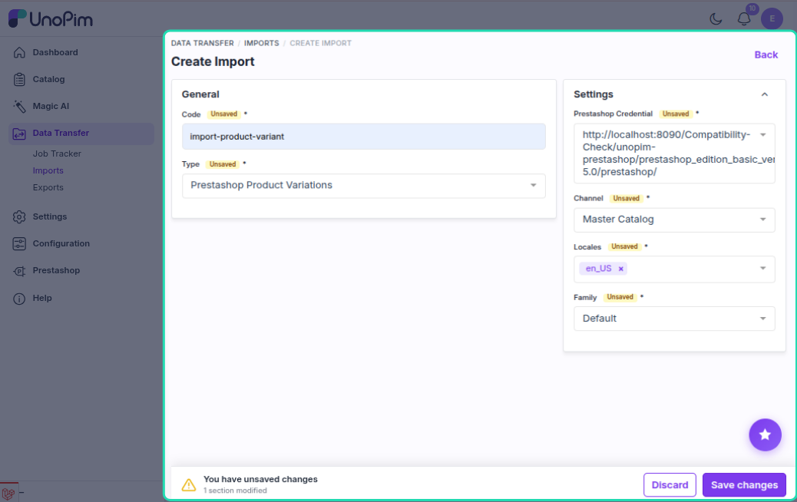
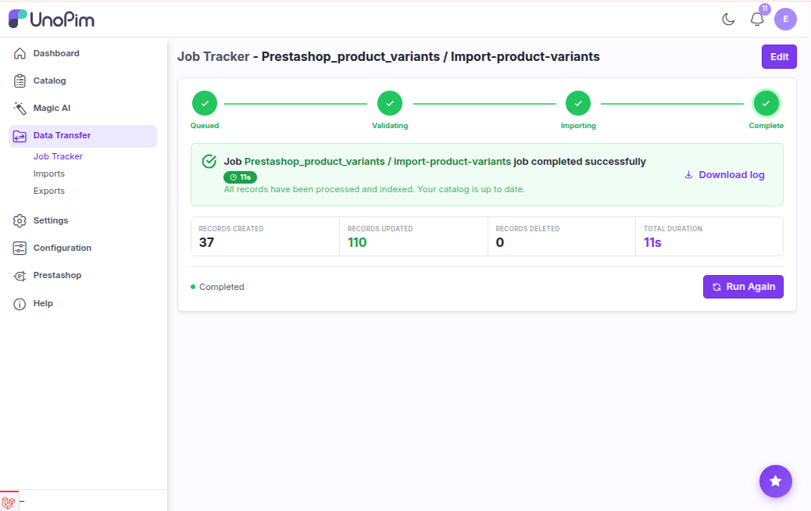

# Product Variant Import

The product variant import job pulls combinations (variants) from PrestaShop into UnoPim. It imports both the parent configurable product and all its child variants in a single job.

---

## How to Run

1. Go to **Data Transfer → Imports → Create Import Job**.

2. Select importer type **Prestashop Product Variants**.

3. Set the filters:

| Filter | What to pick |
|---|---|
| **Credential** | Your PrestaShop connection |
| **Shop** | The shop to import from |
| **Locales** | Which languages to import |
| **Default Attribute Family** | The family to assign to imported products |

4. Save and run the job.

---

## Configurable Product Import vs Product Variant Import

Both jobs import configurable products, but:

| | Configurable Product Import | Product Variant Import |
|---|---|---|
| **Imports parent** | Yes | Yes |
| **Imports variants** | No | Yes |
| **Use when** | You only need the parent product data | You need the full product with all variants |

> Use **Product Variant Import** when you want everything in one job.

---

## What Gets Imported Per Variant

| Field | Notes |
|---|---|
| **SKU** | From combination `reference`; fallback to `{parentSKU}-VAR-{id}` |
| **Price** | Parent base price + combination price offset |
| **Stock / Quantity** | Variant stock |
| **Option values** | e.g. Color: Red, Size: M — resolved from PrestaShop option value IDs |

The parent product receives the same fields as configurable product import (name, description, images, categories, etc.).

---

## How Option Values Are Resolved

Each combination has a list of PrestaShop option value IDs. The connector resolves them to UnoPim attribute codes and option codes by:

1. Looking up saved mappings from a previous **Attribute Import**
2. If not mapped, fetching the option group from the PrestaShop API and matching by name
3. If the option code doesn't exist in UnoPim yet, it is **created automatically**

---

## Variant SKU Resolution

| Priority | Source |
|---|---|
| 1 | Saved mapping code (from a previous import) |
| 2 | Combination `reference` field in PrestaShop |
| 3 | `{parentSKU}-VAR-{combinationId}` as fallback |

If a SKU already exists as a variant under the same parent, it is updated. If it exists elsewhere (different parent or type), a numbered suffix is added to avoid conflicts.

---

## Create vs Update

| Situation | What happens |
|---|---|
| Variant not in UnoPim | **Created** and linked to the parent |
| Variant already exists under same parent | **Updated** |
| Variant exists under different parent | New SKU generated with suffix to avoid conflict |

---

## Recommended Import Order

1. Attribute Import *(ensures option value mappings exist)*
2. Category Import
3. **Product Variant Import** *(imports parent + variants together)*

---

## Common Issues

| Issue | Fix |
|---|---|
| Variants have no option values | Run **Attribute Import** first so option value mappings exist |
| Variant SKUs generated as fallback names | Add a `reference` to combinations in PrestaShop before importing |
| Variant not linked to parent | Check the job log — usually a missing family attribute |
| Categories not linked | Run **Category Import** first |
| Option created but wrong name | Attribute Import populates the correct labels — run it first |
