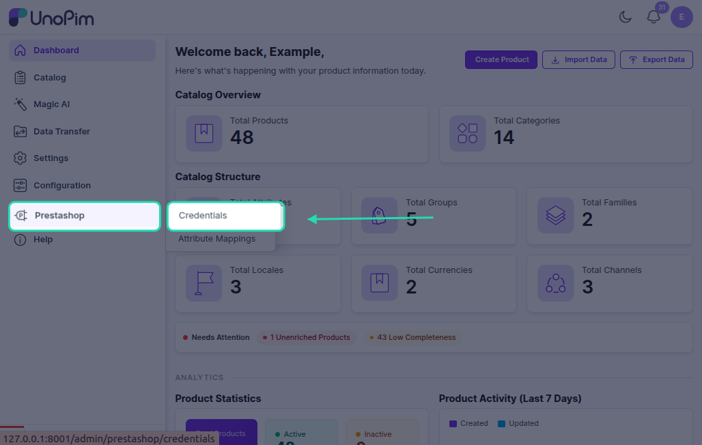
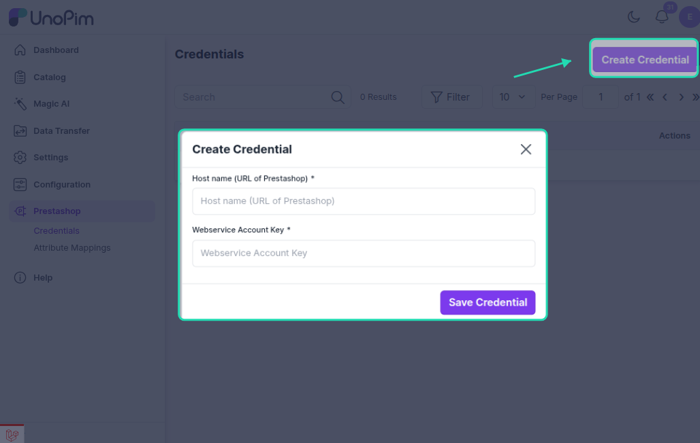
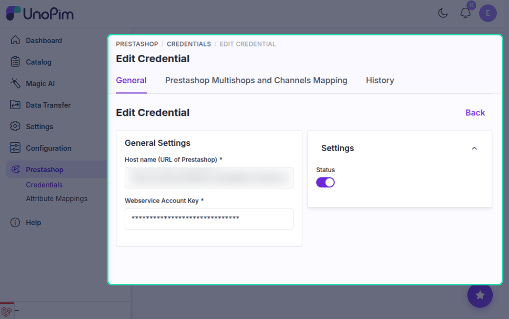

# Configuration Guide — UnoPim PrestaShop Connector

---

## Credentials

Navigate to **Prestashop → Credentials** in the left sidebar.

### Create a Credential

Click **Create Credential**. A modal opens with two fields:

| Field | Description |
|---|---|
| **Host Name (URL)** | Full URL of your PrestaShop store, e.g. `https://myshop.example.com` |
| **Webservice Account Key** | The API key from PrestaShop **Advanced Parameters → Webservice** |

UnoPim tests the connection immediately on save. If the URL or key is incorrect, or the API key lacks `GET` permission on the `shops` resource, the form returns an error. On success the credential is saved with **Status: Enabled** and you are redirected to the edit page.

### Edit a Credential

The edit page has two sections:

**General Settings** — Update the Webservice Account Key or toggle the credential status. The host URL cannot be changed after creation. If you leave the key field showing the masked value (30 asterisks), the existing key is kept.

**Prestashop Multishops and Channels Mapping** — Maps each PrestaShop shop to a UnoPim channel. UnoPim fetches the shop list from your PrestaShop instance via the API. For each shop, configure:

| Column | What to set |
|---|---|
| **Unopim Channel** | The UnoPim channel to sync with this shop |
| **Currency** | The currency for this shop (only currencies on the selected channel are listed) |
| **Default Locale** | The primary locale for this shop |
| **Locale Mapping** | Maps each PrestaShop language to a UnoPim locale — every language must be mapped |

At least one shop must have a channel selected. For any shop with a channel selected, Currency, Default Locale, and all Locale Mappings are required before you can save.

> A credential with **Status: Disabled** does not appear in job filter dropdowns and cannot be used to run jobs.
