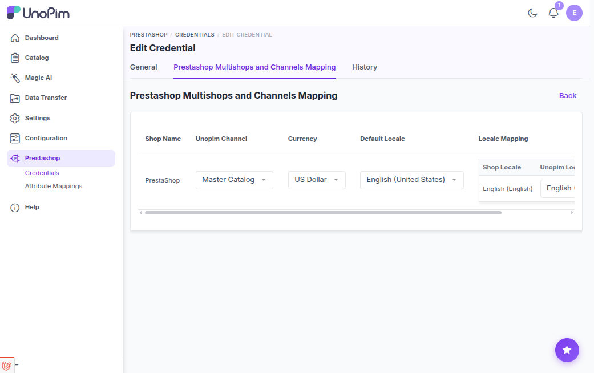

# Shop & Channel Mapping

PrestaShop can run multiple shops from one installation. UnoPim organizes products into **channels**. The mapping connects each PrestaShop shop to a UnoPim channel so the connector knows where to push data.

---

## What You Configure Per Shop

| Field | What it means |
|---|---|
| **Unopim Channel** | Which UnoPim channel feeds this shop |
| **Currency** | The currency for this shop (from the selected channel) |
| **Default Locale** | The primary language for this shop |
| **Locale Mapping** | Maps each PrestaShop language (e.g. Language ID `1`) to a UnoPim locale (e.g. `en_US`) |

---

## How to Set It Up

1. Go to **Prestashop → Credentials** and open a credential.
2. Scroll to **Prestashop Multishops and Channels Mapping**.
3. The table loads your PrestaShop shops automatically via the API.
4. For each shop, select a channel, currency, default locale, and map each language to a UnoPim locale.
5. Click **Save**.



---

## How It Works During Export / Import

When a job runs, you pick a **Shop** in the job filters. The connector:

1. Looks up that shop in the saved mapping.
2. Reads the channel, default locale, and locale mappings for that shop.
3. Filters data down to the locales you selected in the job.
4. Pushes/pulls data using PrestaShop language IDs mapped to UnoPim locale codes.

> If a PrestaShop language has no mapping saved, the connector automatically falls back to the **Default Locale**.

---

## Example Mapping

```
Shop 1 (Default Shop)
  Channel       → default
  Currency      → USD
  Default Locale→ en_US
  Language 1    → en_US
  Language 2    → fr_FR

Shop 2 (French Store)
  Channel       → europe
  Currency      → EUR
  Default Locale→ fr_FR
  Language 1    → en_US
  Language 3    → fr_FR
```

---

## Common Errors

| Error | Fix |
|---|---|
| No shops mapped | Open the credential and complete the mapping table |
| Shop not selected in job | Edit the job and pick a shop |
| No valid locales | Make sure the selected locales exist on the mapped channel |
| Credential inactive | Enable the credential in its settings |
