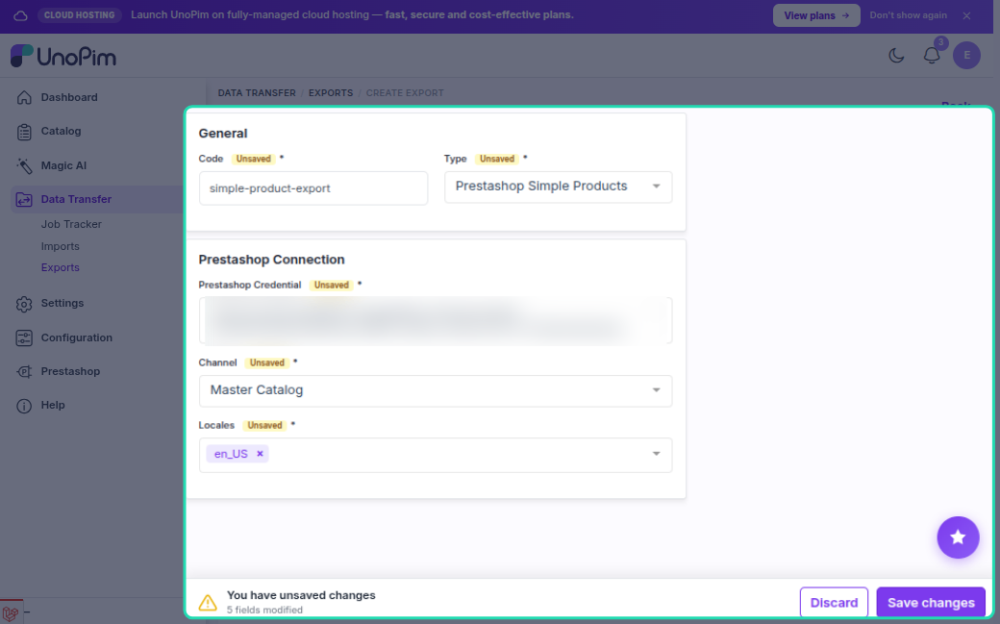
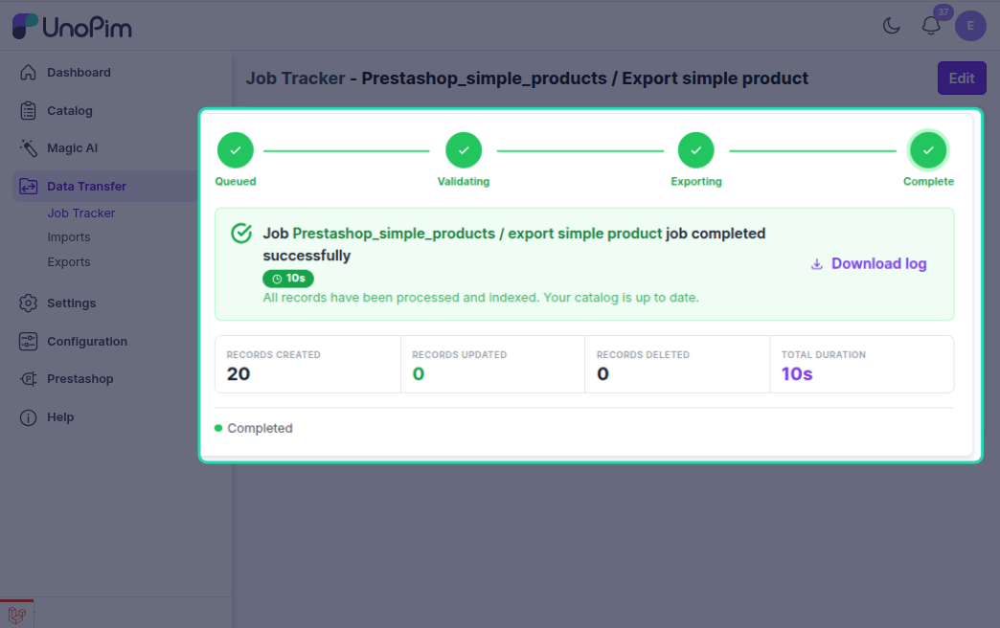
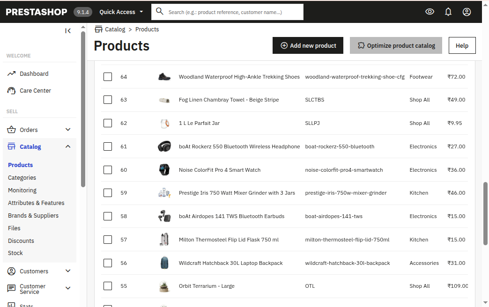

# Simple Product Export

The simple product export job pushes UnoPim simple products (non-variant, no parent) to PrestaShop. Each product is created or updated via the PrestaShop Webservice API.

---

## How to Run

1. Go to **Data Transfer → Exports → Create Export Job**.

2. Select exporter type **Prestashop Simple Products**.

3. Set the filters:

| Filter | What to pick |
|---|---|
| **Credential** | Your PrestaShop connection |
| **Shop** | The shop to export products to |
| **Locales** | Which languages to include |

4. Save and run the job.

---

## What Gets Exported

| Field | Notes |
|---|---|
| **Name** | Localized per language |
| **Description** | Localized |
| **Short description** | Localized |
| **Price** | Required — product is skipped if missing |
| **SKU** (`reference`) | Taken from product code |
| **Slug** (`link_rewrite`) | Auto-generated from name |
| **Meta title / description** | Localized |
| **EAN13 / UPC / MPN** | If mapped in Attribute Mapping |
| **Weight, dimensions** | If mapped |
| **Stock / Quantity** | Defaults to 0 if not set |
| **Active status** | Defaults to active |
| **Categories** | Linked via category export mappings |
| **Features** | Attributes marked as features in Attribute Mapping |
| **Images** | Uploaded via the image attribute configured in Attribute Mapping |

---

## Create vs Update

| Situation | What happens |
|---|---|
| Product never exported | **Created** in PrestaShop; ID is saved |
| Product already exported | **Updated** |
| Product ID saved but missing in PrestaShop | Stale record deleted, product **recreated** |

The connector checks in this order: saved mapping → SKU search in PrestaShop → create if not found.

---

## Images

Images are uploaded separately after the product is created/updated.

- The image attribute is set in **Attribute Mapping → Other → Image Mapping**.
- Each image is uploaded via the PrestaShop image API.
- Images removed from UnoPim are deleted from PrestaShop on the next export.

---

## Categories

Categories must be exported before products. The connector looks up each category's PrestaShop ID from the saved mappings and links them to the product.

If no category mapping is found, PrestaShop's default category (ID 2) is used as a fallback.

---

## Features

Attributes marked as **Feature Attributes** in Attribute Mapping are attached to the product as PrestaShop features. These features and their values must be exported first using the **Attribute Export** job.

---

## Localization

All localized fields (name, description, slug, etc.) are exported once per selected locale, mapped to PrestaShop language IDs using the credential's **Shop & Channel Mapping**.

---

## Common Issues

| Issue | Fix |
|---|---|
| Product skipped | Check the job log — likely missing price |
| Categories not linked | Run the **Category Export** job first |
| Features missing | Run the **Attribute Export** job first |
| Images not uploading | Set the image attribute in Attribute Mapping → Other → Image Mapping |
| Names blank in PrestaShop | Ensure selected locales have values in UnoPim |
