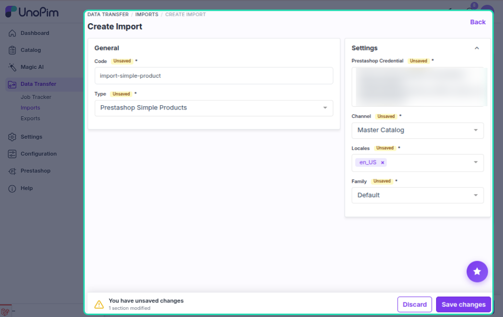
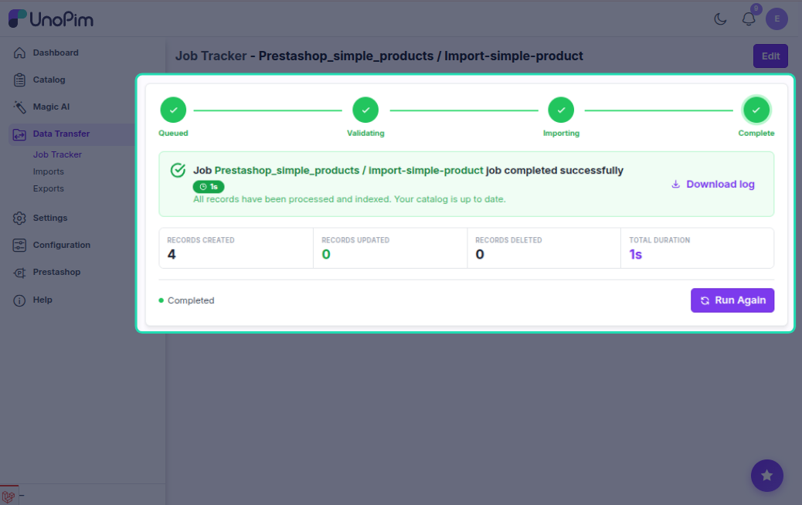

# Simple Product Import

The simple product import job pulls simple (non-variant) products from PrestaShop into UnoPim. Products with combinations are automatically skipped — those are handled by the configurable product import.

---

## How to Run

1. Go to **Data Transfer → Imports → Create Import Job**.

2. Select importer type **Prestashop Simple Products**.

3. Set the filters:

| Filter | What to pick |
|---|---|
| **Credential** | Your PrestaShop connection |
| **Shop** | The shop to import from |
| **Locales** | Which languages to import |
| **Default Attribute Family** | The family to assign to imported products |

4. Save and run the job.

---

## What Gets Imported Per Product

| Field | Notes |
|---|---|
| **SKU** | Taken from PrestaShop `reference`; fallback to `PS-{id}` if empty |
| **Name** | Localized per language |
| **Description / Short description** | Localized |
| **Price** | Mapped via Attribute Mapping |
| **Meta title / description** | Localized |
| **EAN13 / UPC / MPN / Weight** | If mapped in Attribute Mapping |
| **Stock / Quantity** | If mapped |
| **Categories** | Linked using category import mappings |
| **Images** | Downloaded from PrestaShop and stored in UnoPim |

Field values are populated based on the **Attribute Mapping** configuration. Only attributes that are mapped will be imported.

---

## What is Skipped

The importer only processes **simple/standard** PrestaShop products. A product is skipped if it has:

- Combinations (variants)
- A default combination set
- Combination associations in its data

Those products should be imported with the **Configurable Product Import** job instead.

---

## Create vs Update

| Situation | What happens |
|---|---|
| Product SKU not in UnoPim | **Created** and assigned to the default family |
| Product SKU already exists | **Updated** — existing values are merged |

---

## Images

Images are downloaded directly from the PrestaShop image API and stored in UnoPim's file storage.

- The **cover image** goes to the main image attribute configured in **Attribute Mapping → Other → Image Mapping**.
- Additional images go to the additional image attribute (if configured).
- Images are downloaded once — re-importing does not re-download images that already exist.

---

## Categories

Categories are linked using the mapping data saved from a previous **Category Import** job. If a category has not been imported yet, it won't be linked to the product.

Run **Category Import** before **Simple Product Import** to ensure category links are resolved correctly.

---

## Localization

Localized fields (name, description, meta fields) are imported for each selected locale using the credential's **Shop & Channel Mapping** (PrestaShop language ID → UnoPim locale code).

---

## Common Issues

| Issue | Fix |
|---|---|
| Product fields missing | Check Attribute Mapping — only mapped fields are imported |
| Default family not found | Ensure the family code in the job filter exists in UnoPim |
| Categories not linked | Run **Category Import** first |
| Images not downloading | Check the credential's API key has permission to read images |
| Product created but no values | Verify the attribute mapping is configured and the attributes exist in the selected family |
