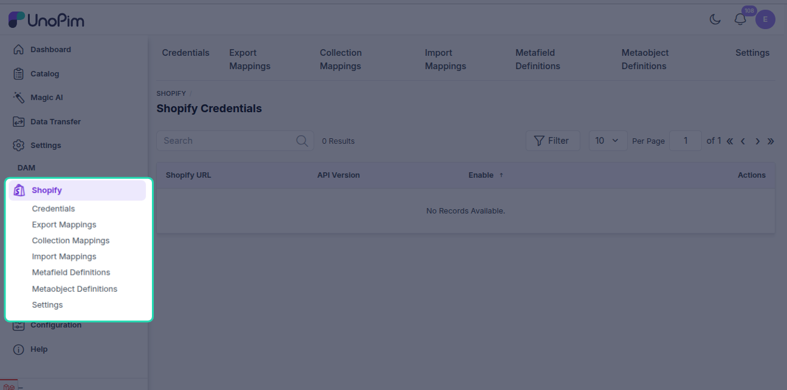

# Installation

There are two ways to install the UnoPim Shopify Connector — **Composer** (recommended) and **Manual**. Pick the one that suits your setup. If you're not sure, go with Composer — it's faster and handles everything automatically.

---

## Option 1 — Composer Installation (Recommended)

If you have Composer set up on your server, this is by far the quickest way to get started.

**Step 1 — Install the package**

Open your terminal, navigate to your UnoPim project root, and run:

```bash
composer require unopim/shopify-connector
```

| Command | Purpose |
|---|---|
| `composer require unopim/shopify-connector` | Downloads and installs the Shopify connector package and updates Composer dependencies. |

Wait for Composer to finish downloading and installing the package.

**Step 2 — Run the installer and clear the cache**

Once the package is installed, run these two commands one after the other:

```bash
php artisan shopify-package:install
php artisan optimize:clear
```

| Command | Purpose |
|---|---|
| `php artisan shopify-package:install` | Runs the Shopify connector installer and required setup steps. |
| `php artisan optimize:clear` | Clears all cached files (bootstrap, configuration, routes, and views) to load the new changes. |

That's it — the connector is installed and ready to configure.

---

## Option 2 — Manual Installation

Use this method if you can't use Composer or prefer to install packages manually.

**Step 1 — Add the package files**

Download the extension ZIP file and unzip it. Rename the extracted folder to `Shopify` and move it into the following directory inside your UnoPim project:

```
packages/Webkul/Shopify
```

**Step 2 — Register the service provider**

Open the `config/app.php` file and add the following line inside the `providers` array:

```php
Webkul\Shopify\Providers\ShopifyServiceProvider::class,
```

> [!NOTE]
> This registers `ShopifyServiceProvider` in Laravel so the connector can bootstrap its services, routes, and package configuration during application startup.

**Step 3 — Update Composer autoload**

Open `composer.json` and add the following line under the `autoload > psr-4` section:

```json
"Webkul\\Shopify\\": "packages/Webkul/Shopify/src"
```

**Step 4 — Run the setup commands**

Now run the following commands in order:

```bash
composer dump-autoload
php artisan shopify-package:install
php artisan optimize:clear
```

| Command | Purpose |
|---|---|
| `composer dump-autoload` | Regenerates Composer's autoloader mapping to include the newly added namespace. |
| `php artisan shopify-package:install` | Runs the Shopify connector installer and required setup steps. |
| `php artisan optimize:clear` | Clears all cached files (bootstrap, configuration, routes, and views) to load the new changes. |

---

## Verify the Installation

Once either installation method is complete, log in to your UnoPim dashboard. You should see a **Shopify icon** appear in the left sidebar — that confirms the connector has been installed successfully.



If the icon doesn't appear, try running `php artisan optimize:clear` again and refresh the page.

