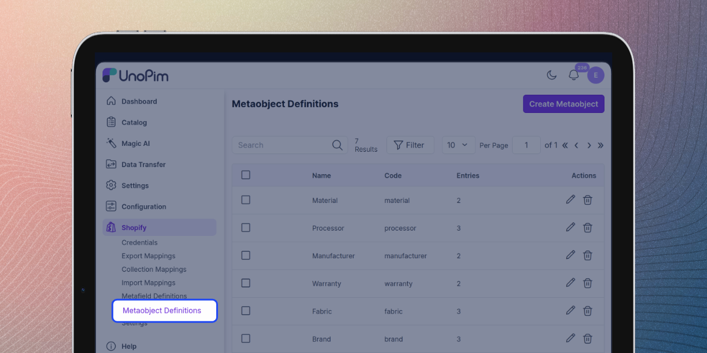
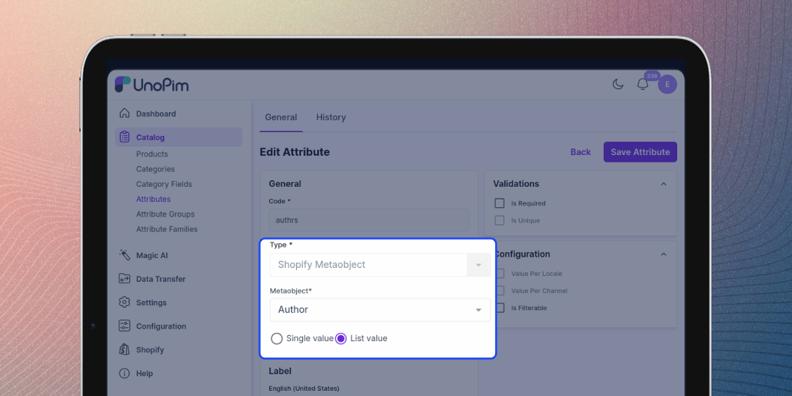
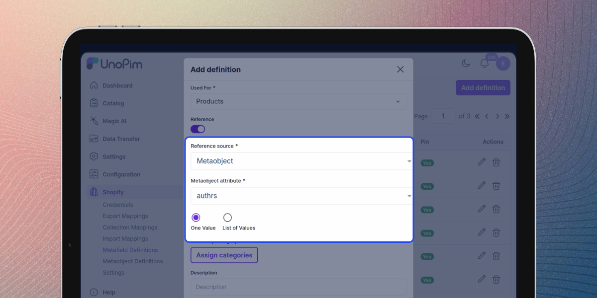

# Add & Manage Shopify Metaobject Definitions

**Metaobjects** are a flexible way to store and manage structured custom data — think of them as custom resources made up of several fields grouped together. They let you capture information that doesn't fit into standard product fields, such as an **Author** profile, a **Brand**, a **Material**, a size chart, or an ingredient list, and then reuse it across many products.

Instead of repeating the same brand name, logo, and description on every product, you define a **Brand** metaobject once and simply point each product at it. Update it in one place and every product that references it stays in sync.

With the UnoPim Shopify Connector you build these metaobjects — both their structure and their content — directly in UnoPim and export them to Shopify. There's no need to create them by hand in the Shopify admin; on export they appear under **Content → Metaobjects** in your store.

---

## The Two Parts of a Metaobject

A metaobject has two components:

| Part | What it is | In UnoPim | In Shopify |
|---|---|---|---|
| **Definition** | The *structure* — the fields, their types, and validation rules. For example an **Author** definition with the fields *Author name*, *Bio*, *Date of birth*, and *Country*. | Created on the **Metaobject Definitions** screen. | Lives under **Settings → Custom data**. |
| **Entry** | The actual *content* that follows a definition — for example the author *"Robert Kiyosaki"*. One definition can have many entries. | Added from the definition's edit screen. | Lives under **Content → Metaobjects**. |

A **Field** is a single piece of data inside a definition (for example *Bio* stored as rich text), with its own type and validations.

> **Note:** Shopify also has *standard* (pre-built) and *app-created* metaobject definitions. The definitions you build with this connector are **custom** definitions — unique to your store and fully managed from UnoPim.

**Common use cases:** author or ambassador profiles, brand information, product highlights, size charts, ingredient lists, warranty details, or any repeatable structured content.

---

## How to Create a Metaobject Definition

1. Click the **Shopify icon** in the left sidebar.
2. Click on **Metaobject Definitions**.

The list shows every definition with its **Name**, **Code** (auto-generated from the name), the number of **Entries** it holds, and actions to **edit** or **delete** it.

3. Click the **Create Metaobject** button in the top-right corner.

---

## Building the Definition

Give the metaobject a **Name**, then add one or more **Fields**. Each field has a name, a type, its validations, and a single/list choice.

For every field you can set:

- **Field name** — a readable label such as *Author name* or *Bio*.
- **Type** — the kind of data the field holds (see the table below).
- **Validations** — rules that appear based on the chosen type (for example *Min* / *Max* / *Regex* for text, a unit for measurements, or an allowed file type for files).
- **Single value / List value** — choose **List value** when the field should hold multiple values.

Click **Add Field** for each additional field, then **Save**. A definition must have at least one field.

> **Tip:** To build nested data — for example a *Laptop* metaobject that references a *Processor* metaobject — add a field of type **Metaobject reference**. You can pick an existing definition or create a new one inline, without leaving the form.

---

## Field Types

| Type | When to use |
|---|---|
| **Single line text** / **Multi-line text** | Short or long plain text |
| **Rich text** | Formatted text such as a description |
| **Email** | An email address |
| **URL** | A link |
| **Number** / **Decimal** | Whole or decimal numbers |
| **Boolean** | A true/false flag |
| **Date** / **Date & time** | A calendar date or timestamp |
| **Color** | A hex colour value |
| **Rating** | A rating with a min/max scale |
| **Money** | A monetary amount |
| **Dimension** / **Volume** / **Weight** | A measurement with its unit |
| **Link** | A text-and-URL pair |
| **JSON** / **ID** | Structured data or a formatted identifier |
| **Image** / **File** | An image or any file (uploaded per entry) |
| **Metaobject reference** | Points to another metaobject definition — used for nested data |

---

## Adding Entries

Open a definition from the list (the **edit** icon). On the edit screen you can adjust the definition and, in the **Entries** section, click **Add Entry** to create records for it.

Each entry form adapts to your field types — a text field shows a text box, an image field shows an uploader, a date field shows a calendar, and a **Metaobject reference** field shows a dropdown of the referenced definition's entries.

> **Note:** Once a definition is saved, the **type** of its existing fields is locked (Shopify does not allow changing a field's type after creation). You can still rename fields, edit validations, add new fields, and manage entries. New fields added on the edit screen are exported to Shopify the next time you run the metaobject export.

---

## Using a Metaobject on a Product

To let a product reference a metaobject entry, create a UnoPim attribute of the special type **Shopify Metaobject** (**Catalog → Attributes → Create Attribute**).

- **Type** — choose **Shopify Metaobject**.
- **Metaobject** — pick the definition this attribute is bound to (for example *Author*).
- **Single value / List value** — choose **List value** to let the product reference more than one entry.

Add this attribute to the relevant attribute family. When you edit a product, the attribute appears as a dropdown of the definition's entries, so you can pick the entry (or entries) that apply to that product.

---

## Sending Metaobjects to Shopify

A metaobject reaches a product on Shopify through a **metafield**. Create a metafield definition (**Shopify → Metafield Definitions → Add Definition**) and turn on **Reference**:

- **Reference source** — choose **Metaobject**.
- **Metaobject attribute** — select the **Shopify Metaobject** attribute you created above.
- **One Value / List of Values** — choose **List of Values** for a list-type metafield.

This links the metafield to the attribute. When a product is exported, the entry selected on the product is sent to Shopify as this metafield's value.

> **Note:** On export the connector reconciles the attribute and the metafield. If the metafield is single-value it sends one entry; if it is a list it sends all selected entries.

---

## Exporting & Importing Metaobjects

Metaobject definitions and their entries are transferred through **Data Transfer** jobs, like the rest of your catalog:

- **Export** — run the **Shopify Metaobject** export job to create/update the definitions and their entries on Shopify. Newly added fields are added to existing definitions automatically (existing fields are never removed). Run the metafield and product exports so the reference is linked and each product points at the right entry.
- **Import** — run the **Shopify Metaobject** import job to pull existing definitions and entries from Shopify back into UnoPim.

> **Recommended order:** export (or import) **metaobject definitions first**, then **metafield definitions**, then **products** — so every reference is resolved correctly.
