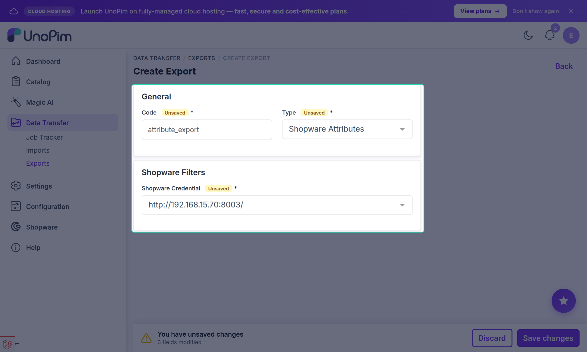
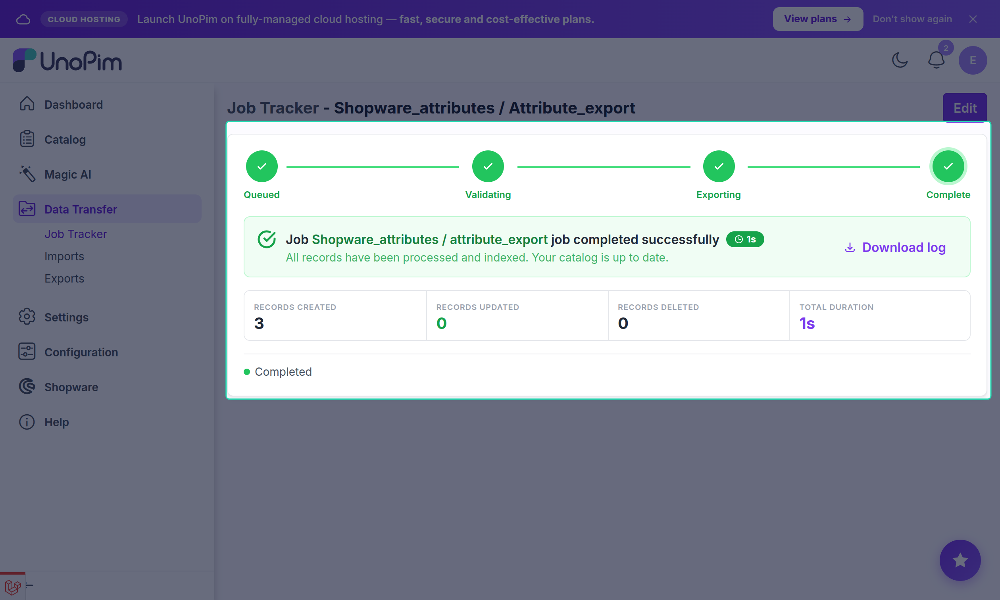

# Attribute Export

The **Shopware Attributes** export job pushes UnoPim attributes to Shopware as **property groups**. This includes both regular attributes and the super-attributes used to define configurable product variants.

Export attributes before exporting attribute options, and before running product export jobs that rely on property values.

---

## Open the Export Jobs Section

Go to:

`Data Transfer → Exports`

Click **Create Export** in the top-right corner.

---

## Create an Attribute Export Job

While creating the export job:

1. Enter a unique **Export Job Code** to identify this job (e.g. `shopware-attributes`).
2. Select **Shopware Attributes** as the export job type.

---

## Configure Filters

After selecting the job type, configure the required filter:

| Filter | Description |
|---|---|
| **Shopware Credential** | Select the Shopware store connection to export to. Only active credentials appear in this list. |

---

## Save and Run

Click **Save Export** to create the job.

To run the job, open it from the exports list and click **Export Now**.

Once the job completes, you can monitor the result in the **Job Tracker** — it will show the number of attributes created or updated in Shopware.

---

## What Gets Exported

Each UnoPim attribute is pushed to Shopware as a **property group** with:
- The attribute name (translated per each mapped locale)
- The attribute code used as the Shopware property-group identifier

> [!NOTE]
> After a successful attribute export, run the **Shopware Attribute Options** export to push the individual values (property-group options) for each attribute.
