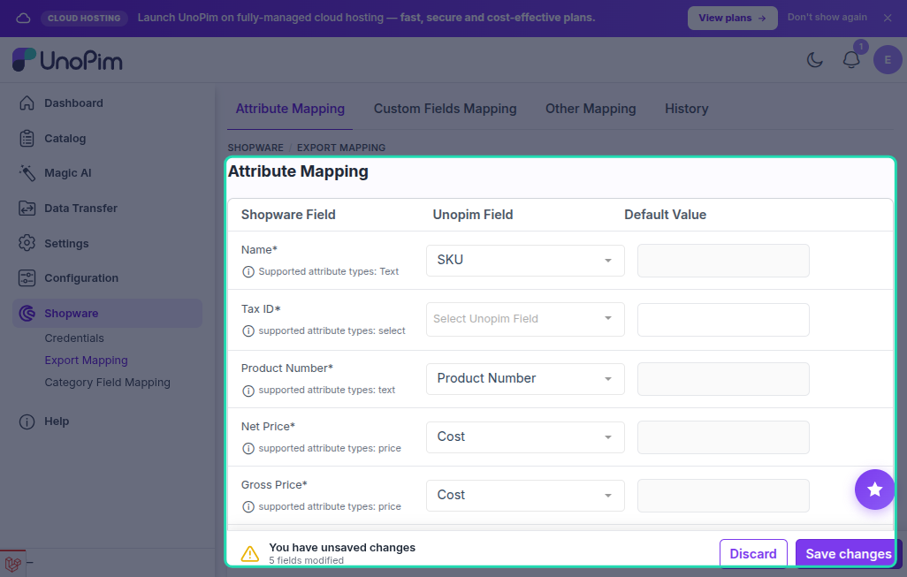

# Attribute Mapping (Standard Fields)

The **Attribute Mapping** screen lets you map UnoPim attributes to the standard Shopware product fields. Once configured, every export job reads these mappings to know which UnoPim value to push into each Shopware field.

Go to **Shopware → Export Mapping → Attribute Mapping** in the UnoPim sidebar.

---

## How It Works

Each row on the mapping screen represents one Shopware product field. Use the dropdown on the right to select the UnoPim attribute whose value will be sent to that field. You can also enter a **default value** for any field — this value is used when the selected attribute has no value for a product.

---

## Available Shopware Product Fields

| Shopware Field | What it maps to |
|---|---|
| **Name** | Product title displayed in Shopware (text attribute). |
| **Product Number** | Unique product identifier / SKU (text attribute). |
| **Tax ID** | Shopware tax rate assigned to the product (select attribute). |
| **Net Price** | Selling price excluding tax (price attribute). |
| **Gross Price** | Selling price including tax (price attribute). |
| **List Price (Net)** | Original/crossed-out net price, used for discounts (price attribute). |
| **List Price (Gross)** | Original/crossed-out gross price (price attribute). |
| **Regulation Price (Net)** | Regulatory reference price, net (price attribute). |
| **Regulation Price (Gross)** | Regulatory reference price, gross (price attribute). |
| **Purchase Price (Net)** | Cost of goods sold, net (price attribute). |
| **Purchase Price (Gross)** | Cost of goods sold, gross (price attribute). |
| **Stock Quantity** | Available inventory count (text attribute with numeric value). |
| **Delivery Time ID** | Shopware delivery time option (select attribute). |
| **Unit ID** | Unit of measurement (select attribute). |
| **Manufacturer ID** | Brand or manufacturer in Shopware (select attribute). |
| **Sales Channel Visibility** | Which sales channels the product is published to (multiselect attribute). |
| **Free Shipping** | Whether the product ships for free — `true` or `false` (boolean attribute). |
| **Pack Unit** | Number of items per pack (text attribute with numeric value). |
| **Closeout Status** | Whether the product is unavailable when out of stock (boolean attribute). |
| **Description** | Full product description (textarea attribute). |
| **Meta Title** | SEO page title (text attribute). |
| **Meta Description** | SEO meta description (textarea attribute). |
| **Keywords** | SEO keywords (textarea attribute). |
| **Mark as Topseller** | Flags the product as a top seller in Shopware (boolean attribute). |
| **Release Date** | Product release date (date attribute). |
| **Reference Unit** | Reference quantity for unit pricing (text attribute with numeric value). |
| **Minimum Purchase Quantity** | Minimum order quantity (text attribute with numeric value). |
| **Maximum Purchase Quantity** | Maximum order quantity (text attribute with numeric value). |
| **Product Length** | Physical product length (text attribute with numeric value). |
| **Purchase Unit** | Purchase quantity step (text attribute with numeric value). |

---

## Using Default Values

If a product does not have a value for the mapped attribute, Shopware will receive the **default value** you entered for that field. This is useful for fields like **Free Shipping**, **Closeout Status**, or **Mark as Topseller** where you want a consistent value across all products unless explicitly overridden.

**Example:** Set **Free Shipping** default to `false` — all products will be marked as "standard shipping" unless a specific product has a boolean attribute mapped to `true`.

---

## Adding Custom Standard Fields

If you need to map a Shopware product field that is not in the default list, use the **Additional Standard Attributes Mapping** section at the bottom of the page.

Enter the Shopware field code, select the UnoPim attribute type it expects, and click **Add**. The new field will appear in the mapping list.

---

## Saving

After completing the mapping, click **Save** at the top of the page. The mapping is applied globally — all export jobs that send products to Shopware use this configuration.

> [!TIP]
> Mapping changes are tracked in **Shopware → Export Mapping → Attribute Mapping → History**, so you can see what changed and when.
