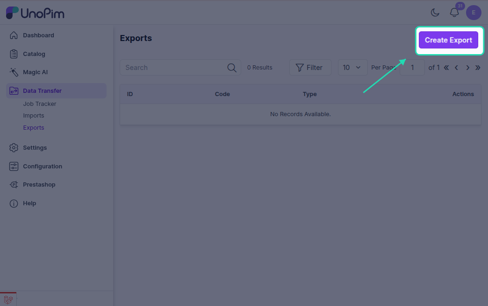
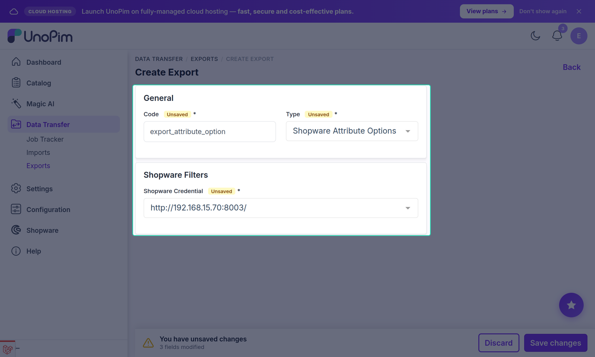
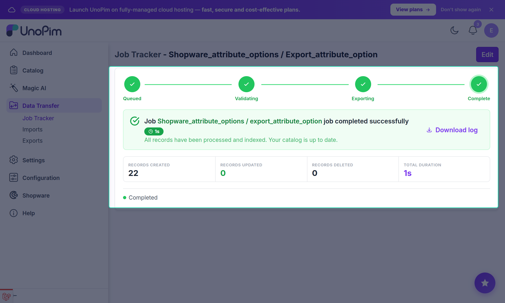

# Attribute Options Export

The **Shopware Attribute Options** export job pushes UnoPim attribute options to Shopware as **property-group options** — the individual values that belong to each property group (attribute).

Run this job after the **Shopware Attributes** export and before any product export that uses property values.

---

## Open the Export Jobs Section

Go to:

`Data Transfer → Exports`

Click **Create Export** in the top-right corner.

---

## Create an Attribute Options Export Job

While creating the export job:

1. Enter a unique **Export Job Code** (e.g. `shopware-attribute-options`).
2. Select **Shopware Attribute Options** as the export job type.

---

## Configure Filters

| Filter | Description |
|---|---|
| **Shopware Credential** | Select the Shopware store connection to export to. |

---

## Save and Run

Click **Save Export** to create the job, then click **Export Now** to run it.

Monitor progress in the **Job Tracker** — it will report how many options were created or updated.

---

## What Gets Exported

Each UnoPim attribute option is pushed to Shopware as a **property-group option** linked to its parent property group (attribute). The option label is translated per each mapped locale.

> [!NOTE]
> Product export jobs that use properties will fail if the corresponding attribute options have not been exported first. Run this job before the **Shopware Simple Products and Variants** or **Shopware Configurable Products** export when properties are configured in [Other Mapping](./other-mapping).
