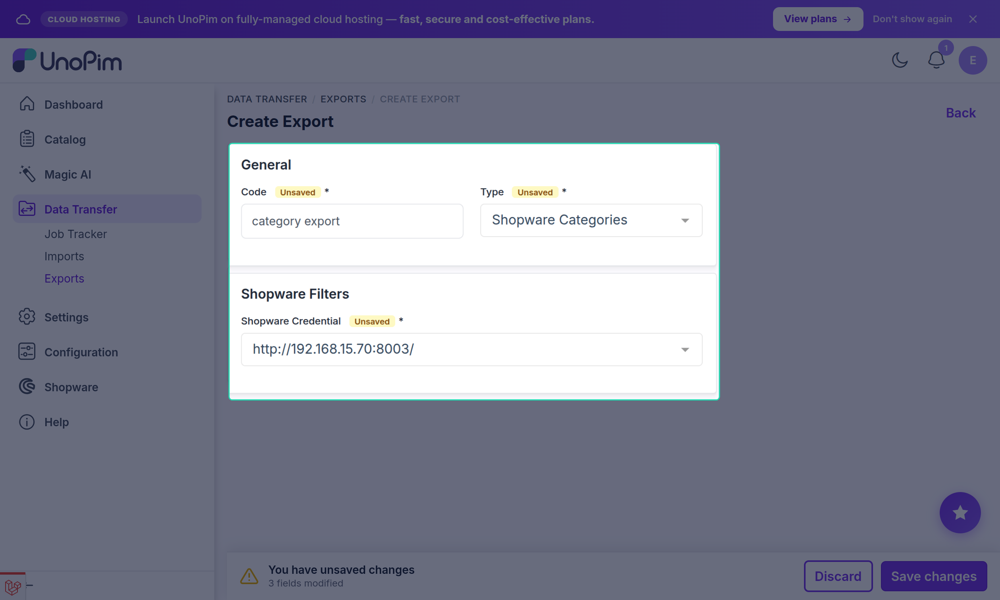

# Category Export

The **Shopware Categories** export job pushes your UnoPim category tree to Shopware, preserving parent-child relationships, localized names and descriptions, and category images.

Export categories before products so that products can be assigned to the correct Shopware categories when they are pushed.

---

## Prerequisites

Before running the category export:

- [Category Field Mapping](./category-mapping) must be configured — at minimum, the **Name** field must be mapped.
- At least one active [credential](./credentials) must exist.

---

## Open the Export Jobs Section

Go to:

`Data Transfer → Exports`

Click **Create Export** in the top-right corner.

---

## Create a Category Export Job

While creating the export job:

1. Enter a unique **Export Job Code** (e.g. `shopware-categories`).
2. Select **Shopware Categories** as the export job type.

---

## Configure Filters

| Filter | Description |
|---|---|
| **Shopware Credential** | Select the Shopware store connection to export to. |

---

## Save and Run

Click **Save Export** to create the job, then click **Export Now** to run it.

Monitor the progress in the **Job Tracker** — it will report the number of categories created or updated in Shopware.

---

## What Gets Exported

For each category in UnoPim, the connector sends:

- **Name** and **Description** — translated per each mapped locale.
- **Meta Title**, **Meta Description**, and **Keywords** — if mapped.
- **Active** and **Visible** flags.
- **Category Image** — uploaded to Shopware as category media.
- **Parent/child structure** — root categories are created without a parent; child categories are linked to their Shopware parent by the stored ID mapping.

Re-running the job updates existing categories (upsert) — it does not create duplicates.
