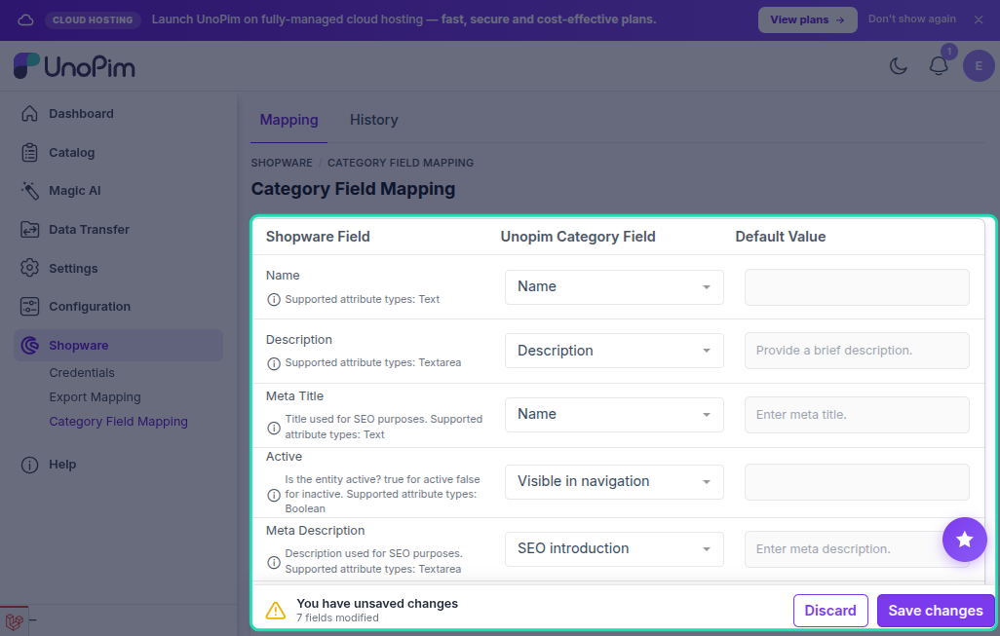

# Category Field Mapping

The **Category Field Mapping** screen controls how UnoPim category fields are exported to the corresponding Shopware category fields.

Go to **Shopware → Export Mapping → Category Field Mapping** in the UnoPim sidebar.

---

## How It Works

Each row represents one Shopware category field. Use the dropdown to select the UnoPim category attribute or system field that maps to it.

---

## Available Category Fields

| Shopware Category Field | Description |
|---|---|
| **Name** | The category name shown in Shopware navigation menus and breadcrumbs. Mapped from a UnoPim category text attribute or the built-in name field. Supported type: **Text** |
| **Description** | Full category description displayed on the category page. Supported type: **Textarea** |
| **Meta Title** | SEO page title for the category. Supported type: **Text** |
| **Meta Description** | SEO meta description for the category. Supported type: **Textarea** |
| **Keywords** | SEO keywords for the category page. Supported type: **Textarea** |
| **Active** | Whether the category is published and visible in Shopware. Supported type: **Boolean** |
| **Visible** | Whether the category appears in the Shopware storefront navigation. Supported type: **Boolean** |
| **Category Image** | Category image uploaded to Shopware as category media. Supported type: **Image** |

---

## Locale-Aware Fields

The connector resolves category field values per locale. When a locale mapping is configured in the credential, localized values (name, description, meta fields) are pushed as Shopware category translations for each mapped language.

---

## Saving

Once all fields are mapped, click **Save**. The mapping applies to the **Shopware Categories** export job.

> [!NOTE]
> At minimum, the **Name** field must be mapped before the category export job will run successfully.

> [!TIP]
> Mapping changes are tracked in history. Go to **Shopware → Export Mapping → Category Field Mapping → History** to review past changes.
