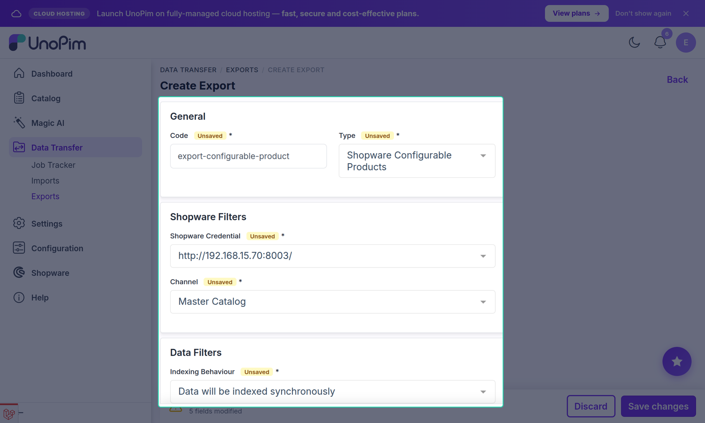
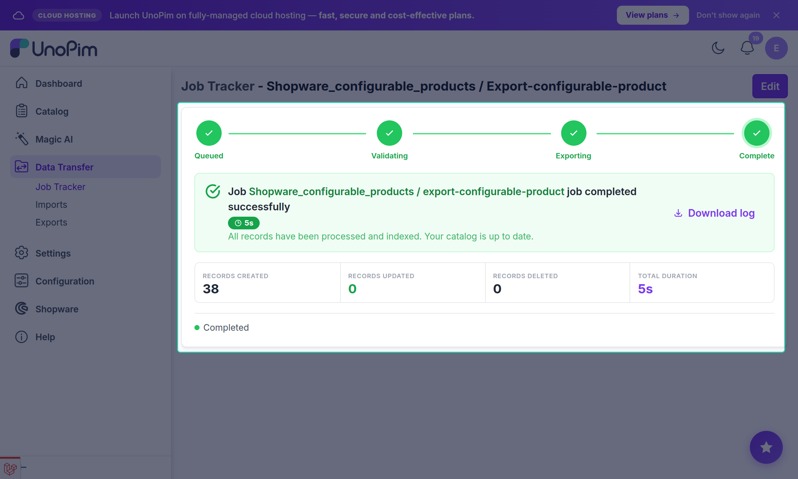

# Configurable Product Export

The **Shopware Configurable Products** export job pushes configurable (parent) products from UnoPim to Shopware. It creates the parent product, sets up the **configurator settings** (variant axes), and links each variant to the parent with its selected option values.

---

## How Configurable Products Work in Shopware

In Shopware, a configurable product is a parent product with one or more **variant axes** (e.g. Color, Size). Each combination of options produces a variant. When a customer views the product page, they use the configurator to pick their options.

The connector maps this structure from UnoPim:

| UnoPim concept | Shopware equivalent |
|---|---|
| Configurable product | Parent product |
| Super-attributes | Configurator settings (variant axes) |
| Variants | Variant products linked to the parent |
| Attribute options on variants | Property option selections |

---

## Prerequisites

Before running the configurable product export:

- Run [Shopware Attributes](./attribute-export) and [Shopware Attribute Options](./attribute-options-export) so that property groups and their options already exist in Shopware.
- Configure [Attribute Mapping](./attribute-mapping) for the standard product fields.
- Configure [Other Mapping → Configurator Listing Attributes](./other-mapping) for the super-attributes that appear in the Shopware storefront configurator.
- Run [Shopware Product Tags](./product-tags-export) first if tags are configured.
- At least one active [credential](./credentials) with locale and currency mappings.

---

## Open the Export Jobs Section

Go to:

`Data Transfer → Exports`

Click **Create Export** in the top-right corner.

---

## Create a Configurable Product Export Job

1. Enter a unique **Export Job Code** (e.g. `shopware-configurable-products`).
2. Select **Shopware Configurable Products** as the export job type.

---

## Configure Filters

| Filter | Description |
|---|---|
| **Shopware Credential** | Select the Shopware store to export to. |
| **Channel** | Select the UnoPim channel whose product values are used for the export. |
| **Indexing Behaviour** | Controls Shopware's post-import indexing strategy. |

### Indexing Behaviour Options

| Option | Description |
|---|---|
| **Data will be indexed synchronously** | Products are indexed immediately after each bulk write (default). |
| **Data will be indexed asynchronously** | Shopware queues indexing to run in the background. Faster export, delayed searchability. |
| **Data indexing is completely disabled** | Indexing is skipped entirely. Trigger manually after the export if needed. |

---

## Save and Run

Click **Save Export**, then click **Export Now**.

The **Job Tracker** reports:

- **Created** — new configurable products added to Shopware.
- **Updated** — existing configurable products refreshed.
- **Skipped** — products that could not be exported. Each is logged with a reason.

---

## What Gets Exported

For each configurable product in UnoPim, the connector:

1. Creates or updates the **parent product** in Shopware with all mapped standard fields, images, and custom fields.
2. Sets the parent's **configurator settings** from the super-attributes defined on the UnoPim product family.
3. Marks selected super-attributes in the **Configurator Listing** if configured under [Other Mapping](./other-mapping).
4. Creates or updates each **variant** linked to the parent, with its own product number, price, stock, and option selections.

---

## Recommended Export Order

For configurable products specifically, follow this sequence:

1. Shopware Categories
2. Shopware Attributes
3. Shopware Attribute Options
4. Shopware Product Tags *(if used)*
5. **Shopware Configurable Products** ← this job
6. Shopware Simple Products and Variants *(for standalone variants if needed)*

> [!WARNING]
> Running this job without first exporting attributes and attribute options will cause the export to fail for any product that references properties. The error will appear in the Job Tracker log.
