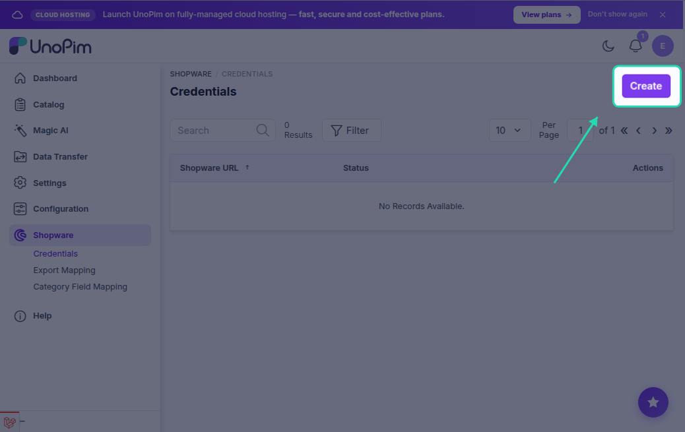
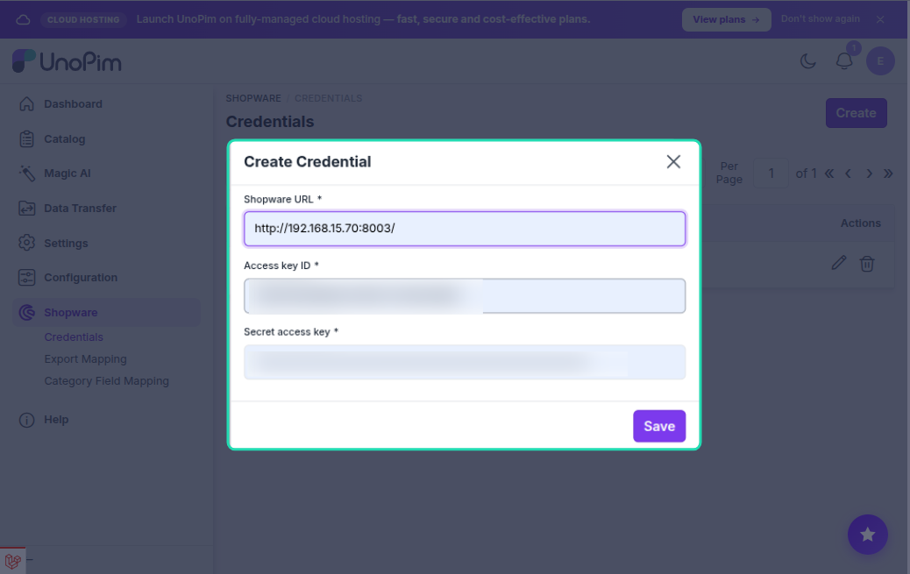
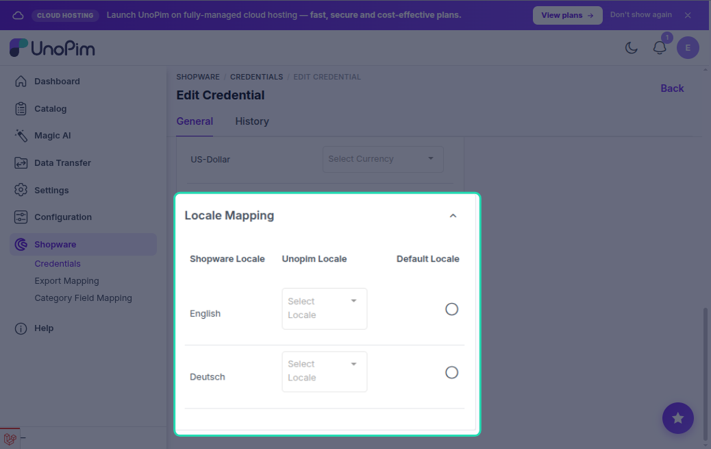
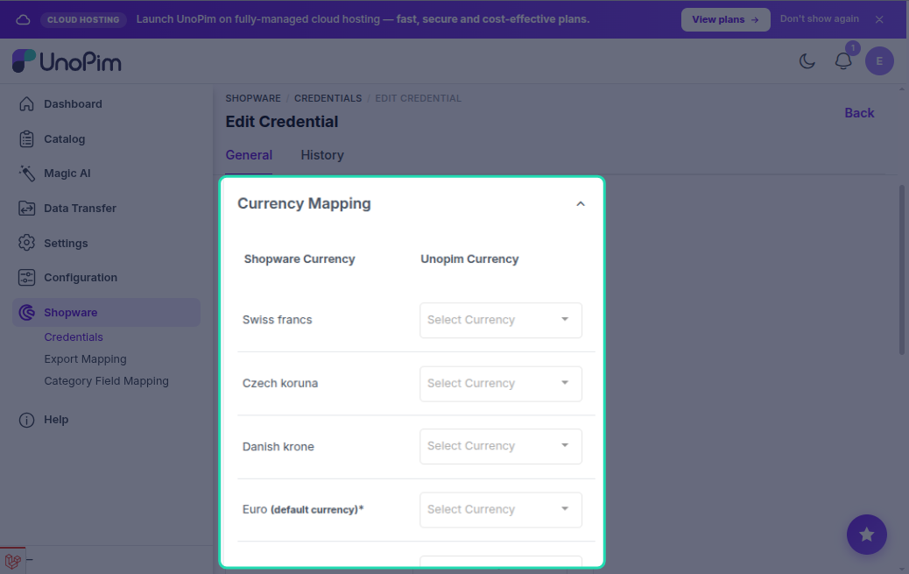

# Setup Credentials in UnoPim

After the connector is installed, the next step is to connect UnoPim to your Shopware store by entering your Shopware API credentials.

Go to **Shopware → Credentials → Create** in the UnoPim left sidebar.

---

## Create a New Credential

Fill in the following fields to add a new Shopware connection.

### General

| Field | Description |
|---|---|
| **Shopware URL** | The full URL of your Shopware store admin (e.g. `https://mystore.example.com`). |
| **Access Key ID** | The Access Key ID from the Shopware Integration you created. |
| **Secret Access Key** | The Secret Access Key from the Shopware Integration. |
| **Status** | Enable this toggle to make the credential active and available in export jobs. |

> [!NOTE]
> UnoPim validates the URL format, Access Key ID, and Secret Access Key by attempting an OAuth2 token request to your Shopware store when you save. If the connection fails, check your Shopware Integration permissions and make sure the Bulk API plugin is installed.

---

## Locale Mapping

After saving the basic credential, you need to map each **UnoPim locale** to the corresponding **Shopware language**.

On the credential edit screen, scroll to the **Locale Mapping** section. For each Shopware language shown, select the matching UnoPim locale from the dropdown.

Also select the **Default Locale** — this is used as the base translation language when pushing content to Shopware.

| Field | Description |
|---|---|
| **Shopware Locale** | The language identifier as configured in your Shopware store. |
| **UnoPim Locale** | The locale in UnoPim whose attribute values will be sent for this language. |
| **Default Locale** | The UnoPim locale used for the primary (default) Shopware language. |

> [!TIP]
> Click **Fetch Shopware Languages** to load the available languages directly from your Shopware store. Make sure the store URL and credentials are saved first.

---

## Currency Mapping

In the **Currency Mapping** section, map each **Shopware currency** to the corresponding **UnoPim currency**.

This mapping controls which price attribute values are exported for each currency in Shopware.

| Field | Description |
|---|---|
| **Shopware Currency** | The currency as configured in your Shopware store (e.g. EUR, USD). |
| **UnoPim Currency** | The matching currency defined in UnoPim. |

> [!TIP]
> Click **Fetch Shopware Currencies** to load the available currencies directly from your Shopware store.

The **default currency** must be mapped before any product export job will run successfully.

---

## Managing Multiple Stores

You can create more than one credential — each pointing at a different Shopware store URL. Each export job lets you select which credential (store) to use, so you can manage multiple storefronts from a single UnoPim instance.

---

## Credential Grid

All saved credentials are listed in the grid at **Shopware → Credentials**. From there you can:

- **Edit** a credential to update the URL, keys, locale mapping, or currency mapping.
- **Delete** a credential if a store connection is no longer needed.

